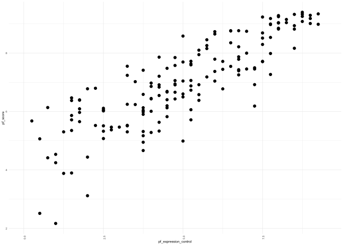

Activity 2
================

### A typical modeling process

The process that we will use for today’s activity is:

1.  Identify our research question(s),
2.  Explore (graphically and with numerical summaries) the variables of
    interest - both individually and in relationship to one another,
3.  Fit a simple linear regression model to obtain and describe model
    estimates,
4.  Assess how “good” our model is, and
5.  Predict new values.

We will continue to update/tweak/adapt this process and you are
encouraged to build your own process. Before we begin, we set up our R
session and introduce this activity’s data.

## Day 1

### The setup

We will be using two packages from Posit (formerly
[RStudio](https://posit.co/)): `{tidyverse}` and `{tidymodels}`. If you
would like to try the *ISLR* labs using these two packages instead of
base R, [Emil Hvitfeldt](https://www.emilhvitfeldt.com/) (of Posit) has
put together a [complementary online
text](https://emilhvitfeldt.github.io/ISLR-tidymodels-labs/index.html).

- In the **Packages** pane of RStudio (same area as **Files**), check to
  see if `{tidyverse}` and `{tidymodels}` are installed. Be sure to
  check both your **User Library** and **System Library**.

- If either of these are not currently listed, type the following in
  your **Console** pane, replacing `package_name` with the appropriate
  name, and press Enter/Return afterwards.

  ``` r
  # Note: the "eval = FALSE" in the above line tells R not to evaluate this code
  install.packages("package_name")
  ```

- Once you have verified that both `{tidyverse}` and `{tidymodels}` are
  installed, load these packages in the R chunk below titled `setup`.
  That is, type the following:

  ``` r
  library(tidyverse)
  library(tidymodels)
  ```

- Run the `setup` code chunk and/or **knit**
   icon
  your Rmd document to verify that no errors occur.

``` r
library(tidyverse)
```

    ## ── Attaching core tidyverse packages ──────────────────────── tidyverse 2.0.0 ──
    ## ✔ dplyr     1.1.2     ✔ readr     2.1.4
    ## ✔ forcats   1.0.0     ✔ stringr   1.5.0
    ## ✔ ggplot2   3.4.4     ✔ tibble    3.2.1
    ## ✔ lubridate 1.9.2     ✔ tidyr     1.3.0
    ## ✔ purrr     1.0.2     
    ## ── Conflicts ────────────────────────────────────────── tidyverse_conflicts() ──
    ## ✖ dplyr::filter() masks stats::filter()
    ## ✖ dplyr::lag()    masks stats::lag()
    ## ℹ Use the conflicted package (<http://conflicted.r-lib.org/>) to force all conflicts to become errors

``` r
library(tidymodels)
```

    ## ── Attaching packages ────────────────────────────────────── tidymodels 1.1.1 ──
    ## ✔ broom        1.0.5     ✔ rsample      1.2.0
    ## ✔ dials        1.2.0     ✔ tune         1.1.2
    ## ✔ infer        1.0.5     ✔ workflows    1.1.3
    ## ✔ modeldata    1.3.0     ✔ workflowsets 1.0.1
    ## ✔ parsnip      1.1.1     ✔ yardstick    1.3.0
    ## ✔ recipes      1.0.9     
    ## ── Conflicts ───────────────────────────────────────── tidymodels_conflicts() ──
    ## ✖ scales::discard() masks purrr::discard()
    ## ✖ dplyr::filter()   masks stats::filter()
    ## ✖ recipes::fixed()  masks stringr::fixed()
    ## ✖ dplyr::lag()      masks stats::lag()
    ## ✖ yardstick::spec() masks readr::spec()
    ## ✖ recipes::step()   masks stats::step()
    ## • Dig deeper into tidy modeling with R at https://www.tmwr.org

 **Check in**

Test your GitHub skills by staging, committing, and pushing your changes
to GitHub and verify that your changes have been added to your GitHub
repository.

### The data

The data we’re working with is from the OpenIntro site:
`https://www.openintro.org/data/csv/hfi.csv`. Here is the “about” page:
<https://www.openintro.org/data/index.php?data=hfi>.

In the R code chunk below titled `load-data`, you will type the code
that reads in the above linked CSV file by doing the following:

- Rather than downloading this file, uploading to RStudio, then reading
  it in, explore how to load this file directly from the provided URL
  with `readr::read_csv` (`{readr}` is part of `{tidyverse}`).
- Assign this data set into a data frame named `hfi` (short for “Human
  Freedom Index”).

``` r
hfi <- read.csv("https://www.openintro.org/data/csv/hfi.csv")
dim(hfi)
```

    ## [1] 1458  123

After doing this and viewing the loaded data, answer the following
questions:

1.  What are the dimensions of the dataset? The dimensions are 1458 rows
    and 123 columns

2.  What does each row represent? Each row represents an individual data
    entry or record of an individual country in a particular year

The dataset spans a lot of years. We are only interested in data from
year 2016. In the R code chunk below titled `hfi-2016`, type the code
that does the following:

- Filter the data `hfi` data frame for year 2016, and
- Assigns the result to a data frame named `hfi_2016`.

``` r
hfi_2016 <- filter(hfi, year == 2016)
```

### 1. Identify our research question(s)

The research question is often defined by you (or your company, boss,
etc.). Today’s research question/goal is to predict a country’s personal
freedom score in 2016.

For this activity we want to explore the relationship between the
personal freedom score, `pf_score`, and the political pressures and
controls on media content index,`pf_expression_control`. Specifically,
we are going to use the political pressures and controls on media
content index to predict a country’s personal freedom score in 2016.

### 2. Explore the variables of interest

Answer the following questions (use your markdown skills) and complete
the following tasks.

2.  What type of plot would you use to display the distribution of the
    personal freedom scores, `pf_score`? Would this be the same type of
    plot to display the distribution of the political pressures and
    controls on media content index, `pf_expression_control`?

Considering the number of data points we have, I would use a histogram
as that would be a good illustration of the variability of the data and
easier for comparison. I would use the same graph for both pf scores and
expression control.

- In the R code chunk below titled `univariable-plots`, type the R code
  that displays this plot for `pf_score`.
- In the R code chunk below titled `univariable-plots`, type the R code
  that displays this plot for `pf_expression_control`.

``` r
# Distribution of pf_score

ggplot(hfi_2016, aes(x = countries, y = pf_score)) +
  geom_histogram(stat = "identity", position = position_dodge(width = 0.5)) + 
  theme_minimal(base_size = 5) +
  theme(axis.text.x = element_text(angle = 90))
```

    ## Warning in geom_histogram(stat = "identity", position = position_dodge(width =
    ## 0.5)): Ignoring unknown parameters: `binwidth`, `bins`, and `pad`

<!-- -->

``` r
# Distribution of pf_expression_control

ggplot(hfi_2016, aes(x = countries, y = pf_expression_control)) +
  geom_histogram(stat = "identity", position = position_dodge(width = 0.5)) + 
  theme_minimal(base_size = 5) +
  theme(axis.text.x = element_text(angle = 90))
```

    ## Warning in geom_histogram(stat = "identity", position = position_dodge(width =
    ## 0.5)): Ignoring unknown parameters: `binwidth`, `bins`, and `pad`

<!-- -->

4.  Comment on each of these two distributions. Be sure to describe
    their centers, spread, shape, and any potential outliers.

# For pf_score

There is no distinct center, the spread and shape are both uniform.

# For pf_expression_control

There is no distinct center, the spread and shape are both uniform

3.  What type of plot would you use to display the relationship between
    the personal freedom score, `pf_score`, and the political pressures
    and controls on media content index,`pf_expression_control`?

I would use a scatterplot

- In the R code chunk below titled `relationship-plot`, plot this
  relationship using the variable `pf_expression_control` as the
  predictor/explanatory variable.

``` r
ggplot(hfi_2016, aes(x = pf_expression_control, y = pf_score)) +
  geom_point(stat = "identity", position = position_dodge(width = 0.5)) + 
  theme_minimal(base_size = 5) +
  theme(axis.text.x = element_text(angle = 90))
```

    ## Warning: `position_dodge()` requires non-overlapping x intervals

<!-- -->

4.  Does the relationship look linear? Yes, relationship is linear.

If you knew a country’s `pf_expression_control`, or its score out of 10,
with 0 being the most, of political pressures and controls on media
content, would you be comfortable using a linear model to predict the
personal freedom score?

I would not be comfortable to using a linear model because if the scores
are subjective, then that means the scores we got for expression control
and pf_scores are subjective hence they might not be the most accurate
data points

#### Challenge

For each plot and using your `{dplyr}` skills, obtain the appropriate
numerical summary statistics and provide more detailed descriptions of
these plots. For example, in (4) you were asked to comment on the
center, spread, shape, and potential outliers. What measures
could/should be used to describe these? You might not know of one for
each of those terms.

What numerical summary would you use to describe the relationship
between two numerical variables? (hint: explore the `cor` function from
Base R)

``` r
cor(hfi_2016$pf_expression_control, hfi_2016$pf_score)
```

    ## [1] 0.8450646

### 3. Fit a simple linear regression model

Regardless of your response to (4), we will continue fitting a simple
linear regression (SLR) model to these data. The code that we will be
using to fit statistical models in this course use `{tidymodels}` - an
opinionated way to fit models in R - and this is likely new to most of
you. I will provide you with example code when I do not think you should
know what to do - i.e., anything `{tidymodels}` related.

To begin, we will create a `{parsnip}` specification for a linear model.

- In the code chunk below titled `parsnip-spec`, replace “verbatim” with
  “r” just before the code chunk title.

``` r
lm_spec <- linear_reg() %>%
  set_mode("regression") %>%
  set_engine("lm")

lm_spec
```

    ## Linear Regression Model Specification (regression)
    ## 
    ## Computational engine: lm

Note that the `set_mode("regression")` is really unnecessary/redundant
as linear models (`"lm"`) can only be regression models. It is better to
be explicit as we get comfortable with this new process. Remember that
you can type `?function_name` in the R **Console** to explore a
function’s help documentation.

The above code also outputs the `lm_spec` output. This code does not do
any calculations by itself, but rather specifies what we plan to do.

Using this specification, we can now fit our model:
$\texttt{pf\score} = \beta_0 + \beta_1 \times \texttt{pf\_expression\_control} + \varepsilon$.
Note, the “\$” portion in the previous sentence is LaTeX snytex which is
a math scripting (and other scripting) language. I do not expect you to
know this, but you will become more comfortable with this. Look at your
knitted document to see how this syntax appears.

- In the code chunk below titled `fit-lm`, replace “verbatim” with “r”
  just before the code chunk title.

``` r
slr_mod <- lm_spec %>% 
  fit(pf_score ~ pf_expression_control, data = hfi_2016)

tidy(slr_mod)
```

    ## # A tibble: 2 × 5
    ##   term                  estimate std.error statistic  p.value
    ##   <chr>                    <dbl>     <dbl>     <dbl>    <dbl>
    ## 1 (Intercept)              4.28     0.149       28.8 4.23e-65
    ## 2 pf_expression_control    0.542    0.0271      20.0 2.31e-45

The above code fits our SLR model, then provides a `tidy` parameter
estimates table.

5.  Using the `tidy` output, update the below formula with the estimated
    parameters. That is, replace “intercept” and “slope” with the
    appropriate values

$\hat{\texttt{pf\score}} = 4.284 + 0.5418 \times \texttt{pf\_expression\_control}$

6.  Interpret each of the estimated parameters from (5) in the context
    of this research question. That is, what do these values represent?

The values represent an increase. For pf_expression_control, if the
expression control is 0, then the mean personal freedom score was 4.28.
In addition, if we increase expression control by 1 then the mean
freedom score increases by 0.542.

## Day 2

Hopefully, you were able to interpret the SLR model parameter estimates
(i.e., the *y*-intercept and slope) as follows:

> For countries with a `pf_expression_control` of 0 (those with the
> largest amount of political pressure on media content), we expect
> their mean personal freedom score to be 4.28.

> For every 1 unit increase in `pf_expression_control` (political
> pressure on media content index), we expect a country’s mean personal
> freedom score to increase 0.542 units.

### 4. Assessing

#### 4.A: Assess with your Day 1 model

To assess our model fit, we can use $R^2$ (the coefficient of
determination), the proportion of variability in the response variable
that is explained by the explanatory variable. We use `glance` from
`{broom}` (which is automatically loaded with `{tidymodels}` - `{broom}`
is also where `tidy` is from) to access this information.

- In the code chunk below titled `glance-lm`, replace “verbatim” with
  “r” just before the code chunk title.

``` r
glance(slr_mod)
```

    ## # A tibble: 1 × 12
    ##   r.squared adj.r.squared sigma statistic  p.value    df logLik   AIC   BIC
    ##       <dbl>         <dbl> <dbl>     <dbl>    <dbl> <dbl>  <dbl> <dbl> <dbl>
    ## 1     0.714         0.712 0.799      400. 2.31e-45     1  -193.  391.  400.
    ## # ℹ 3 more variables: deviance <dbl>, df.residual <int>, nobs <int>

After doing this and running the code, answer the following questions:

7.  What is the value of $R^2$ for this model? 0.714

8.  What does this value mean in the context of this model? Think about
    what would a “good” value of $R^2$ would be? Can/should this value
    be “perfect”?

I think this value doesn’t represent a value that is as good as we would
like it to be.

#### 4.B: Assess with test/train

You previously fit a model and evaluated it using the exact same data.
This is a bit of circular reasoning and does not provide much
information about the model’s performance. Now we will work through the
test/train process of fitting and assessing a simple linear regression
model.

Using the `diamonds` example provided to you in the Day 2 `README`, do
the following

- Create a new R code chunk and provide it with a descriptive tile
  (e.g., `train-test`).
- Set a seed.
- Create an initial 80-20 split of the `hfi_2016` dataset
- Using your initial split R object, assign the two splits into a
  training R object and a testing R object.

``` r
# Setting the seed
set.seed(1)

#putting 80% of the data into a training set
hfi_2016_split <- initial_split(hfi_2016, prop = 0.80)

#assigning the two splits to data frames
hfi_2016_train <- training(hfi_2016_split)
hfi_2016_test <- testing(hfi_2016_split)

hfi_2016_train
```

    ##     year ISO_code              countries                        region
    ## 1   2016      IDN              Indonesia                    South Asia
    ## 2   2016      SYC             Seychelles            Sub-Saharan Africa
    ## 3   2016      DOM         Dominican Rep. Latin America & the Caribbean
    ## 4   2016      BEL                Belgium                Western Europe
    ## 5   2016      FRA                 France                Western Europe
    ## 6   2016      LSO                Lesotho            Sub-Saharan Africa
    ## 7   2016      BRA                 Brazil Latin America & the Caribbean
    ## 8   2016      NPL                  Nepal                    South Asia
    ## 9   2016      JAM                Jamaica Latin America & the Caribbean
    ## 10  2016      AUT                Austria                Western Europe
    ## 11  2016      ITA                  Italy                Western Europe
    ## 12  2016      KOR           Korea, South                     East Asia
    ## 13  2016      CRI             Costa Rica Latin America & the Caribbean
    ## 14  2016      NAM                Namibia            Sub-Saharan Africa
    ## 15  2016      NER                  Niger            Sub-Saharan Africa
    ## 16  2016      COL               Colombia Latin America & the Caribbean
    ## 17  2016      GBR         United Kingdom                Western Europe
    ## 18  2016      SAU           Saudi Arabia    Middle East & North Africa
    ## 19  2016      LUX             Luxembourg                Western Europe
    ## 20  2016      CHN                  China                     East Asia
    ## 21  2016      LBN                Lebanon    Middle East & North Africa
    ## 22  2016      IRQ                   Iraq    Middle East & North Africa
    ## 23  2016      ARE   United Arab Emirates    Middle East & North Africa
    ## 24  2016      DNK                Denmark                Western Europe
    ## 25  2016      NGA                Nigeria            Sub-Saharan Africa
    ## 26  2016      BWA               Botswana            Sub-Saharan Africa
    ## 27  2016      ECU                Ecuador Latin America & the Caribbean
    ## 28  2016      PRT               Portugal                Western Europe
    ## 29  2016      LBY                  Libya    Middle East & North Africa
    ## 30  2016      CHE            Switzerland                Western Europe
    ## 31  2016      ESP                  Spain                Western Europe
    ## 32  2016      CYP                 Cyprus                Eastern Europe
    ## 33  2016      BDI                Burundi            Sub-Saharan Africa
    ## 34  2016      PHL            Philippines                    South Asia
    ## 35  2016      POL                 Poland                Eastern Europe
    ## 36  2016      SVN               Slovenia                Eastern Europe
    ## 37  2016      QAT                  Qatar    Middle East & North Africa
    ## 38  2016      HRV                Croatia                Eastern Europe
    ## 39  2016      VEN              Venezuela Latin America & the Caribbean
    ## 40  2016      SWZ              Swaziland            Sub-Saharan Africa
    ## 41  2016      AUS              Australia                       Oceania
    ## 42  2016      BFA           Burkina Faso            Sub-Saharan Africa
    ## 43  2016      CHL                  Chile Latin America & the Caribbean
    ## 44  2016      VNM                Vietnam                    South Asia
    ## 45  2016      DZA                Algeria    Middle East & North Africa
    ## 46  2016      EGY                  Egypt    Middle East & North Africa
    ## 47  2016      BOL                Bolivia Latin America & the Caribbean
    ## 48  2016      BRN      Brunei Darussalam                    South Asia
    ## 49  2016      KEN                  Kenya            Sub-Saharan Africa
    ## 50  2016      MAR                Morocco    Middle East & North Africa
    ## 51  2016      HUN                Hungary                Eastern Europe
    ## 52  2016      MMR                Myanmar                    South Asia
    ## 53  2016      SEN                Senegal            Sub-Saharan Africa
    ## 54  2016      ZAF           South Africa            Sub-Saharan Africa
    ## 55  2016      NZL            New Zealand                       Oceania
    ## 56  2016      TGO                   Togo            Sub-Saharan Africa
    ## 57  2016      SUR               Suriname Latin America & the Caribbean
    ## 58  2016      MOZ             Mozambique            Sub-Saharan Africa
    ## 59  2016      JPN                  Japan                     East Asia
    ## 60  2016      KGZ        Kyrgyz Republic       Caucasus & Central Asia
    ## 61  2016      MNG               Mongolia                     East Asia
    ## 62  2016      BLR                Belarus                Eastern Europe
    ## 63  2016      SGP              Singapore                    South Asia
    ## 64  2016      TJK             Tajikistan       Caucasus & Central Asia
    ## 65  2016      ETH               Ethiopia            Sub-Saharan Africa
    ## 66  2016      MDA                Moldova                Eastern Europe
    ## 67  2016      BGR               Bulgaria                Eastern Europe
    ## 68  2016      SYR                  Syria    Middle East & North Africa
    ## 69  2016      CPV             Cape Verde            Sub-Saharan Africa
    ## 70  2016      MNE             Montenegro                Eastern Europe
    ## 71  2016      PAN                 Panama Latin America & the Caribbean
    ## 72  2016      CAN                 Canada                 North America
    ## 73  2016      MEX                 Mexico Latin America & the Caribbean
    ## 74  2016      TWN                 Taiwan                     East Asia
    ## 75  2016      PRY               Paraguay Latin America & the Caribbean
    ## 76  2016      USA          United States                 North America
    ## 77  2016      TCD                   Chad            Sub-Saharan Africa
    ## 78  2016      BTN                 Bhutan                    South Asia
    ## 79  2016      UGA                 Uganda            Sub-Saharan Africa
    ## 80  2016      LVA                 Latvia                Eastern Europe
    ## 81  2016      MKD              Macedonia                Eastern Europe
    ## 82  2016      HKG              Hong Kong                     East Asia
    ## 83  2016      GNB          Guinea-Bissau            Sub-Saharan Africa
    ## 84  2016      RUS                 Russia                Eastern Europe
    ## 85  2016      TLS            Timor-Leste                    South Asia
    ## 86  2016      BHR                Bahrain    Middle East & North Africa
    ## 87  2016      ALB                Albania                Eastern Europe
    ## 88  2016      YEM            Yemen, Rep.    Middle East & North Africa
    ## 89  2016      GIN                 Guinea            Sub-Saharan Africa
    ## 90  2016      KHM               Cambodia                    South Asia
    ## 91  2016      BLZ                 Belize Latin America & the Caribbean
    ## 92  2016      GTM              Guatemala Latin America & the Caribbean
    ## 93  2016      MLI                   Mali            Sub-Saharan Africa
    ## 94  2016      SVK            Slovak Rep.                Eastern Europe
    ## 95  2016      ROU                Romania                Eastern Europe
    ## 96  2016      LAO                   Laos                    South Asia
    ## 97  2016      RWA                 Rwanda            Sub-Saharan Africa
    ## 98  2016      IRN                   Iran    Middle East & North Africa
    ## 99  2016      GMB            Gambia, The            Sub-Saharan Africa
    ## 100 2016      MDG             Madagascar            Sub-Saharan Africa
    ## 101 2016      MWI                 Malawi            Sub-Saharan Africa
    ## 102 2016      OMN                   Oman    Middle East & North Africa
    ## 103 2016      MUS              Mauritius            Sub-Saharan Africa
    ## 104 2016      BIH Bosnia and Herzegovina                Eastern Europe
    ## 105 2016      MLT                  Malta                Western Europe
    ## 106 2016      COD         Congo, Dem. R.            Sub-Saharan Africa
    ## 107 2016      THA               Thailand                    South Asia
    ## 108 2016      JOR                 Jordan    Middle East & North Africa
    ## 109 2016      NLD            Netherlands                Western Europe
    ## 110 2016      ZMB                 Zambia            Sub-Saharan Africa
    ## 111 2016      HTI                  Haiti Latin America & the Caribbean
    ## 112 2016      TZA               Tanzania            Sub-Saharan Africa
    ## 113 2016      HND               Honduras Latin America & the Caribbean
    ## 114 2016      CZE             Czech Rep.                Eastern Europe
    ## 115 2016      TUN                Tunisia    Middle East & North Africa
    ## 116 2016      SLV            El Salvador Latin America & the Caribbean
    ## 117 2016      AGO                 Angola            Sub-Saharan Africa
    ## 118 2016      GAB                  Gabon            Sub-Saharan Africa
    ## 119 2016      GRC                 Greece                Eastern Europe
    ## 120 2016      UKR                Ukraine                Eastern Europe
    ## 121 2016      LKA              Sri Lanka                    South Asia
    ## 122 2016      FJI                   Fiji                       Oceania
    ## 123 2016      CMR               Cameroon            Sub-Saharan Africa
    ## 124 2016      GHA                  Ghana            Sub-Saharan Africa
    ## 125 2016      SDN                  Sudan            Sub-Saharan Africa
    ## 126 2016      NOR                 Norway                Western Europe
    ## 127 2016      BEN                  Benin            Sub-Saharan Africa
    ## 128 2016      SWE                 Sweden                Western Europe
    ## 129 2016      PER                   Peru Latin America & the Caribbean
    ##     pf_rol_procedural pf_rol_civil pf_rol_criminal   pf_rol pf_ss_homicide
    ## 1            4.182062     4.506668        3.542565 4.077098       9.801973
    ## 2                  NA           NA              NA 5.384695       4.905248
    ## 3            5.242039     4.544211        3.270030 4.352093       3.927318
    ## 4            8.669067     7.343872        7.240364 7.751101       9.220407
    ## 5            6.822107     7.021794        6.469894 6.771265       9.459125
    ## 6                  NA           NA              NA 4.888498       0.000000
    ## 7            4.965023     5.288791        3.701204 4.651673       0.000000
    ## 8            3.930952     4.661817        4.309426 4.300731       9.134488
    ## 9            5.785643     5.438131        4.987695 5.403823       0.000000
    ## 10           8.969832     7.872188        7.673227 8.171749       9.737912
    ## 11           7.522592     5.556020        6.432903 6.503838       9.730775
    ## 12           7.939076     7.403502        6.971971 7.438183       9.719554
    ## 13           8.053553     6.267071        5.560009 6.626877       5.238007
    ## 14                 NA           NA              NA 5.796622       3.144676
    ## 15                 NA           NA              NA 4.150644       8.222386
    ## 16           4.968106     4.874353        3.426459 4.422973       0.000000
    ## 17           8.227729     7.512237        7.409705 7.716557       9.519036
    ## 18                 NA           NA              NA 5.914095       9.401720
    ## 19                 NA           NA              NA 7.897751       9.712394
    ## 20           3.954893     5.380302        4.779259 4.704818       9.753760
    ## 21           4.601614     4.746243        3.671315 4.339724       8.402759
    ## 22                 NA           NA              NA 2.464387       6.058217
    ## 23           5.347898     6.827330        6.922625 6.365951       9.642476
    ## 24           9.273488     8.619286        8.168529 8.687101       9.607727
    ## 25           3.810968     4.990420        4.179642 4.327010       6.060660
    ## 26           5.333481     6.055928        5.535643 5.641684       3.984712
    ## 27           4.368084     4.596152        3.812076 4.258771       7.658493
    ## 28           8.170780     6.920652        6.405393 7.165608       9.745627
    ## 29                 NA           NA              NA 2.198018       8.998449
    ## 30                 NA           NA              NA 8.249290       9.785457
    ## 31           8.088213     6.596637        6.350741 7.011864       9.746606
    ## 32                 NA           NA              NA 6.327702       9.555653
    ## 33                 NA           NA              NA 2.961470       7.591791
    ## 34           2.534832     4.670852        3.104072 3.436585       5.592069
    ## 35           6.579361     6.409359        6.159868 6.382863       9.731942
    ## 36           7.694842     5.859112        5.797913 6.450623       9.807344
    ## 37                 NA           NA              NA 6.546296       9.848384
    ## 38           6.312658     5.732319        5.056636 5.700538       9.582146
    ## 39           1.479799     3.271891        1.429083 2.060257       0.000000
    ## 40                 NA           NA              NA 4.658352       3.083054
    ## 41           8.439110     7.525648        7.364078 7.776279       9.623538
    ## 42           5.148742     4.884167        4.548815 4.860575       9.852021
    ## 43           7.706122     6.291439        5.550751 6.516104       8.614887
    ## 44           5.376034     4.448922        4.911257 4.912071       9.392643
    ## 45                 NA           NA              NA 3.819566       9.456254
    ## 46           2.948325     3.763257        4.166860 3.626148       8.994685
    ## 47           3.702869     3.361331        2.090006 3.051402       7.479924
    ## 48                 NA           NA              NA 6.163383       9.802818
    ## 49           3.464645     4.596396        3.800403 3.953815       8.050626
    ## 50           3.426608     5.434931        3.735974 4.199171       9.504645
    ## 51           6.555008     5.013990        4.748055 5.439018       9.171400
    ## 52           2.399945     3.657112        2.872087 2.976382       9.093876
    ## 53           4.075341     5.649207        4.322606 4.682385       7.049766
    ## 54           5.888715     6.067467        5.228230 5.728138       0.000000
    ## 55           8.365538     7.877339        7.362762 7.868546       9.605842
    ## 56                 NA           NA              NA 4.083064       6.400033
    ## 57           4.607893     5.016272        5.167021 4.930395       6.661154
    ## 58                 NA           NA              NA 3.551132       8.638278
    ## 59           7.677815     7.865213        7.387443 7.643490       9.886591
    ## 60           3.586664     4.648818        3.185602 3.807028       8.205846
    ## 61           5.430154     5.339118        4.985356 5.251542       7.737631
    ## 62           4.483689     5.934587        4.968499 5.128925       8.566135
    ## 63           6.920866     8.131372        7.997979 7.683406       9.871777
    ## 64                 NA           NA              NA 3.297264       9.355165
    ## 65           2.613462     3.896895        3.397061 3.302473       6.975355
    ## 66           5.143328     4.658885        3.552056 4.451423       8.722340
    ## 67           4.984199     5.631897        4.058021 4.891372       9.545583
    ## 68                 NA           NA              NA 1.980355       9.118885
    ## 69                 NA           NA              NA 5.720581       5.405668
    ## 70                 NA           NA              NA 5.103068       8.217753
    ## 71           5.052444     4.823172        3.281000 4.385539       6.132164
    ## 72           8.622615     7.181646        7.410711 7.738324       9.326358
    ## 73           4.690790     4.041975        3.035141 3.922635       2.294416
    ## 74                 NA           NA              NA 6.983996       9.672993
    ## 75                 NA           NA              NA 4.108066       6.282639
    ## 76           7.619550     6.682994        6.547191 6.949912       7.858670
    ## 77                 NA           NA              NA 2.900353       6.383880
    ## 78                 NA           NA              NA 5.925575       9.548283
    ## 79           2.161522     4.527822        3.399779 3.363041       5.392619
    ## 80                 NA           NA              NA 6.681684       8.655066
    ## 81           4.684099     5.632479        4.666636 4.994404       9.364619
    ## 82           6.484917     7.724473        7.204062 7.137817       9.846703
    ## 83                 NA           NA              NA 2.799701       6.180058
    ## 84           3.329539     5.310768        3.345276 3.995194       5.673527
    ## 85                 NA           NA              NA 3.261571       8.420599
    ## 86                 NA           NA              NA 5.900339       9.790481
    ## 87           6.661503     4.547244        4.666508 5.291752       8.920429
    ## 88                 NA           NA              NA 2.623957       7.336599
    ## 89                 NA           NA              NA 3.120741       6.470168
    ## 90           3.022812     1.983626        2.693785 2.566741       9.262616
    ## 91           4.753383     4.737766        3.315467 4.268872       0.000000
    ## 92           5.446891     3.469544        3.046596 3.987677       0.000000
    ## 93                 NA           NA              NA 3.930246       5.638730
    ## 94                 NA           NA              NA 6.275761       9.581016
    ## 95           6.778754     6.460960        5.745707 6.328474       9.500479
    ## 96                 NA           NA              NA 3.953482       7.196007
    ## 97                 NA           NA              NA 5.282070       8.992223
    ## 98           3.410152     5.211233        4.505767 4.375717       9.012385
    ## 99                 NA           NA              NA 3.981623       6.348597
    ## 100          3.333572     3.930339        3.575734 3.613215       6.925294
    ## 101          5.059202     5.412025        4.296704 4.922643       9.306716
    ## 102                NA           NA              NA 5.861203       9.737435
    ## 103                NA           NA              NA 6.446820       9.271222
    ## 104          6.312217     4.995851        5.102173 5.470080       9.489855
    ## 105                NA           NA              NA 6.880670       9.625833
    ## 106                NA           NA              NA 2.603961       4.581445
    ## 107          3.515098     5.328005        4.015992 4.286365       8.704225
    ## 108          5.186786     6.181327        6.028310 5.798808       9.380949
    ## 109          8.867740     8.714600        7.991312 8.524551       9.778655
    ## 110          3.300633     4.891213        4.154905 4.115584       7.880823
    ## 111                NA           NA              NA 3.582254       5.984143
    ## 112          3.749894     5.043568        3.938931 4.244131       7.219003
    ## 113          3.093771     4.053457        2.436940 3.194723       0.000000
    ## 114          8.711492     7.237188        7.411397 7.786692       9.754941
    ## 115          5.074037     4.903501        4.295872 4.757804       8.780159
    ## 116          5.106082     4.977861        2.981356 4.355100       0.000000
    ## 117                NA           NA              NA 3.451814       8.060260
    ## 118                NA           NA              NA 4.241028       6.782865
    ## 119          6.420952     5.682751        5.265669 5.789791       9.699859
    ## 120          4.766431     5.136370        3.736319 4.546374       7.464543
    ## 121          4.241601     4.482074        4.832259 4.518645       8.980183
    ## 122                NA           NA              NA 4.701806       9.096868
    ## 123          2.624329     3.695063        2.761362 3.026918       8.330360
    ## 124          5.849976     6.243898        5.148001 5.747292       9.326481
    ## 125                NA           NA              NA 3.163435       7.934184
    ## 126          8.904126     8.509218        8.256121 8.556488       9.794278
    ## 127                NA           NA              NA 4.129480       7.526895
    ## 128          9.517962     8.094623        8.006348 8.539644       9.568895
    ## 129          6.172623     4.405750        3.569158 4.715844       6.933614
    ##     pf_ss_disappearances_disap pf_ss_disappearances_violent
    ## 1                           10                    10.000000
    ## 2                           10                    10.000000
    ## 3                           10                    10.000000
    ## 4                           10                    10.000000
    ## 5                           10                    10.000000
    ## 6                           10                    10.000000
    ## 7                           10                    10.000000
    ## 8                           10                    10.000000
    ## 9                           10                    10.000000
    ## 10                          10                    10.000000
    ## 11                          10                    10.000000
    ## 12                          10                    10.000000
    ## 13                          10                    10.000000
    ## 14                          10                    10.000000
    ## 15                          10                     5.581996
    ## 16                           0                     9.794465
    ## 17                          10                    10.000000
    ## 18                          10                    10.000000
    ## 19                          10                    10.000000
    ## 20                           0                    10.000000
    ## 21                          10                    10.000000
    ## 22                           0                     0.000000
    ## 23                           5                    10.000000
    ## 24                          10                    10.000000
    ## 25                           0                     5.644919
    ## 26                          10                    10.000000
    ## 27                          10                    10.000000
    ## 28                          10                    10.000000
    ## 29                           5                     0.000000
    ## 30                          10                    10.000000
    ## 31                          10                    10.000000
    ## 32                          10                    10.000000
    ## 33                           5                    10.000000
    ## 34                           5                     8.225581
    ## 35                          10                    10.000000
    ## 36                          10                    10.000000
    ## 37                          10                    10.000000
    ## 38                          10                    10.000000
    ## 39                          10                    10.000000
    ## 40                          10                    10.000000
    ## 41                          10                    10.000000
    ## 42                          10                    10.000000
    ## 43                          10                    10.000000
    ## 44                           5                    10.000000
    ## 45                          10                     9.294030
    ## 46                           0                     9.066417
    ## 47                          10                    10.000000
    ## 48                          10                    10.000000
    ## 49                           0                     9.662963
    ## 50                          10                    10.000000
    ## 51                          10                    10.000000
    ## 52                           5                     9.268857
    ## 53                          10                    10.000000
    ## 54                          10                    10.000000
    ## 55                          10                    10.000000
    ## 56                          10                    10.000000
    ## 57                          10                    10.000000
    ## 58                          10                     9.699382
    ## 59                          10                    10.000000
    ## 60                           5                    10.000000
    ## 61                           5                    10.000000
    ## 62                          10                    10.000000
    ## 63                          10                    10.000000
    ## 64                           5                    10.000000
    ## 65                           5                     9.837245
    ## 66                          10                    10.000000
    ## 67                          10                    10.000000
    ## 68                           0                     0.000000
    ## 69                          10                    10.000000
    ## 70                          10                    10.000000
    ## 71                          10                    10.000000
    ## 72                          10                    10.000000
    ## 73                           0                    10.000000
    ## 74                          10                    10.000000
    ## 75                          10                    10.000000
    ## 76                          10                     9.879305
    ## 77                           5                    10.000000
    ## 78                          10                    10.000000
    ## 79                           5                     8.939451
    ## 80                          10                    10.000000
    ## 81                          10                    10.000000
    ## 82                          NA                    10.000000
    ## 83                          10                    10.000000
    ## 84                           0                     9.840657
    ## 85                          10                    10.000000
    ## 86                          10                    10.000000
    ## 87                          10                    10.000000
    ## 88                           0                     0.000000
    ## 89                          10                    10.000000
    ## 90                          10                    10.000000
    ## 91                          10                    10.000000
    ## 92                          10                    10.000000
    ## 93                           5                     8.221712
    ## 94                          10                    10.000000
    ## 95                          10                    10.000000
    ## 96                          10                    10.000000
    ## 97                          10                     6.391863
    ## 98                           0                     9.875432
    ## 99                           5                    10.000000
    ## 100                         10                    10.000000
    ## 101                         10                    10.000000
    ## 102                         10                    10.000000
    ## 103                         10                    10.000000
    ## 104                         10                    10.000000
    ## 105                         10                    10.000000
    ## 106                          0                     9.305698
    ## 107                         10                     9.757975
    ## 108                         10                     8.801441
    ## 109                         10                    10.000000
    ## 110                         10                    10.000000
    ## 111                         10                    10.000000
    ## 112                         10                    10.000000
    ## 113                         10                    10.000000
    ## 114                         10                    10.000000
    ## 115                         10                     7.895336
    ## 116                         10                    10.000000
    ## 117                          5                    10.000000
    ## 118                         10                    10.000000
    ## 119                         10                    10.000000
    ## 120                          0                     8.111306
    ## 121                          5                    10.000000
    ## 122                         10                    10.000000
    ## 123                          0                     6.857115
    ## 124                         10                    10.000000
    ## 125                          5                     0.000000
    ## 126                         10                    10.000000
    ## 127                         10                    10.000000
    ## 128                         10                    10.000000
    ## 129                         10                    10.000000
    ##     pf_ss_disappearances_organized pf_ss_disappearances_fatalities
    ## 1                              7.5                        9.971915
    ## 2                               NA                       10.000000
    ## 3                              7.5                       10.000000
    ## 4                             10.0                        8.941657
    ## 5                             10.0                        9.526602
    ## 6                              7.5                       10.000000
    ## 7                             10.0                        9.998395
    ## 8                              7.5                        9.942495
    ## 9                              7.5                       10.000000
    ## 10                            10.0                       10.000000
    ## 11                            10.0                        9.994502
    ## 12                             7.5                       10.000000
    ## 13                            10.0                       10.000000
    ## 14                             7.5                       10.000000
    ## 15                             2.5                        7.033165
    ## 16                             2.5                        9.739655
    ## 17                            10.0                        9.954265
    ## 18                             2.5                        8.337242
    ## 19                              NA                       10.000000
    ## 20                             5.0                        9.996857
    ## 21                             2.5                        8.612653
    ## 22                             0.0                        0.000000
    ## 23                             7.5                       10.000000
    ## 24                            10.0                        9.941806
    ## 25                             2.5                        6.121648
    ## 26                            10.0                       10.000000
    ## 27                             7.5                        9.979656
    ## 28                            10.0                       10.000000
    ## 29                             0.0                        0.000000
    ## 30                            10.0                       10.000000
    ## 31                            10.0                       10.000000
    ## 32                             7.5                       10.000000
    ## 33                             2.5                        7.656177
    ## 34                             2.5                        8.674025
    ## 35                             7.5                       10.000000
    ## 36                             7.5                       10.000000
    ## 37                            10.0                       10.000000
    ## 38                            10.0                       10.000000
    ## 39                             5.0                        9.904968
    ## 40                             7.5                       10.000000
    ## 41                            10.0                       10.000000
    ## 42                             7.5                        9.302816
    ## 43                            10.0                       10.000000
    ## 44                            10.0                       10.000000
    ## 45                             5.0                        9.926119
    ## 46                             2.5                        7.888988
    ## 47                             7.5                       10.000000
    ## 48                              NA                       10.000000
    ## 49                             5.0                        9.504762
    ## 50                             5.0                       10.000000
    ## 51                             7.5                       10.000000
    ## 52                             5.0                        9.539884
    ## 53                             5.0                       10.000000
    ## 54                             5.0                        9.875035
    ## 55                            10.0                       10.000000
    ## 56                             7.5                       10.000000
    ## 57                              NA                       10.000000
    ## 58                             5.0                        9.283141
    ## 59                            10.0                        9.950129
    ## 60                             2.5                        9.945171
    ## 61                            10.0                       10.000000
    ## 62                             5.0                       10.000000
    ## 63                            10.0                       10.000000
    ## 64                             2.5                        9.961839
    ## 65                             2.5                        9.091825
    ## 66                             5.0                       10.000000
    ## 67                            10.0                       10.000000
    ## 68                             0.0                        0.000000
    ## 69                              NA                       10.000000
    ## 70                             7.5                       10.000000
    ## 71                            10.0                       10.000000
    ## 72                            10.0                        9.990808
    ## 73                             7.5                        9.989546
    ## 74                             7.5                       10.000000
    ## 75                             5.0                        9.504360
    ## 76                             7.5                        9.929852
    ## 77                             2.5                        9.492592
    ## 78                             7.5                       10.000000
    ## 79                             7.5                        9.397416
    ## 80                            10.0                       10.000000
    ## 81                             5.0                       10.000000
    ## 82                              NA                       10.000000
    ## 83                             5.0                       10.000000
    ## 84                             5.0                        9.852203
    ## 85                             7.5                        0.000000
    ## 86                             2.5                        9.766110
    ## 87                            10.0                       10.000000
    ## 88                             0.0                        0.000000
    ## 89                             7.5                        9.973109
    ## 90                             7.5                       10.000000
    ## 91                              NA                       10.000000
    ## 92                             5.0                       10.000000
    ## 93                             2.5                        6.739806
    ## 94                             7.5                       10.000000
    ## 95                            10.0                       10.000000
    ## 96                             7.5                        9.852035
    ## 97                             5.0                       10.000000
    ## 98                             2.5                        9.950173
    ## 99                             5.0                       10.000000
    ## 100                            7.5                        9.959831
    ## 101                            7.5                       10.000000
    ## 102                            7.5                       10.000000
    ## 103                           10.0                       10.000000
    ## 104                            5.0                       10.000000
    ## 105                             NA                       10.000000
    ## 106                            2.5                        7.747752
    ## 107                            5.0                       10.000000
    ## 108                            7.5                        8.766190
    ## 109                           10.0                        9.980427
    ## 110                            7.5                       10.000000
    ## 111                            5.0                        9.784893
    ## 112                            7.5                        9.982005
    ## 113                            7.5                        9.926843
    ## 114                           10.0                       10.000000
    ## 115                            5.0                        7.924568
    ## 116                            7.5                       10.000000
    ## 117                            7.5                       10.000000
    ## 118                            5.0                       10.000000
    ## 119                            5.0                        7.957388
    ## 120                            0.0                        9.644481
    ## 121                            5.0                       10.000000
    ## 122                             NA                       10.000000
    ## 123                            2.5                        6.515807
    ## 124                            7.5                       10.000000
    ## 125                            2.5                        8.467194
    ## 126                           10.0                       10.000000
    ## 127                            7.5                       10.000000
    ## 128                           10.0                       10.000000
    ## 129                            7.5                        9.884601
    ##     pf_ss_disappearances_injuries pf_ss_disappearances pf_ss_women_fgm
    ## 1                       9.9731919           9.48902146            10.0
    ## 2                      10.0000000          10.00000000              NA
    ## 3                      10.0000000           9.50000000            10.0
    ## 4                       5.1316209           8.81465552            10.0
    ## 5                       8.5947541           9.62427112            10.0
    ## 6                      10.0000000           9.50000000            10.0
    ## 7                      10.0000000           9.99967895            10.0
    ## 8                       9.8964902           9.46779696            10.0
    ## 9                      10.0000000           9.50000000            10.0
    ## 10                     10.0000000          10.00000000            10.0
    ## 11                      9.9967012           9.99824062            10.0
    ## 12                     10.0000000           9.50000000            10.0
    ## 13                     10.0000000          10.00000000            10.0
    ## 14                     10.0000000           9.50000000            10.0
    ## 15                      8.6552500           6.75408233             9.8
    ## 16                      9.7533575           6.35749545            10.0
    ## 17                      9.9390203           9.97865709            10.0
    ## 18                      8.7854635           7.92454104            10.0
    ## 19                     10.0000000          10.00000000            10.0
    ## 20                      9.9973888           6.99884913            10.0
    ## 21                      7.5360716           7.72974490            10.0
    ## 22                      0.0000000           0.00000000            10.0
    ## 23                     10.0000000           8.50000000            10.0
    ## 24                      9.8952516           9.96741160            10.0
    ## 25                      8.7579953           4.60491237             7.0
    ## 26                     10.0000000          10.00000000            10.0
    ## 27                      9.9145564           9.47884252            10.0
    ## 28                     10.0000000          10.00000000            10.0
    ## 29                      0.0000000           1.00000000            10.0
    ## 30                     10.0000000          10.00000000            10.0
    ## 31                      9.9827900           9.99655799            10.0
    ## 32                     10.0000000           9.50000000            10.0
    ## 33                      5.9521545           6.22166631            10.0
    ## 34                      8.6062748           6.60117628            10.0
    ## 35                      9.9947327           9.49894654            10.0
    ## 36                     10.0000000           9.50000000            10.0
    ## 37                     10.0000000          10.00000000            10.0
    ## 38                     10.0000000          10.00000000            10.0
    ## 39                      9.5121670           8.88342691            10.0
    ## 40                     10.0000000           9.50000000            10.0
    ## 41                      9.9917392           9.99834784            10.0
    ## 42                      9.8069336           9.32194986             2.4
    ## 43                      9.9553316           9.99106632            10.0
    ## 44                     10.0000000           9.00000000            10.0
    ## 45                      9.9901493           8.84205967            10.0
    ## 46                      8.6915903           5.62939895             0.9
    ## 47                     10.0000000           9.50000000            10.0
    ## 48                     10.0000000          10.00000000              NA
    ## 49                      9.7152383           6.77659272             7.3
    ## 50                     10.0000000           9.00000000            10.0
    ## 51                      9.9592420           9.49184840            10.0
    ## 52                      9.7806571           7.71787961            10.0
    ## 53                     10.0000000           9.00000000             7.4
    ## 54                      9.9607251           8.96715193            10.0
    ## 55                     10.0000000          10.00000000            10.0
    ## 56                     10.0000000           9.50000000             9.6
    ## 57                     10.0000000          10.00000000              NA
    ## 58                      9.4242004           8.68134465            10.0
    ## 59                      9.9590533           9.98183649            10.0
    ## 60                      9.8355128           7.45613674            10.0
    ## 61                     10.0000000           9.00000000            10.0
    ## 62                     10.0000000           9.00000000            10.0
    ## 63                     10.0000000          10.00000000            10.0
    ## 64                     10.0000000           7.49236783            10.0
    ## 65                      9.8378957           7.25339311             2.6
    ## 66                     10.0000000           9.00000000            10.0
    ## 67                      9.9719409           9.99438819            10.0
    ## 68                      0.0000000           0.00000000            10.0
    ## 69                     10.0000000          10.00000000              NA
    ## 70                     10.0000000           9.50000000              NA
    ## 71                     10.0000000          10.00000000            10.0
    ## 72                      9.8124893           9.96065953            10.0
    ## 73                     10.0000000           7.49790916            10.0
    ## 74                     10.0000000           9.50000000              NA
    ## 75                      9.9405232           8.88897658            10.0
    ## 76                      9.9139659           9.44462454            10.0
    ## 77                      9.0589891           7.21031626             5.6
    ## 78                     10.0000000           9.50000000            10.0
    ## 79                      9.9084072           8.14905485             9.9
    ## 80                     10.0000000          10.00000000            10.0
    ## 81                     10.0000000           9.00000000            10.0
    ## 82                     10.0000000          10.00000000            10.0
    ## 83                     10.0000000           9.00000000             5.0
    ## 84                      9.9154787           6.92166774            10.0
    ## 85                      0.0000000           5.50000000            10.0
    ## 86                      9.7193319           8.39708837            10.0
    ## 87                     10.0000000          10.00000000            10.0
    ## 88                      0.2842978           0.05685955             6.2
    ## 89                     10.0000000           9.49462189             0.4
    ## 90                     10.0000000           9.50000000            10.0
    ## 91                     10.0000000          10.00000000              NA
    ## 92                     10.0000000           9.00000000            10.0
    ## 93                      7.5548542           6.00327439             1.1
    ## 94                      4.9961220           8.49922440            10.0
    ## 95                     10.0000000          10.00000000            10.0
    ## 96                      9.5561049           9.38162796            10.0
    ## 97                     10.0000000           8.27837263            10.0
    ## 98                      9.9800691           6.46113478            10.0
    ## 99                     10.0000000           8.00000000             2.4
    ## 100                     9.2689163           9.34574938            10.0
    ## 101                    10.0000000           9.50000000            10.0
    ## 102                    10.0000000           9.50000000            10.0
    ## 103                    10.0000000          10.00000000            10.0
    ## 104                    10.0000000           9.00000000            10.0
    ## 105                    10.0000000          10.00000000              NA
    ## 106                     9.5529373           5.82127748            10.0
    ## 107                    10.0000000           8.95159507            10.0
    ## 108                     8.6251827           8.73856274            10.0
    ## 109                     9.9647687           9.98903915            10.0
    ## 110                    10.0000000           9.50000000             9.9
    ## 111                    10.0000000           8.95697868            10.0
    ## 112                     9.9928022           9.49496151             8.5
    ## 113                    10.0000000           9.48536867            10.0
    ## 114                     9.9810720           9.99621439            10.0
    ## 115                     9.5439896           8.07277880            10.0
    ## 116                    10.0000000           9.50000000            10.0
    ## 117                    10.0000000           8.50000000            10.0
    ## 118                    10.0000000           9.00000000            10.0
    ## 119                     9.9628616           8.58404983            10.0
    ## 120                     9.8266846           5.51649435            10.0
    ## 121                     9.9811347           7.99622695            10.0
    ## 122                    10.0000000          10.00000000            10.0
    ## 123                     7.2353992           4.62166425             9.9
    ## 124                    10.0000000           9.50000000             9.6
    ## 125                     8.9236670           4.97817219             1.2
    ## 126                    10.0000000          10.00000000            10.0
    ## 127                    10.0000000           9.50000000             8.7
    ## 128                     9.9798450           9.99596900            10.0
    ## 129                     9.9559386           9.46810794            10.0
    ##     pf_ss_women_missing pf_ss_women_inheritance_widows
    ## 1                   7.5                              5
    ## 2                    NA                             NA
    ## 3                  10.0                             10
    ## 4                  10.0                             10
    ## 5                  10.0                             10
    ## 6                   7.5                              5
    ## 7                  10.0                              5
    ## 8                   7.5                             10
    ## 9                  10.0                             10
    ## 10                 10.0                             10
    ## 11                 10.0                             10
    ## 12                  7.5                             10
    ## 13                 10.0                             10
    ## 14                 10.0                              5
    ## 15                  7.5                              0
    ## 16                 10.0                             10
    ## 17                 10.0                             10
    ## 18                  5.0                              0
    ## 19                 10.0                             10
    ## 20                  2.5                              5
    ## 21                 10.0                              0
    ## 22                  7.5                              0
    ## 23                  7.5                              0
    ## 24                 10.0                             10
    ## 25                  7.5                              0
    ## 26                  7.5                              5
    ## 27                 10.0                             10
    ## 28                 10.0                             10
    ## 29                  7.5                              0
    ## 30                 10.0                             10
    ## 31                 10.0                              5
    ## 32                 10.0                             10
    ## 33                  7.5                              5
    ## 34                 10.0                              5
    ## 35                 10.0                             10
    ## 36                 10.0                             10
    ## 37                  7.5                              0
    ## 38                 10.0                             10
    ## 39                 10.0                             10
    ## 40                 10.0                              0
    ## 41                 10.0                             10
    ## 42                 10.0                              5
    ## 43                 10.0                              5
    ## 44                  7.5                              5
    ## 45                  7.5                              0
    ## 46                  7.5                              0
    ## 47                 10.0                              5
    ## 48                   NA                              0
    ## 49                  7.5                              5
    ## 50                 10.0                              0
    ## 51                 10.0                             10
    ## 52                 10.0                              0
    ## 53                 10.0                              5
    ## 54                  7.5                             10
    ## 55                 10.0                             10
    ## 56                 10.0                              5
    ## 57                   NA                              5
    ## 58                 10.0                              5
    ## 59                  7.5                             10
    ## 60                 10.0                              5
    ## 61                 10.0                             10
    ## 62                 10.0                             10
    ## 63                 10.0                              5
    ## 64                 10.0                              5
    ## 65                 10.0                              5
    ## 66                 10.0                              5
    ## 67                 10.0                             10
    ## 68                  7.5                              0
    ## 69                   NA                             NA
    ## 70                   NA                             NA
    ## 71                 10.0                             10
    ## 72                 10.0                             10
    ## 73                 10.0                              5
    ## 74                   NA                             10
    ## 75                 10.0                              5
    ## 76                 10.0                             10
    ## 77                 10.0                              0
    ## 78                  7.5                              5
    ## 79                  7.5                              5
    ## 80                 10.0                             10
    ## 81                  7.5                              5
    ## 82                  7.5                              5
    ## 83                 10.0                              5
    ## 84                 10.0                             10
    ## 85                  7.5                              5
    ## 86                  7.5                              0
    ## 87                  7.5                              5
    ## 88                  7.5                              0
    ## 89                  7.5                             10
    ## 90                 10.0                             10
    ## 91                   NA                             10
    ## 92                 10.0                             10
    ## 93                  7.5                              5
    ## 94                 10.0                             10
    ## 95                 10.0                             10
    ## 96                 10.0                              5
    ## 97                 10.0                              5
    ## 98                  7.5                              0
    ## 99                 10.0                              0
    ## 100                10.0                              5
    ## 101                 7.5                              5
    ## 102                 7.5                              0
    ## 103                10.0                              5
    ## 104                10.0                              5
    ## 105                10.0                             10
    ## 106                10.0                              5
    ## 107                10.0                              5
    ## 108                 7.5                              0
    ## 109                10.0                             10
    ## 110                 7.5                              5
    ## 111                10.0                              5
    ## 112                 7.5                              0
    ## 113                10.0                              5
    ## 114                10.0                             10
    ## 115                 7.5                              0
    ## 116                10.0                             10
    ## 117                10.0                              5
    ## 118                 7.5                             10
    ## 119                10.0                              5
    ## 120                 7.5                             10
    ## 121                10.0                              5
    ## 122                 7.5                              5
    ## 123                 7.5                              5
    ## 124                10.0                              5
    ## 125                10.0                              0
    ## 126                10.0                             10
    ## 127                 7.5                              5
    ## 128                10.0                             10
    ## 129                10.0                              5
    ##     pf_ss_women_inheritance_daughters pf_ss_women_inheritance pf_ss_women
    ## 1                                   5                     5.0    7.500000
    ## 2                                  NA                      NA          NA
    ## 3                                  10                    10.0   10.000000
    ## 4                                  10                    10.0   10.000000
    ## 5                                  10                    10.0   10.000000
    ## 6                                   5                     5.0    7.500000
    ## 7                                   5                     5.0    8.333333
    ## 8                                  10                    10.0    9.166667
    ## 9                                  10                    10.0   10.000000
    ## 10                                 10                    10.0   10.000000
    ## 11                                 10                    10.0   10.000000
    ## 12                                 10                    10.0    9.166667
    ## 13                                 10                    10.0   10.000000
    ## 14                                  5                     5.0    8.333333
    ## 15                                  0                     0.0    5.766667
    ## 16                                 10                    10.0   10.000000
    ## 17                                 10                    10.0   10.000000
    ## 18                                  0                     0.0    5.000000
    ## 19                                 10                    10.0   10.000000
    ## 20                                  5                     5.0    5.833333
    ## 21                                  0                     0.0    6.666667
    ## 22                                  0                     0.0    5.833333
    ## 23                                  0                     0.0    5.833333
    ## 24                                 10                    10.0   10.000000
    ## 25                                  0                     0.0    4.833333
    ## 26                                  5                     5.0    7.500000
    ## 27                                 10                    10.0   10.000000
    ## 28                                 10                    10.0   10.000000
    ## 29                                  0                     0.0    5.833333
    ## 30                                  5                     7.5    9.166667
    ## 31                                 10                     7.5    9.166667
    ## 32                                 10                    10.0   10.000000
    ## 33                                  0                     2.5    6.666667
    ## 34                                  5                     5.0    8.333333
    ## 35                                 10                    10.0   10.000000
    ## 36                                 10                    10.0   10.000000
    ## 37                                  0                     0.0    5.833333
    ## 38                                 10                    10.0   10.000000
    ## 39                                 10                    10.0   10.000000
    ## 40                                  5                     2.5    7.500000
    ## 41                                 10                    10.0   10.000000
    ## 42                                  5                     5.0    5.800000
    ## 43                                  5                     5.0    8.333333
    ## 44                                  5                     5.0    7.500000
    ## 45                                  0                     0.0    5.833333
    ## 46                                  0                     0.0    2.800000
    ## 47                                  5                     5.0    8.333333
    ## 48                                  0                     0.0    0.000000
    ## 49                                  5                     5.0    6.600000
    ## 50                                  0                     0.0    6.666667
    ## 51                                 10                    10.0   10.000000
    ## 52                                  5                     2.5    7.500000
    ## 53                                  5                     5.0    7.466667
    ## 54                                 10                    10.0    9.166667
    ## 55                                 10                    10.0   10.000000
    ## 56                                  5                     5.0    8.200000
    ## 57                                  5                     5.0    5.000000
    ## 58                                  5                     5.0    8.333333
    ## 59                                 10                    10.0    9.166667
    ## 60                                  5                     5.0    8.333333
    ## 61                                 10                    10.0   10.000000
    ## 62                                 10                    10.0   10.000000
    ## 63                                  5                     5.0    8.333333
    ## 64                                  5                     5.0    8.333333
    ## 65                                  5                     5.0    5.866667
    ## 66                                  5                     5.0    8.333333
    ## 67                                 10                    10.0   10.000000
    ## 68                                  0                     0.0    5.833333
    ## 69                                 NA                      NA          NA
    ## 70                                 NA                      NA          NA
    ## 71                                 10                    10.0   10.000000
    ## 72                                 10                    10.0   10.000000
    ## 73                                  5                     5.0    8.333333
    ## 74                                 10                    10.0   10.000000
    ## 75                                  5                     5.0    8.333333
    ## 76                                 10                    10.0   10.000000
    ## 77                                  0                     0.0    5.200000
    ## 78                                  5                     5.0    7.500000
    ## 79                                  5                     5.0    7.466667
    ## 80                                 10                    10.0   10.000000
    ## 81                                  5                     5.0    7.500000
    ## 82                                 10                     7.5    8.333333
    ## 83                                  0                     2.5    5.833333
    ## 84                                 10                    10.0   10.000000
    ## 85                                  5                     5.0    7.500000
    ## 86                                  0                     0.0    5.833333
    ## 87                                  5                     5.0    7.500000
    ## 88                                  0                     0.0    4.566667
    ## 89                                  5                     7.5    5.133333
    ## 90                                 10                    10.0   10.000000
    ## 91                                 10                    10.0   10.000000
    ## 92                                 10                    10.0   10.000000
    ## 93                                  5                     5.0    4.533333
    ## 94                                 10                    10.0   10.000000
    ## 95                                 10                    10.0   10.000000
    ## 96                                  5                     5.0    8.333333
    ## 97                                  5                     5.0    8.333333
    ## 98                                  0                     0.0    5.833333
    ## 99                                  0                     0.0    4.133333
    ## 100                                 5                     5.0    8.333333
    ## 101                                 5                     5.0    7.500000
    ## 102                                 0                     0.0    5.833333
    ## 103                                 5                     5.0    8.333333
    ## 104                                 5                     5.0    8.333333
    ## 105                                10                    10.0   10.000000
    ## 106                                 5                     5.0    8.333333
    ## 107                                 5                     5.0    8.333333
    ## 108                                 0                     0.0    5.833333
    ## 109                                10                    10.0   10.000000
    ## 110                                 5                     5.0    7.466667
    ## 111                                 5                     5.0    8.333333
    ## 112                                 0                     0.0    5.333333
    ## 113                                 5                     5.0    8.333333
    ## 114                                10                    10.0   10.000000
    ## 115                                 0                     0.0    5.833333
    ## 116                                10                    10.0   10.000000
    ## 117                                 5                     5.0    8.333333
    ## 118                                 5                     7.5    8.333333
    ## 119                                 5                     5.0    8.333333
    ## 120                                10                    10.0    9.166667
    ## 121                                 5                     5.0    8.333333
    ## 122                                 5                     5.0    7.500000
    ## 123                                 5                     5.0    7.466667
    ## 124                                 5                     5.0    8.200000
    ## 125                                 0                     0.0    3.733333
    ## 126                                10                    10.0   10.000000
    ## 127                                 5                     5.0    7.066667
    ## 128                                10                    10.0   10.000000
    ## 129                                 5                     5.0    8.333333
    ##        pf_ss pf_movement_domestic pf_movement_foreign pf_movement_women
    ## 1   8.930331                   10                   5                 5
    ## 2   7.452624                   10                   5                NA
    ## 3   7.809106                    5                   5                10
    ## 4   9.345021                   10                  10                10
    ## 5   9.694465                   10                  10                10
    ## 6   5.666667                   10                  10                10
    ## 7   6.111004                   10                  10                10
    ## 8   9.256317                   10                  10                 5
    ## 9   6.500000                   10                  10                 5
    ## 10  9.912637                   10                  10                10
    ## 11  9.909672                   10                  10                10
    ## 12  9.462074                   10                   5                10
    ## 13  8.412669                   10                  10                10
    ## 14  6.992670                   10                  10                10
    ## 15  6.914378                   10                  10                 0
    ## 16  5.452498                   10                  10                 5
    ## 17  9.832564                   10                  10                10
    ## 18  7.442087                    0                   0                 0
    ## 19  9.904131                   10                  10                10
    ## 20  7.528647                    0                   0                10
    ## 21  7.599724                    5                  10                 5
    ## 22  3.963850                    0                   0                 0
    ## 23  7.991936                   10                   0                 0
    ## 24  9.858380                   10                  10                10
    ## 25  5.166302                    5                  10                 5
    ## 26  7.161571                   10                  10                 5
    ## 27  9.045779                   10                  10                10
    ## 28  9.915209                   10                  10                10
    ## 29  5.277261                   NA                  NA                 5
    ## 30  9.650708                   10                  10                10
    ## 31  9.636610                   10                  10                10
    ## 32  9.685218                   10                  10                10
    ## 33  6.826708                    0                   0                 5
    ## 34  6.842193                   10                  10                 5
    ## 35  9.743629                   10                  10                10
    ## 36  9.769115                   10                  10                10
    ## 37  8.560572                    5                   5                 0
    ## 38  9.860715                   10                  10                10
    ## 39  6.294476                   10                   5                10
    ## 40  6.694351                   10                   5                 5
    ## 41  9.873962                   10                  10                10
    ## 42  8.324657                   10                  10                 5
    ## 43  8.979762                   10                  10                10
    ## 44  8.630881                    0                   5                 5
    ## 45  8.043882                    5                   5                 5
    ## 46  5.808028                    5                   0                 0
    ## 47  8.437752                   10                  10                10
    ## 48  6.600939                   10                   5                NA
    ## 49  7.142406                    5                   5                10
    ## 50  8.390437                   10                   5                10
    ## 51  9.554416                   10                  10                10
    ## 52  8.103919                    0                   0                 5
    ## 53  7.838811                   10                   5                 5
    ## 54  6.044606                   10                  10                10
    ## 55  9.868614                   10                  10                10
    ## 56  8.033344                    0                  10                10
    ## 57  7.220385                   10                  10                NA
    ## 58  8.550985                   10                  10                 5
    ## 59  9.678365                   10                  10                10
    ## 60  7.998439                    5                   5                 5
    ## 61  8.912544                   10                  10                10
    ## 62  9.188712                    0                   0                10
    ## 63  9.401703                   10                   5                10
    ## 64  8.393622                    5                  10                10
    ## 65  6.698472                    5                   5                10
    ## 66  8.685224                    5                  10                10
    ## 67  9.846657                   10                  10                10
    ## 68  4.984073                    0                   0                 0
    ## 69  7.702834                   10                  10                NA
    ## 70  8.858877                   10                  10                NA
    ## 71  8.710721                   10                  10                10
    ## 72  9.762339                   10                  10                10
    ## 73  6.041886                   10                  10                10
    ## 74  9.724331                   10                  10                NA
    ## 75  7.834983                   10                   5                10
    ## 76  9.101098                   10                  10                10
    ## 77  6.264732                   10                  10                 5
    ## 78  8.849428                    5                   0                10
    ## 79  7.002780                   10                  10                 5
    ## 80  9.551689                   10                  10                10
    ## 81  8.621540                   10                   0                10
    ## 82  9.393346                   NA                  NA                10
    ## 83  7.004464                   10                  10                10
    ## 84  7.531732                    0                   0                10
    ## 85  7.140200                    5                  10                 0
    ## 86  8.006968                   10                   5                 5
    ## 87  8.806810                    5                  10                 5
    ## 88  3.986708                   NA                  NA                 0
    ## 89  7.032708                    0                   5                 5
    ## 90  9.587539                   10                  10                10
    ## 91  6.666667                   10                  10                NA
    ## 92  6.333333                   10                  10                10
    ## 93  5.391779                   10                  10                 5
    ## 94  9.360080                   10                  10                10
    ## 95  9.833493                   10                  10                10
    ## 96  8.303656                    5                   5                 5
    ## 97  8.534643                   10                   5                 5
    ## 98  7.102284                    0                   0                 0
    ## 99  6.160643                   10                   5                 5
    ## 100 8.201459                   10                  10                10
    ## 101 8.768905                   10                  10                 5
    ## 102 8.356923                   10                  10                 0
    ## 103 9.201518                    5                   5                10
    ## 104 8.941063                    5                   5                10
    ## 105 9.875278                   10                  10                10
    ## 106 6.245352                    0                   5                 0
    ## 107 8.663051                   10                   5                10
    ## 108 7.984282                   10                   5                 5
    ## 109 9.922565                   10                  10                10
    ## 110 8.282496                    0                  10                 5
    ## 111 7.758152                   10                  10                10
    ## 112 7.349099                   10                  10                 5
    ## 113 5.939567                   10                  10                 5
    ## 114 9.917052                   10                  10                10
    ## 115 7.562090                   10                  10                 5
    ## 116 6.500000                   10                  10                10
    ## 117 8.297865                    0                   5                10
    ## 118 8.038733                    0                   0                 0
    ## 119 8.872414                   10                  10                10
    ## 120 7.382568                    5                  10                10
    ## 121 8.436581                    5                   5                10
    ## 122 8.865623                   10                   5                10
    ## 123 6.806230                    0                   5                 5
    ## 124 9.008827                   10                  10                10
    ## 125 5.548563                   10                   5                 0
    ## 126 9.931426                   10                  10                10
    ## 127 8.031187                    5                  10                 5
    ## 128 9.854955                   10                  10                10
    ## 129 8.245018                   10                  10                10
    ##     pf_movement pf_religion_estop_establish pf_religion_estop_operate
    ## 1      6.666667                          NA                        NA
    ## 2      7.500000                          NA                        NA
    ## 3      6.666667                          NA                        NA
    ## 4     10.000000                          NA                        NA
    ## 5     10.000000                          NA                        NA
    ## 6     10.000000                          NA                        NA
    ## 7     10.000000                          NA                        NA
    ## 8      8.333333                          NA                        NA
    ## 9      8.333333                          NA                        NA
    ## 10    10.000000                          NA                        NA
    ## 11    10.000000                          NA                        NA
    ## 12     8.333333                          NA                        NA
    ## 13    10.000000                          NA                        NA
    ## 14    10.000000                          NA                        NA
    ## 15     6.666667                          NA                        NA
    ## 16     8.333333                          NA                        NA
    ## 17    10.000000                          NA                        NA
    ## 18     0.000000                          NA                        NA
    ## 19    10.000000                          NA                        NA
    ## 20     3.333333                          NA                        NA
    ## 21     6.666667                          NA                        NA
    ## 22     0.000000                          NA                        NA
    ## 23     3.333333                          NA                        NA
    ## 24    10.000000                          NA                        NA
    ## 25     6.666667                          NA                        NA
    ## 26     8.333333                          NA                        NA
    ## 27    10.000000                          NA                        NA
    ## 28    10.000000                          NA                        NA
    ## 29     5.000000                          NA                        NA
    ## 30    10.000000                          NA                        NA
    ## 31    10.000000                          NA                        NA
    ## 32    10.000000                          NA                        NA
    ## 33     1.666667                          NA                        NA
    ## 34     8.333333                          NA                        NA
    ## 35    10.000000                          NA                        NA
    ## 36    10.000000                          NA                        NA
    ## 37     3.333333                          NA                        NA
    ## 38    10.000000                          NA                        NA
    ## 39     8.333333                          NA                        NA
    ## 40     6.666667                          NA                        NA
    ## 41    10.000000                          NA                        NA
    ## 42     8.333333                          NA                        NA
    ## 43    10.000000                          NA                        NA
    ## 44     3.333333                          NA                        NA
    ## 45     5.000000                          NA                        NA
    ## 46     1.666667                          NA                        NA
    ## 47    10.000000                          NA                        NA
    ## 48     7.500000                          NA                        NA
    ## 49     6.666667                          NA                        NA
    ## 50     8.333333                          NA                        NA
    ## 51    10.000000                          NA                        NA
    ## 52     1.666667                          NA                        NA
    ## 53     6.666667                          NA                        NA
    ## 54    10.000000                          NA                        NA
    ## 55    10.000000                          NA                        NA
    ## 56     6.666667                          NA                        NA
    ## 57    10.000000                          NA                        NA
    ## 58     8.333333                          NA                        NA
    ## 59    10.000000                          NA                        NA
    ## 60     5.000000                          NA                        NA
    ## 61    10.000000                          NA                        NA
    ## 62     3.333333                          NA                        NA
    ## 63     8.333333                          NA                        NA
    ## 64     8.333333                          NA                        NA
    ## 65     6.666667                          NA                        NA
    ## 66     8.333333                          NA                        NA
    ## 67    10.000000                          NA                        NA
    ## 68     0.000000                          NA                        NA
    ## 69    10.000000                          NA                        NA
    ## 70    10.000000                          NA                        NA
    ## 71    10.000000                          NA                        NA
    ## 72    10.000000                          NA                        NA
    ## 73    10.000000                          NA                        NA
    ## 74    10.000000                          NA                        NA
    ## 75     8.333333                          NA                        NA
    ## 76    10.000000                          NA                        NA
    ## 77     8.333333                          NA                        NA
    ## 78     5.000000                          NA                        NA
    ## 79     8.333333                          NA                        NA
    ## 80    10.000000                          NA                        NA
    ## 81     6.666667                          NA                        NA
    ## 82    10.000000                          NA                        NA
    ## 83    10.000000                          NA                        NA
    ## 84     3.333333                          NA                        NA
    ## 85     5.000000                          NA                        NA
    ## 86     6.666667                          NA                        NA
    ## 87     6.666667                          NA                        NA
    ## 88     0.000000                          NA                        NA
    ## 89     3.333333                          NA                        NA
    ## 90    10.000000                          NA                        NA
    ## 91    10.000000                          NA                        NA
    ## 92    10.000000                          NA                        NA
    ## 93     8.333333                          NA                        NA
    ## 94    10.000000                          NA                        NA
    ## 95    10.000000                          NA                        NA
    ## 96     5.000000                          NA                        NA
    ## 97     6.666667                          NA                        NA
    ## 98     0.000000                          NA                        NA
    ## 99     6.666667                          NA                        NA
    ## 100   10.000000                          NA                        NA
    ## 101    8.333333                          NA                        NA
    ## 102    6.666667                          NA                        NA
    ## 103    6.666667                          NA                        NA
    ## 104    6.666667                          NA                        NA
    ## 105   10.000000                          NA                        NA
    ## 106    1.666667                          NA                        NA
    ## 107    8.333333                          NA                        NA
    ## 108    6.666667                          NA                        NA
    ## 109   10.000000                          NA                        NA
    ## 110    5.000000                          NA                        NA
    ## 111   10.000000                          NA                        NA
    ## 112    8.333333                          NA                        NA
    ## 113    8.333333                          NA                        NA
    ## 114   10.000000                          NA                        NA
    ## 115    8.333333                          NA                        NA
    ## 116   10.000000                          NA                        NA
    ## 117    5.000000                          NA                        NA
    ## 118    0.000000                          NA                        NA
    ## 119   10.000000                          NA                        NA
    ## 120    8.333333                          NA                        NA
    ## 121    6.666667                          NA                        NA
    ## 122    8.333333                          NA                        NA
    ## 123    3.333333                          NA                        NA
    ## 124   10.000000                          NA                        NA
    ## 125    5.000000                          NA                        NA
    ## 126   10.000000                          NA                        NA
    ## 127    6.666667                          NA                        NA
    ## 128   10.000000                          NA                        NA
    ## 129   10.000000                          NA                        NA
    ##     pf_religion_estop pf_religion_harassment pf_religion_restrictions
    ## 1                 2.5               6.240000                 2.822222
    ## 2                  NA               9.888889                 6.388889
    ## 3                10.0              10.000000                 5.461111
    ## 4                10.0               8.333333                 6.061111
    ## 5                 7.5               7.088889                 7.172222
    ## 6                  NA               9.666667                 8.794444
    ## 7                 5.0               8.157778                 9.077778
    ## 8                 2.5               7.557778                 5.505556
    ## 9                10.0               9.444444                 8.472222
    ## 10               10.0               8.131111                 5.644444
    ## 11               10.0               7.808889                 6.338889
    ## 12               10.0               9.126667                 8.933333
    ## 13               10.0               9.444444                 4.811111
    ## 14                7.5               9.788889                 8.888889
    ## 15                7.5               9.295556                 6.616667
    ## 16               10.0               8.211111                 8.011111
    ## 17               10.0               7.573333                 5.183333
    ## 18                0.0               7.144444                 2.500000
    ## 19               10.0               9.555556                 7.866667
    ## 20                0.0               7.482222                 3.516667
    ## 21                7.5               7.944444                 6.016667
    ## 22                7.5               5.244444                 3.238889
    ## 23                2.5               8.071111                 3.516667
    ## 24               10.0               7.740000                 5.366667
    ## 25               10.0               6.477778                 5.505556
    ## 26                 NA               9.777778                 8.238889
    ## 27                5.0               9.333333                 9.077778
    ## 28               10.0               9.482222                 8.794444
    ## 29                7.5               7.533333                 5.783333
    ## 30               10.0               7.715556                 6.850000
    ## 31               10.0               7.740000                 6.250000
    ## 32                7.5               8.611111                 5.366667
    ## 33                5.0               9.300000                 8.105556
    ## 34               10.0               8.111111                 7.361111
    ## 35                5.0               8.160000                 5.877778
    ## 36               10.0               9.177778                 7.822222
    ## 37                2.5               8.611111                 2.961111
    ## 38                7.5               9.104444                 7.550000
    ## 39                5.0               9.037778                 6.616667
    ## 40                 NA               9.297778                 6.616667
    ## 41               10.0               8.288889                 8.938889
    ## 42                7.5               8.128889                 8.427778
    ## 43               10.0               9.142222                 8.655556
    ## 44                2.5               8.615556                 6.572222
    ## 45                5.0               6.873333                 2.961111
    ## 46                2.5               5.877778                 2.822222
    ## 47                7.5               8.851111                 8.933333
    ## 48                0.0                     NA                       NA
    ## 49                7.5               7.666667                 6.477778
    ## 50                2.5               8.104444                 2.683333
    ## 51                7.5               7.964444                 6.388889
    ## 52                7.5               6.866667                 4.672222
    ## 53               10.0               9.566667                 7.500000
    ## 54               10.0               8.277778                 9.816667
    ## 55               10.0               9.333333                 9.861111
    ## 56               10.0               9.593333                 7.038889
    ## 57                 NA               9.666667                 9.305556
    ## 58                5.0               9.288889                 9.400000
    ## 59                5.0               9.277778                10.000000
    ## 60                 NA               7.733333                 6.527778
    ## 61               10.0               9.037778                 6.716667
    ## 62                2.5               8.471111                 4.488889
    ## 63                5.0               8.577778                 4.766667
    ## 64                0.0               8.388889                 4.677778
    ## 65                2.5               8.140000                 6.016667
    ## 66                5.0               7.677778                 5.461111
    ## 67                7.5               8.088889                 5.827778
    ## 68                 NA               5.433333                 3.377778
    ## 69                 NA               9.777778                 6.438889
    ## 70                 NA               8.975556                 8.800000
    ## 71               10.0               9.022222                 6.061111
    ## 72               10.0               8.444444                 8.566667
    ## 73                7.5               7.384444                 7.822222
    ## 74               10.0               9.277778                 8.794444
    ## 75                7.5               9.566667                 7.455556
    ## 76               10.0               7.906667                 8.655556
    ## 77                7.5               9.204444                 7.772222
    ## 78                 NA               9.426667                 5.088889
    ## 79               10.0               7.555556                 7.638889
    ## 80               10.0               9.111111                 6.527778
    ## 81               10.0               8.660000                 6.344444
    ## 82                7.5               9.482222                 8.794444
    ## 83                 NA               9.888889                 9.816667
    ## 84                5.0               5.966667                 2.822222
    ## 85                 NA               9.240000                 8.011111
    ## 86               10.0               8.362222                 4.022222
    ## 87               10.0               9.566667                 8.011111
    ## 88                 NA                     NA                       NA
    ## 89               10.0               9.093333                 6.527778
    ## 90               10.0               8.617778                 6.200000
    ## 91                 NA               9.593333                 8.516667
    ## 92               10.0               8.882222                 6.527778
    ## 93                7.5               9.000000                 9.305556
    ## 94                7.5               8.555556                 7.127778
    ## 95               10.0               7.937778                 5.694444
    ## 96                7.5               8.204444                 4.488889
    ## 97                2.5               8.682222                 6.938889
    ## 98                2.5               6.937778                 3.377778
    ## 99                 NA               8.671111                 6.477778
    ## 100               5.0               9.288889                 8.333333
    ## 101                NA               9.426667                 7.638889
    ## 102               2.5               8.900000                 3.700000
    ## 103               7.5               9.184444                 7.405556
    ## 104              10.0               8.417778                 7.127778
    ## 105              10.0               9.148889                 6.200000
    ## 106                NA               7.902222                 9.116667
    ## 107              10.0               7.417778                 4.350000
    ## 108               7.5               7.751111                 3.750000
    ## 109              10.0               8.444444                 8.238889
    ## 110                NA               8.326667                 6.338889
    ## 111              10.0               8.926667                 6.250000
    ## 112               5.0               8.326667                 6.016667
    ## 113              10.0               8.833333                 7.361111
    ## 114               7.5               8.482222                 7.311111
    ## 115               7.5               8.033333                 3.838889
    ## 116              10.0               9.444444                 7.822222
    ## 117              10.0               8.904444                 7.455556
    ## 118               7.5               9.888889                 9.444444
    ## 119              10.0               7.577778                 4.394444
    ## 120               2.5               7.484444                 7.588889
    ## 121               7.5               7.440000                 5.688889
    ## 122                NA               9.055556                 9.350000
    ## 123               7.5               8.495556                 7.683333
    ## 124               7.5               8.777778                 7.966667
    ## 125               7.5               8.175556                 3.794444
    ## 126               7.5               8.611111                 6.111111
    ## 127              10.0               8.606667                 9.633333
    ## 128              10.0               8.371111                 8.283333
    ## 129              10.0               9.260000                 5.416667
    ##     pf_religion pf_association_association pf_association_assembly
    ## 1      3.854074                       10.0                    10.0
    ## 2      8.138889                         NA                      NA
    ## 3      8.487037                        7.5                     7.5
    ## 4      8.131481                       10.0                    10.0
    ## 5      7.253704                       10.0                    10.0
    ## 6      9.230556                         NA                      NA
    ## 7      7.411852                       10.0                    10.0
    ## 8      5.187778                        7.5                     7.5
    ## 9      9.305556                       10.0                    10.0
    ## 10     7.925185                       10.0                    10.0
    ## 11     8.049259                       10.0                    10.0
    ## 12     9.353333                       10.0                    10.0
    ## 13     8.085185                       10.0                    10.0
    ## 14     8.725926                        7.5                     7.5
    ## 15     7.804074                        5.0                     5.0
    ## 16     8.740741                       10.0                    10.0
    ## 17     7.585556                       10.0                    10.0
    ## 18     3.214815                        2.5                     2.5
    ## 19     9.140741                       10.0                    10.0
    ## 20     3.666296                        2.5                     2.5
    ## 21     7.153704                       10.0                    10.0
    ## 22     5.327778                        5.0                     7.5
    ## 23     4.695926                        0.0                     0.0
    ## 24     7.702222                       10.0                    10.0
    ## 25     7.327778                        7.5                     7.5
    ## 26     9.008333                         NA                      NA
    ## 27     7.803704                        7.5                    10.0
    ## 28     9.425556                       10.0                    10.0
    ## 29     6.938889                        2.5                     2.5
    ## 30     8.188519                       10.0                    10.0
    ## 31     7.996667                       10.0                     7.5
    ## 32     7.159259                       10.0                    10.0
    ## 33     7.468519                        0.0                     0.0
    ## 34     8.490741                        7.5                     7.5
    ## 35     6.345926                       10.0                    10.0
    ## 36     9.000000                       10.0                    10.0
    ## 37     4.690741                        0.0                     2.5
    ## 38     8.051481                       10.0                    10.0
    ## 39     6.884815                       10.0                    10.0
    ## 40     7.957222                         NA                      NA
    ## 41     9.075926                       10.0                    10.0
    ## 42     8.018889                        7.5                     7.5
    ## 43     9.265926                       10.0                    10.0
    ## 44     5.895926                        2.5                     2.5
    ## 45     4.944815                        5.0                     5.0
    ## 46     3.733333                        5.0                     2.5
    ## 47     8.428148                        7.5                     7.5
    ## 48     0.000000                        0.0                     0.0
    ## 49     7.214815                       10.0                     7.5
    ## 50     4.429259                        7.5                     2.5
    ## 51     7.284444                       10.0                     7.5
    ## 52     6.346296                        7.5                     7.5
    ## 53     9.022222                       10.0                    10.0
    ## 54     9.364815                       10.0                    10.0
    ## 55     9.731481                       10.0                    10.0
    ## 56     8.877407                        7.5                     5.0
    ## 57     9.486111                         NA                      NA
    ## 58     7.896296                        5.0                     2.5
    ## 59     8.092593                       10.0                    10.0
    ## 60     7.130556                         NA                      NA
    ## 61     8.584815                       10.0                    10.0
    ## 62     5.153333                        2.5                     2.5
    ## 63     6.114815                        5.0                     2.5
    ## 64     4.355556                        2.5                     2.5
    ## 65     5.552222                        0.0                     0.0
    ## 66     6.046296                        7.5                     7.5
    ## 67     7.138889                       10.0                    10.0
    ## 68     4.405556                         NA                      NA
    ## 69     8.108333                         NA                      NA
    ## 70     8.887778                         NA                      NA
    ## 71     8.361111                       10.0                    10.0
    ## 72     9.003704                       10.0                    10.0
    ## 73     7.568889                       10.0                    10.0
    ## 74     9.357407                       10.0                    10.0
    ## 75     8.174074                        7.5                    10.0
    ## 76     8.854074                       10.0                    10.0
    ## 77     8.158889                        5.0                     5.0
    ## 78     7.257778                         NA                      NA
    ## 79     8.398148                        7.5                     5.0
    ## 80     8.546296                       10.0                    10.0
    ## 81     8.334815                        7.5                     7.5
    ## 82     8.592222                        7.5                     7.5
    ## 83     9.852778                         NA                      NA
    ## 84     4.596296                        5.0                     5.0
    ## 85     8.625556                         NA                      NA
    ## 86     7.461481                        5.0                     0.0
    ## 87     9.192593                       10.0                    10.0
    ## 88           NA                         NA                      NA
    ## 89     8.540370                        7.5                     7.5
    ## 90     8.272593                       10.0                     7.5
    ## 91     9.055000                         NA                      NA
    ## 92     8.470000                        7.5                     7.5
    ## 93     8.601852                        7.5                     7.5
    ## 94     7.727778                       10.0                    10.0
    ## 95     7.877407                       10.0                    10.0
    ## 96     6.731111                        0.0                     0.0
    ## 97     6.040370                        2.5                     2.5
    ## 98     4.271852                        2.5                     5.0
    ## 99     7.574444                         NA                      NA
    ## 100    7.540741                        7.5                     2.5
    ## 101    8.532778                         NA                      NA
    ## 102    5.033333                        2.5                     2.5
    ## 103    8.030000                       10.0                     7.5
    ## 104    8.515185                       10.0                     7.5
    ## 105    8.449630                       10.0                    10.0
    ## 106    8.509444                         NA                      NA
    ## 107    7.255926                        2.5                     0.0
    ## 108    6.333704                        5.0                     7.5
    ## 109    8.894444                       10.0                    10.0
    ## 110    7.332778                         NA                      NA
    ## 111    8.392222                       10.0                    10.0
    ## 112    6.447778                        7.5                     5.0
    ## 113    8.731481                        7.5                     7.5
    ## 114    7.764444                       10.0                     7.5
    ## 115    6.457407                        7.5                     7.5
    ## 116    9.088889                        7.5                     7.5
    ## 117    8.786667                        2.5                     2.5
    ## 118    8.944444                        5.0                     2.5
    ## 119    7.324074                       10.0                    10.0
    ## 120    5.857778                        7.5                     7.5
    ## 121    6.876296                        5.0                     5.0
    ## 122    9.202778                         NA                      NA
    ## 123    7.892963                        7.5                     2.5
    ## 124    8.081481                        7.5                     7.5
    ## 125    6.490000                        2.5                     2.5
    ## 126    7.407407                       10.0                    10.0
    ## 127    9.413333                       10.0                    10.0
    ## 128    8.884815                       10.0                    10.0
    ## 129    8.225556                       10.0                     7.5
    ##     pf_association_political_establish pf_association_political_operate
    ## 1                                   NA                               NA
    ## 2                                   NA                               NA
    ## 3                                   NA                               NA
    ## 4                                   NA                               NA
    ## 5                                   NA                               NA
    ## 6                                   NA                               NA
    ## 7                                   NA                               NA
    ## 8                                   NA                               NA
    ## 9                                   NA                               NA
    ## 10                                  NA                               NA
    ## 11                                  NA                               NA
    ## 12                                  NA                               NA
    ## 13                                  NA                               NA
    ## 14                                  NA                               NA
    ## 15                                  NA                               NA
    ## 16                                  NA                               NA
    ## 17                                  NA                               NA
    ## 18                                  NA                               NA
    ## 19                                  NA                               NA
    ## 20                                  NA                               NA
    ## 21                                  NA                               NA
    ## 22                                  NA                               NA
    ## 23                                  NA                               NA
    ## 24                                  NA                               NA
    ## 25                                  NA                               NA
    ## 26                                  NA                               NA
    ## 27                                  NA                               NA
    ## 28                                  NA                               NA
    ## 29                                  NA                               NA
    ## 30                                  NA                               NA
    ## 31                                  NA                               NA
    ## 32                                  NA                               NA
    ## 33                                  NA                               NA
    ## 34                                  NA                               NA
    ## 35                                  NA                               NA
    ## 36                                  NA                               NA
    ## 37                                  NA                               NA
    ## 38                                  NA                               NA
    ## 39                                  NA                               NA
    ## 40                                  NA                               NA
    ## 41                                  NA                               NA
    ## 42                                  NA                               NA
    ## 43                                  NA                               NA
    ## 44                                  NA                               NA
    ## 45                                  NA                               NA
    ## 46                                  NA                               NA
    ## 47                                  NA                               NA
    ## 48                                  NA                               NA
    ## 49                                  NA                               NA
    ## 50                                  NA                               NA
    ## 51                                  NA                               NA
    ## 52                                  NA                               NA
    ## 53                                  NA                               NA
    ## 54                                  NA                               NA
    ## 55                                  NA                               NA
    ## 56                                  NA                               NA
    ## 57                                  NA                               NA
    ## 58                                  NA                               NA
    ## 59                                  NA                               NA
    ## 60                                  NA                               NA
    ## 61                                  NA                               NA
    ## 62                                  NA                               NA
    ## 63                                  NA                               NA
    ## 64                                  NA                               NA
    ## 65                                  NA                               NA
    ## 66                                  NA                               NA
    ## 67                                  NA                               NA
    ## 68                                  NA                               NA
    ## 69                                  NA                               NA
    ## 70                                  NA                               NA
    ## 71                                  NA                               NA
    ## 72                                  NA                               NA
    ## 73                                  NA                               NA
    ## 74                                  NA                               NA
    ## 75                                  NA                               NA
    ## 76                                  NA                               NA
    ## 77                                  NA                               NA
    ## 78                                  NA                               NA
    ## 79                                  NA                               NA
    ## 80                                  NA                               NA
    ## 81                                  NA                               NA
    ## 82                                  NA                               NA
    ## 83                                  NA                               NA
    ## 84                                  NA                               NA
    ## 85                                  NA                               NA
    ## 86                                  NA                               NA
    ## 87                                  NA                               NA
    ## 88                                  NA                               NA
    ## 89                                  NA                               NA
    ## 90                                  NA                               NA
    ## 91                                  NA                               NA
    ## 92                                  NA                               NA
    ## 93                                  NA                               NA
    ## 94                                  NA                               NA
    ## 95                                  NA                               NA
    ## 96                                  NA                               NA
    ## 97                                  NA                               NA
    ## 98                                  NA                               NA
    ## 99                                  NA                               NA
    ## 100                                 NA                               NA
    ## 101                                 NA                               NA
    ## 102                                 NA                               NA
    ## 103                                 NA                               NA
    ## 104                                 NA                               NA
    ## 105                                 NA                               NA
    ## 106                                 NA                               NA
    ## 107                                 NA                               NA
    ## 108                                 NA                               NA
    ## 109                                 NA                               NA
    ## 110                                 NA                               NA
    ## 111                                 NA                               NA
    ## 112                                 NA                               NA
    ## 113                                 NA                               NA
    ## 114                                 NA                               NA
    ## 115                                 NA                               NA
    ## 116                                 NA                               NA
    ## 117                                 NA                               NA
    ## 118                                 NA                               NA
    ## 119                                 NA                               NA
    ## 120                                 NA                               NA
    ## 121                                 NA                               NA
    ## 122                                 NA                               NA
    ## 123                                 NA                               NA
    ## 124                                 NA                               NA
    ## 125                                 NA                               NA
    ## 126                                 NA                               NA
    ## 127                                 NA                               NA
    ## 128                                 NA                               NA
    ## 129                                 NA                               NA
    ##     pf_association_political pf_association_prof_establish
    ## 1                        5.0                            NA
    ## 2                         NA                            NA
    ## 3                        7.5                            NA
    ## 4                       10.0                            NA
    ## 5                       10.0                            NA
    ## 6                         NA                            NA
    ## 7                        2.5                            NA
    ## 8                        5.0                            NA
    ## 9                       10.0                            NA
    ## 10                      10.0                            NA
    ## 11                      10.0                            NA
    ## 12                       7.5                            NA
    ## 13                      10.0                            NA
    ## 14                       7.5                            NA
    ## 15                       5.0                            NA
    ## 16                      10.0                            NA
    ## 17                      10.0                            NA
    ## 18                       0.0                            NA
    ## 19                      10.0                            NA
    ## 20                       0.0                            NA
    ## 21                       7.5                            NA
    ## 22                       5.0                            NA
    ## 23                       0.0                            NA
    ## 24                      10.0                            NA
    ## 25                      10.0                            NA
    ## 26                        NA                            NA
    ## 27                       5.0                            NA
    ## 28                      10.0                            NA
    ## 29                       2.5                            NA
    ## 30                      10.0                            NA
    ## 31                      10.0                            NA
    ## 32                       7.5                            NA
    ## 33                       2.5                            NA
    ## 34                       7.5                            NA
    ## 35                      10.0                            NA
    ## 36                      10.0                            NA
    ## 37                       0.0                            NA
    ## 38                       7.5                            NA
    ## 39                       2.5                            NA
    ## 40                        NA                            NA
    ## 41                      10.0                            NA
    ## 42                       7.5                            NA
    ## 43                      10.0                            NA
    ## 44                       0.0                            NA
    ## 45                       5.0                            NA
    ## 46                       2.5                            NA
    ## 47                       5.0                            NA
    ## 48                       0.0                            NA
    ## 49                       5.0                            NA
    ## 50                       2.5                            NA
    ## 51                      10.0                            NA
    ## 52                       5.0                            NA
    ## 53                      10.0                            NA
    ## 54                      10.0                            NA
    ## 55                      10.0                            NA
    ## 56                      10.0                            NA
    ## 57                        NA                            NA
    ## 58                       0.0                            NA
    ## 59                       7.5                            NA
    ## 60                        NA                            NA
    ## 61                      10.0                            NA
    ## 62                       2.5                            NA
    ## 63                       2.5                            NA
    ## 64                       0.0                            NA
    ## 65                       2.5                            NA
    ## 66                       5.0                            NA
    ## 67                       7.5                            NA
    ## 68                        NA                            NA
    ## 69                        NA                            NA
    ## 70                        NA                            NA
    ## 71                       7.5                            NA
    ## 72                      10.0                            NA
    ## 73                       7.5                            NA
    ## 74                      10.0                            NA
    ## 75                       5.0                            NA
    ## 76                      10.0                            NA
    ## 77                       7.5                            NA
    ## 78                        NA                            NA
    ## 79                       2.5                            NA
    ## 80                      10.0                            NA
    ## 81                       5.0                            NA
    ## 82                       7.5                            NA
    ## 83                        NA                            NA
    ## 84                       2.5                            NA
    ## 85                        NA                            NA
    ## 86                       0.0                            NA
    ## 87                      10.0                            NA
    ## 88                        NA                            NA
    ## 89                      10.0                            NA
    ## 90                       5.0                            NA
    ## 91                        NA                            NA
    ## 92                      10.0                            NA
    ## 93                       7.5                            NA
    ## 94                      10.0                            NA
    ## 95                      10.0                            NA
    ## 96                       0.0                            NA
    ## 97                       0.0                            NA
    ## 98                       5.0                            NA
    ## 99                        NA                            NA
    ## 100                      5.0                            NA
    ## 101                       NA                            NA
    ## 102                      0.0                            NA
    ## 103                     10.0                            NA
    ## 104                     10.0                            NA
    ## 105                     10.0                            NA
    ## 106                       NA                            NA
    ## 107                      2.5                            NA
    ## 108                      5.0                            NA
    ## 109                     10.0                            NA
    ## 110                       NA                            NA
    ## 111                     10.0                            NA
    ## 112                      2.5                            NA
    ## 113                      7.5                            NA
    ## 114                     10.0                            NA
    ## 115                      7.5                            NA
    ## 116                      7.5                            NA
    ## 117                      2.5                            NA
    ## 118                      2.5                            NA
    ## 119                     10.0                            NA
    ## 120                      5.0                            NA
    ## 121                      5.0                            NA
    ## 122                       NA                            NA
    ## 123                      5.0                            NA
    ## 124                      7.5                            NA
    ## 125                      2.5                            NA
    ## 126                     10.0                            NA
    ## 127                     10.0                            NA
    ## 128                     10.0                            NA
    ## 129                     10.0                            NA
    ##     pf_association_prof_operate pf_association_prof
    ## 1                            NA                 2.5
    ## 2                            NA                  NA
    ## 3                            NA                 5.0
    ## 4                            NA                10.0
    ## 5                            NA                10.0
    ## 6                            NA                  NA
    ## 7                            NA                 2.5
    ## 8                            NA                 2.5
    ## 9                            NA                 7.5
    ## 10                           NA                10.0
    ## 11                           NA                 7.5
    ## 12                           NA                10.0
    ## 13                           NA                 7.5
    ## 14                           NA                 7.5
    ## 15                           NA                 7.5
    ## 16                           NA                10.0
    ## 17                           NA                10.0
    ## 18                           NA                 0.0
    ## 19                           NA                10.0
    ## 20                           NA                 0.0
    ## 21                           NA                 7.5
    ## 22                           NA                 2.5
    ## 23                           NA                 0.0
    ## 24                           NA                 7.5
    ## 25                           NA                10.0
    ## 26                           NA                  NA
    ## 27                           NA                 2.5
    ## 28                           NA                10.0
    ## 29                           NA                 2.5
    ## 30                           NA                10.0
    ## 31                           NA                10.0
    ## 32                           NA                 7.5
    ## 33                           NA                 2.5
    ## 34                           NA                10.0
    ## 35                           NA                 7.5
    ## 36                           NA                10.0
    ## 37                           NA                 0.0
    ## 38                           NA                 7.5
    ## 39                           NA                 5.0
    ## 40                           NA                  NA
    ## 41                           NA                10.0
    ## 42                           NA                 7.5
    ## 43                           NA                10.0
    ## 44                           NA                 0.0
    ## 45                           NA                 5.0
    ## 46                           NA                 2.5
    ## 47                           NA                 5.0
    ## 48                           NA                 2.5
    ## 49                           NA                 5.0
    ## 50                           NA                 5.0
    ## 51                           NA                10.0
    ## 52                           NA                 7.5
    ## 53                           NA                10.0
    ## 54                           NA                10.0
    ## 55                           NA                10.0
    ## 56                           NA                 7.5
    ## 57                           NA                  NA
    ## 58                           NA                 2.5
    ## 59                           NA                 5.0
    ## 60                           NA                  NA
    ## 61                           NA                 2.5
    ## 62                           NA                 2.5
    ## 63                           NA                 2.5
    ## 64                           NA                 2.5
    ## 65                           NA                 2.5
    ## 66                           NA                 5.0
    ## 67                           NA                10.0
    ## 68                           NA                  NA
    ## 69                           NA                  NA
    ## 70                           NA                  NA
    ## 71                           NA                 7.5
    ## 72                           NA                10.0
    ## 73                           NA                 7.5
    ## 74                           NA                10.0
    ## 75                           NA                 7.5
    ## 76                           NA                10.0
    ## 77                           NA                 7.5
    ## 78                           NA                  NA
    ## 79                           NA                10.0
    ## 80                           NA                10.0
    ## 81                           NA                10.0
    ## 82                           NA                 7.5
    ## 83                           NA                  NA
    ## 84                           NA                 5.0
    ## 85                           NA                  NA
    ## 86                           NA                10.0
    ## 87                           NA                10.0
    ## 88                           NA                  NA
    ## 89                           NA                10.0
    ## 90                           NA                 5.0
    ## 91                           NA                  NA
    ## 92                           NA                 2.5
    ## 93                           NA                 7.5
    ## 94                           NA                10.0
    ## 95                           NA                10.0
    ## 96                           NA                 0.0
    ## 97                           NA                 2.5
    ## 98                           NA                 2.5
    ## 99                           NA                  NA
    ## 100                          NA                 5.0
    ## 101                          NA                  NA
    ## 102                          NA                 5.0
    ## 103                          NA                 7.5
    ## 104                          NA                10.0
    ## 105                          NA                10.0
    ## 106                          NA                  NA
    ## 107                          NA                 7.5
    ## 108                          NA                 2.5
    ## 109                          NA                10.0
    ## 110                          NA                  NA
    ## 111                          NA                10.0
    ## 112                          NA                 5.0
    ## 113                          NA                10.0
    ## 114                          NA                10.0
    ## 115                          NA                 7.5
    ## 116                          NA                 7.5
    ## 117                          NA                 5.0
    ## 118                          NA                 2.5
    ## 119                          NA                10.0
    ## 120                          NA                 2.5
    ## 121                          NA                 5.0
    ## 122                          NA                  NA
    ## 123                          NA                 5.0
    ## 124                          NA                 7.5
    ## 125                          NA                 2.5
    ## 126                          NA                10.0
    ## 127                          NA                 7.5
    ## 128                          NA                10.0
    ## 129                          NA                 7.5
    ##     pf_association_sport_establish pf_association_sport_operate
    ## 1                               NA                           NA
    ## 2                               NA                           NA
    ## 3                               NA                           NA
    ## 4                               NA                           NA
    ## 5                               NA                           NA
    ## 6                               NA                           NA
    ## 7                               NA                           NA
    ## 8                               NA                           NA
    ## 9                               NA                           NA
    ## 10                              NA                           NA
    ## 11                              NA                           NA
    ## 12                              NA                           NA
    ## 13                              NA                           NA
    ## 14                              NA                           NA
    ## 15                              NA                           NA
    ## 16                              NA                           NA
    ## 17                              NA                           NA
    ## 18                              NA                           NA
    ## 19                              NA                           NA
    ## 20                              NA                           NA
    ## 21                              NA                           NA
    ## 22                              NA                           NA
    ## 23                              NA                           NA
    ## 24                              NA                           NA
    ## 25                              NA                           NA
    ## 26                              NA                           NA
    ## 27                              NA                           NA
    ## 28                              NA                           NA
    ## 29                              NA                           NA
    ## 30                              NA                           NA
    ## 31                              NA                           NA
    ## 32                              NA                           NA
    ## 33                              NA                           NA
    ## 34                              NA                           NA
    ## 35                              NA                           NA
    ## 36                              NA                           NA
    ## 37                              NA                           NA
    ## 38                              NA                           NA
    ## 39                              NA                           NA
    ## 40                              NA                           NA
    ## 41                              NA                           NA
    ## 42                              NA                           NA
    ## 43                              NA                           NA
    ## 44                              NA                           NA
    ## 45                              NA                           NA
    ## 46                              NA                           NA
    ## 47                              NA                           NA
    ## 48                              NA                           NA
    ## 49                              NA                           NA
    ## 50                              NA                           NA
    ## 51                              NA                           NA
    ## 52                              NA                           NA
    ## 53                              NA                           NA
    ## 54                              NA                           NA
    ## 55                              NA                           NA
    ## 56                              NA                           NA
    ## 57                              NA                           NA
    ## 58                              NA                           NA
    ## 59                              NA                           NA
    ## 60                              NA                           NA
    ## 61                              NA                           NA
    ## 62                              NA                           NA
    ## 63                              NA                           NA
    ## 64                              NA                           NA
    ## 65                              NA                           NA
    ## 66                              NA                           NA
    ## 67                              NA                           NA
    ## 68                              NA                           NA
    ## 69                              NA                           NA
    ## 70                              NA                           NA
    ## 71                              NA                           NA
    ## 72                              NA                           NA
    ## 73                              NA                           NA
    ## 74                              NA                           NA
    ## 75                              NA                           NA
    ## 76                              NA                           NA
    ## 77                              NA                           NA
    ## 78                              NA                           NA
    ## 79                              NA                           NA
    ## 80                              NA                           NA
    ## 81                              NA                           NA
    ## 82                              NA                           NA
    ## 83                              NA                           NA
    ## 84                              NA                           NA
    ## 85                              NA                           NA
    ## 86                              NA                           NA
    ## 87                              NA                           NA
    ## 88                              NA                           NA
    ## 89                              NA                           NA
    ## 90                              NA                           NA
    ## 91                              NA                           NA
    ## 92                              NA                           NA
    ## 93                              NA                           NA
    ## 94                              NA                           NA
    ## 95                              NA                           NA
    ## 96                              NA                           NA
    ## 97                              NA                           NA
    ## 98                              NA                           NA
    ## 99                              NA                           NA
    ## 100                             NA                           NA
    ## 101                             NA                           NA
    ## 102                             NA                           NA
    ## 103                             NA                           NA
    ## 104                             NA                           NA
    ## 105                             NA                           NA
    ## 106                             NA                           NA
    ## 107                             NA                           NA
    ## 108                             NA                           NA
    ## 109                             NA                           NA
    ## 110                             NA                           NA
    ## 111                             NA                           NA
    ## 112                             NA                           NA
    ## 113                             NA                           NA
    ## 114                             NA                           NA
    ## 115                             NA                           NA
    ## 116                             NA                           NA
    ## 117                             NA                           NA
    ## 118                             NA                           NA
    ## 119                             NA                           NA
    ## 120                             NA                           NA
    ## 121                             NA                           NA
    ## 122                             NA                           NA
    ## 123                             NA                           NA
    ## 124                             NA                           NA
    ## 125                             NA                           NA
    ## 126                             NA                           NA
    ## 127                             NA                           NA
    ## 128                             NA                           NA
    ## 129                             NA                           NA
    ##     pf_association_sport pf_association pf_expression_killed
    ## 1                    7.5            7.0            10.000000
    ## 2                     NA             NA            10.000000
    ## 3                   10.0            7.5            10.000000
    ## 4                   10.0           10.0            10.000000
    ## 5                   10.0           10.0            10.000000
    ## 6                     NA             NA            10.000000
    ## 7                    7.5            6.5             8.555281
    ## 8                    2.5            5.0            10.000000
    ## 9                   10.0            9.5            10.000000
    ## 10                  10.0           10.0            10.000000
    ## 11                  10.0            9.5            10.000000
    ## 12                  10.0            9.5            10.000000
    ## 13                  10.0            9.5            10.000000
    ## 14                   5.0            7.0            10.000000
    ## 15                   5.0            5.5            10.000000
    ## 16                  10.0           10.0            10.000000
    ## 17                  10.0           10.0            10.000000
    ## 18                   5.0            2.0            10.000000
    ## 19                  10.0           10.0            10.000000
    ## 20                   2.5            1.5            10.000000
    ## 21                  10.0            9.0            10.000000
    ## 22                   2.5            4.5             0.000000
    ## 23                   2.5            0.5            10.000000
    ## 24                  10.0            9.5            10.000000
    ## 25                  10.0            9.0            10.000000
    ## 26                    NA             NA            10.000000
    ## 27                   7.5            6.5            10.000000
    ## 28                   7.5            9.5            10.000000
    ## 29                   2.5            2.5             0.000000
    ## 30                  10.0           10.0            10.000000
    ## 31                  10.0            9.5            10.000000
    ## 32                   7.5            8.5            10.000000
    ## 33                   2.5            1.5            10.000000
    ## 34                   7.5            8.0             7.096406
    ## 35                   7.5            9.0            10.000000
    ## 36                  10.0           10.0            10.000000
    ## 37                  10.0            2.5            10.000000
    ## 38                  10.0            9.0            10.000000
    ## 39                   5.0            6.5            10.000000
    ## 40                    NA             NA            10.000000
    ## 41                  10.0           10.0            10.000000
    ## 42                   7.5            7.5            10.000000
    ## 43                  10.0           10.0            10.000000
    ## 44                   2.5            1.5            10.000000
    ## 45                   5.0            5.0            10.000000
    ## 46                   5.0            3.5            10.000000
    ## 47                   7.5            6.5            10.000000
    ## 48                   2.5            1.0            10.000000
    ## 49                   7.5            7.0            10.000000
    ## 50                   7.5            5.0            10.000000
    ## 51                   7.5            9.0            10.000000
    ## 52                   7.5            7.0             8.109113
    ## 53                  10.0           10.0            10.000000
    ## 54                  10.0           10.0            10.000000
    ## 55                  10.0           10.0            10.000000
    ## 56                  10.0            8.0            10.000000
    ## 57                    NA             NA            10.000000
    ## 58                   2.5            2.5            10.000000
    ## 59                   5.0            7.5            10.000000
    ## 60                    NA             NA            10.000000
    ## 61                  10.0            8.5            10.000000
    ## 62                   2.5            2.5            10.000000
    ## 63                   5.0            3.5            10.000000
    ## 64                   2.5            2.0            10.000000
    ## 65                   2.5            1.5            10.000000
    ## 66                   5.0            6.0            10.000000
    ## 67                  10.0            9.5            10.000000
    ## 68                    NA             NA             0.000000
    ## 69                    NA             NA            10.000000
    ## 70                    NA             NA            10.000000
    ## 71                   7.5            8.5            10.000000
    ## 72                  10.0           10.0            10.000000
    ## 73                   7.5            8.5             2.943414
    ## 74                  10.0           10.0            10.000000
    ## 75                   7.5            7.5            10.000000
    ## 76                  10.0           10.0             9.690525
    ## 77                   7.5            6.5            10.000000
    ## 78                    NA             NA            10.000000
    ## 79                  10.0            7.0            10.000000
    ## 80                  10.0           10.0            10.000000
    ## 81                  10.0            8.0            10.000000
    ## 82                  10.0            8.0            10.000000
    ## 83                    NA             NA            10.000000
    ## 84                   7.5            5.0            10.000000
    ## 85                    NA             NA            10.000000
    ## 86                  10.0            5.0            10.000000
    ## 87                  10.0           10.0            10.000000
    ## 88                    NA             NA             0.000000
    ## 89                  10.0            9.0             1.932832
    ## 90                  10.0            7.5            10.000000
    ## 91                    NA             NA            10.000000
    ## 92                  10.0            7.5             3.969535
    ## 93                   7.5            7.5            10.000000
    ## 94                  10.0           10.0            10.000000
    ## 95                  10.0           10.0            10.000000
    ## 96                   2.5            0.5            10.000000
    ## 97                   2.5            2.0            10.000000
    ## 98                   5.0            4.0            10.000000
    ## 99                    NA             NA            10.000000
    ## 100                  7.5            5.5            10.000000
    ## 101                   NA             NA            10.000000
    ## 102                  2.5            2.5            10.000000
    ## 103                 10.0            9.0            10.000000
    ## 104                 10.0            9.5            10.000000
    ## 105                 10.0           10.0            10.000000
    ## 106                   NA             NA             8.729935
    ## 107                 10.0            4.5            10.000000
    ## 108                  5.0            5.0            10.000000
    ## 109                 10.0           10.0            10.000000
    ## 110                   NA             NA            10.000000
    ## 111                 10.0           10.0            10.000000
    ## 112                  5.0            5.0            10.000000
    ## 113                 10.0            8.5            10.000000
    ## 114                 10.0            9.5            10.000000
    ## 115                 10.0            8.0            10.000000
    ## 116                 10.0            8.0             0.000000
    ## 117                  7.5            4.0            10.000000
    ## 118                  7.5            4.0            10.000000
    ## 119                 10.0           10.0            10.000000
    ## 120                  5.0            5.5             7.778007
    ## 121                  7.5            5.5            10.000000
    ## 122                   NA             NA            10.000000
    ## 123                  7.5            5.5            10.000000
    ## 124                  7.5            7.5            10.000000
    ## 125                  7.5            3.5            10.000000
    ## 126                 10.0           10.0            10.000000
    ## 127                 10.0            9.5            10.000000
    ## 128                 10.0           10.0            10.000000
    ## 129                 10.0            9.0             6.852757
    ##     pf_expression_jailed pf_expression_influence pf_expression_control
    ## 1              10.000000               4.6666667                  5.50
    ## 2              10.000000               4.6666667                  6.00
    ## 3              10.000000               7.3333333                  4.75
    ## 4              10.000000               9.0000000                  9.25
    ## 5              10.000000               8.0000000                  6.75
    ## 6              10.000000               5.6666667                  4.50
    ## 7              10.000000               5.3333333                  4.50
    ## 8              10.000000               4.6666667                  4.75
    ## 9              10.000000               9.0000000                  7.75
    ## 10             10.000000               7.3333333                  8.00
    ## 11             10.000000               6.0000000                  7.50
    ## 12             10.000000               6.3333333                  6.50
    ## 13             10.000000               8.6666667                  8.50
    ## 14             10.000000               7.0000000                  6.75
    ## 15             10.000000               4.6666667                  5.25
    ## 16             10.000000               5.6666667                  3.50
    ## 17             10.000000               7.0000000                  7.75
    ## 18              8.141016               0.3333333                  2.00
    ## 19             10.000000               9.0000000                  8.75
    ## 20              9.724371               0.0000000                  1.50
    ## 21             10.000000               3.3333333                  4.75
    ## 22             10.000000               2.3333333                  2.00
    ## 23             10.000000               1.6666667                  2.50
    ## 24             10.000000               9.3333333                  8.50
    ## 25              9.892467               5.3333333                  4.50
    ## 26             10.000000               6.0000000                  5.25
    ## 27             10.000000               2.3333333                  3.25
    ## 28             10.000000               8.6666667                  8.25
    ## 29             10.000000               2.6666667                  1.25
    ## 30             10.000000               8.6666667                  9.00
    ## 31             10.000000               8.0000000                  6.50
    ## 32             10.000000               8.6666667                  7.50
    ## 33             10.000000               1.6666667                  0.75
    ## 34             10.000000               5.3333333                  5.00
    ## 35             10.000000               6.3333333                  6.50
    ## 36             10.000000               8.0000000                  8.00
    ## 37             10.000000               3.0000000                  3.25
    ## 38             10.000000               7.0000000                  5.75
    ## 39              9.683225               1.3333333                  2.25
    ## 40             10.000000               1.3333333                  2.50
    ## 41             10.000000               8.0000000                  7.75
    ## 42             10.000000               4.6666667                  7.00
    ## 43             10.000000               7.3333333                  6.75
    ## 44              9.154057               0.0000000                  1.75
    ## 45             10.000000               2.6666667                  4.00
    ## 46              7.387361               1.3333333                  1.50
    ## 47             10.000000               4.6666667                  4.25
    ## 48             10.000000               0.6666667                  3.75
    ## 49             10.000000               4.3333333                  4.00
    ## 50             10.000000               2.3333333                  3.75
    ## 51             10.000000               6.0000000                  5.75
    ## 52              9.621823               2.3333333                  2.75
    ## 53             10.000000               4.0000000                  6.25
    ## 54             10.000000               7.3333333                  5.00
    ## 55             10.000000               8.6666667                  8.00
    ## 56             10.000000               4.0000000                  5.25
    ## 57             10.000000               7.3333333                  6.75
    ## 58             10.000000               6.0000000                  4.75
    ## 59             10.000000               8.3333333                  6.00
    ## 60              8.355128               3.3333333                  3.25
    ## 61             10.000000               5.6666667                  7.00
    ## 62             10.000000               0.6666667                  2.50
    ## 63              6.433210               2.0000000                  4.50
    ## 64             10.000000               0.6666667                  1.75
    ## 65              8.437549               0.3333333                  0.50
    ## 66             10.000000               4.3333333                  4.75
    ## 67             10.000000               6.0000000                  5.75
    ## 68              6.201938               0.3333333                  0.50
    ## 69             10.000000               8.0000000                  7.75
    ## 70              0.000000               5.6666667                  5.25
    ## 71              7.521144               4.3333333                  6.25
    ## 72             10.000000               8.3333333                  8.25
    ## 73             10.000000               3.6666667                  2.25
    ## 74             10.000000               7.0000000                  8.00
    ## 75             10.000000               4.6666667                  4.00
    ## 76             10.000000               8.0000000                  7.00
    ## 77             10.000000               2.6666667                  2.50
    ## 78             10.000000               4.0000000                  5.00
    ## 79             10.000000               4.0000000                  3.75
    ## 80             10.000000               7.6666667                  8.00
    ## 81             10.000000               3.6666667                  3.75
    ## 82             10.000000               5.6666667                  5.00
    ## 83             10.000000               4.3333333                  4.00
    ## 84              9.861441               1.6666667                  1.50
    ## 85             10.000000               6.3333333                  7.25
    ## 86              0.000000               0.6666667                  0.75
    ## 87             10.000000               5.0000000                  5.25
    ## 88             10.000000               1.3333333                  1.00
    ## 89             10.000000               3.3333333                  2.75
    ## 90             10.000000               2.0000000                  3.25
    ## 91             10.000000               7.3333333                  6.75
    ## 92             10.000000               4.0000000                  4.25
    ## 93             10.000000               7.3333333                  5.25
    ## 94             10.000000               7.3333333                  7.75
    ## 95             10.000000               7.0000000                  6.00
    ## 96             10.000000               1.3333333                  1.50
    ## 97             10.000000               2.3333333                  1.50
    ## 98              9.003456               0.0000000                  1.00
    ## 99              0.000000               0.3333333                  1.25
    ## 100            10.000000               3.6666667                  4.25
    ## 101            10.000000               5.0000000                  6.25
    ## 102            10.000000               1.6666667                  3.25
    ## 103            10.000000               8.0000000                  7.50
    ## 104            10.000000               6.3333333                  4.25
    ## 105            10.000000               8.3333333                  7.75
    ## 106            10.000000               4.3333333                  3.75
    ## 107             9.854785               1.0000000                  1.75
    ## 108            10.000000               2.6666667                  3.50
    ## 109            10.000000               9.3333333                  8.75
    ## 110             9.397278               3.6666667                  4.00
    ## 111            10.000000               4.3333333                  5.75
    ## 112            10.000000               3.0000000                  4.50
    ## 113            10.000000               4.0000000                  1.75
    ## 114            10.000000               8.6666667                  8.00
    ## 115             9.123057               4.0000000                  5.50
    ## 116            10.000000               6.6666667                  5.50
    ## 117            10.000000               2.6666667                  2.50
    ## 118            10.000000               2.0000000                  3.75
    ## 119            10.000000               5.6666667                  5.50
    ## 120            10.000000               5.6666667                  3.75
    ## 121            10.000000               4.3333333                  3.75
    ## 122            10.000000               4.6666667                  6.00
    ## 123             9.573364               2.6666667                  4.25
    ## 124            10.000000               7.0000000                  6.75
    ## 125            10.000000               1.3333333                  1.00
    ## 126            10.000000               9.3333333                  9.25
    ## 127            10.000000               5.6666667                  7.25
    ## 128            10.000000               9.3333333                  8.75
    ## 129            10.000000               5.3333333                  5.25
    ##     pf_expression_cable pf_expression_newspapers pf_expression_internet
    ## 1                   7.5                     10.0                    5.0
    ## 2                    NA                       NA                     NA
    ## 3                  10.0                     10.0                   10.0
    ## 4                  10.0                     10.0                   10.0
    ## 5                  10.0                     10.0                   10.0
    ## 6                    NA                       NA                     NA
    ## 7                  10.0                     10.0                   10.0
    ## 8                   5.0                      7.5                    5.0
    ## 9                  10.0                     10.0                   10.0
    ## 10                 10.0                     10.0                   10.0
    ## 11                 10.0                     10.0                   10.0
    ## 12                 10.0                     10.0                   10.0
    ## 13                 10.0                     10.0                   10.0
    ## 14                   NA                       NA                    7.5
    ## 15                  2.5                      2.5                    2.5
    ## 16                 10.0                     10.0                   10.0
    ## 17                 10.0                     10.0                   10.0
    ## 18                  7.5                      7.5                    5.0
    ## 19                 10.0                     10.0                   10.0
    ## 20                  7.5                      2.5                    5.0
    ## 21                 10.0                     10.0                   10.0
    ## 22                  7.5                      7.5                    7.5
    ## 23                  7.5                      7.5                    5.0
    ## 24                 10.0                     10.0                   10.0
    ## 25                 10.0                     10.0                    7.5
    ## 26                   NA                       NA                     NA
    ## 27                 10.0                     10.0                   10.0
    ## 28                 10.0                     10.0                   10.0
    ## 29                  7.5                      7.5                    5.0
    ## 30                 10.0                     10.0                   10.0
    ## 31                 10.0                     10.0                   10.0
    ## 32                 10.0                     10.0                   10.0
    ## 33                  0.0                      0.0                    0.0
    ## 34                 10.0                     10.0                   10.0
    ## 35                  7.5                     10.0                   10.0
    ## 36                 10.0                     10.0                   10.0
    ## 37                  7.5                      7.5                    7.5
    ## 38                 10.0                     10.0                    7.5
    ## 39                  5.0                      2.5                    5.0
    ## 40                   NA                       NA                     NA
    ## 41                 10.0                     10.0                   10.0
    ## 42                  7.5                      7.5                    7.5
    ## 43                 10.0                     10.0                   10.0
    ## 44                  7.5                      7.5                    5.0
    ## 45                 10.0                      7.5                    7.5
    ## 46                  7.5                     10.0                    7.5
    ## 47                 10.0                     10.0                   10.0
    ## 48                  2.5                      2.5                    2.5
    ## 49                 10.0                     10.0                   10.0
    ## 50                 10.0                      7.5                    7.5
    ## 51                 10.0                     10.0                   10.0
    ## 52                 10.0                     10.0                   10.0
    ## 53                 10.0                      7.5                   10.0
    ## 54                 10.0                     10.0                   10.0
    ## 55                 10.0                     10.0                   10.0
    ## 56                 10.0                     10.0                   10.0
    ## 57                   NA                       NA                     NA
    ## 58                  7.5                      7.5                    7.5
    ## 59                 10.0                     10.0                   10.0
    ## 60                   NA                       NA                     NA
    ## 61                 10.0                     10.0                    5.0
    ## 62                  7.5                      5.0                    5.0
    ## 63                  7.5                      7.5                    5.0
    ## 64                  2.5                      2.5                    2.5
    ## 65                  7.5                      7.5                    2.5
    ## 66                  7.5                      7.5                    7.5
    ## 67                 10.0                     10.0                   10.0
    ## 68                   NA                       NA                     NA
    ## 69                   NA                       NA                     NA
    ## 70                   NA                       NA                     NA
    ## 71                 10.0                     10.0                   10.0
    ## 72                 10.0                     10.0                   10.0
    ## 73                 10.0                     10.0                   10.0
    ## 74                 10.0                     10.0                   10.0
    ## 75                 10.0                     10.0                   10.0
    ## 76                 10.0                     10.0                   10.0
    ## 77                 10.0                      7.5                   10.0
    ## 78                   NA                       NA                     NA
    ## 79                 10.0                     10.0                    7.5
    ## 80                 10.0                     10.0                   10.0
    ## 81                 10.0                     10.0                    7.5
    ## 82                 10.0                     10.0                   10.0
    ## 83                   NA                       NA                     NA
    ## 84                  5.0                      7.5                    7.5
    ## 85                   NA                       NA                     NA
    ## 86                  7.5                      7.5                    2.5
    ## 87                 10.0                     10.0                   10.0
    ## 88                   NA                       NA                     NA
    ## 89                  7.5                      7.5                    7.5
    ## 90                 10.0                     10.0                   10.0
    ## 91                   NA                       NA                     NA
    ## 92                 10.0                     10.0                   10.0
    ## 93                  7.5                      7.5                    7.5
    ## 94                 10.0                     10.0                   10.0
    ## 95                 10.0                     10.0                   10.0
    ## 96                  7.5                      2.5                    7.5
    ## 97                  7.5                      5.0                    7.5
    ## 98                  7.5                      5.0                    5.0
    ## 99                   NA                       NA                     NA
    ## 100                10.0                     10.0                   10.0
    ## 101                  NA                       NA                     NA
    ## 102                 5.0                      2.5                    5.0
    ## 103                10.0                     10.0                   10.0
    ## 104                10.0                     10.0                   10.0
    ## 105                10.0                     10.0                   10.0
    ## 106                  NA                       NA                     NA
    ## 107                10.0                     10.0                    7.5
    ## 108                 7.5                      7.5                    5.0
    ## 109                10.0                     10.0                   10.0
    ## 110                  NA                       NA                     NA
    ## 111                10.0                      7.5                   10.0
    ## 112                10.0                     10.0                    5.0
    ## 113                10.0                     10.0                   10.0
    ## 114                10.0                     10.0                   10.0
    ## 115                10.0                      7.5                   10.0
    ## 116                10.0                     10.0                   10.0
    ## 117                 7.5                      5.0                    7.5
    ## 118                 7.5                      7.5                    2.5
    ## 119                10.0                     10.0                   10.0
    ## 120                 7.5                      7.5                    7.5
    ## 121                 7.5                      7.5                    7.5
    ## 122                  NA                       NA                     NA
    ## 123                 7.5                      7.5                    7.5
    ## 124                10.0                      7.5                   10.0
    ## 125                10.0                      0.0                    7.5
    ## 126                10.0                     10.0                   10.0
    ## 127                10.0                     10.0                   10.0
    ## 128                10.0                     10.0                   10.0
    ## 129                10.0                     10.0                   10.0
    ##     pf_expression pf_identity_legal pf_identity_parental_marriage
    ## 1        7.523810                10                             5
    ## 2        7.666667                NA                            NA
    ## 3        8.869048                 0                            10
    ## 4        9.750000                 7                            10
    ## 5        9.250000                10                            10
    ## 6        7.541667                 0                             5
    ## 7        8.341231                 0                            10
    ## 8        6.702381                10                            10
    ## 9        9.535714                 0                            10
    ## 10       9.333333                10                            10
    ## 11       9.071429                 7                            10
    ## 12       8.976190                 7                            10
    ## 13       9.595238                 0                             5
    ## 14       8.250000                 7                            10
    ## 15       5.345238                NA                             5
    ## 16       8.452381                10                            10
    ## 17       9.250000                 7                            10
    ## 18       5.782050                NA                             0
    ## 19       9.678571                 7                            10
    ## 20       5.174910                 7                            10
    ## 21       8.297619                NA                             5
    ## 22       5.261905                NA                             0
    ## 23       6.309524                NA                             0
    ## 24       9.690476                10                            10
    ## 25       8.175114                NA                             5
    ## 26       7.812500                 7                             5
    ## 27       7.940476                10                            10
    ## 28       9.559524                 7                            10
    ## 29       4.845238                NA                             0
    ## 30       9.666667                 7                            10
    ## 31       9.214286                 7                            10
    ## 32       9.452381                10                            10
    ## 33       3.202381                NA                             5
    ## 34       8.204248                10                             0
    ## 35       8.619048                 7                            10
    ## 36       9.428571                 7                            10
    ## 37       6.964286                NA                             0
    ## 38       8.607143                10                            10
    ## 39       5.109508                 0                            10
    ## 40       5.958333                 7                             5
    ## 41       9.392857                 7                            10
    ## 42       7.738095                NA                            10
    ## 43       9.154762                 0                             0
    ## 44       5.843437                 7                            10
    ## 45       7.380952                NA                             0
    ## 46       6.460099                NA                             0
    ## 47       8.416667                10                            10
    ## 48       4.559524                 0                             0
    ## 49       8.333333                10                             5
    ## 50       7.297619                NA                             5
    ## 51       8.821429                10                            10
    ## 52       7.544895                 0                             0
    ## 53       8.250000                NA                             0
    ## 54       8.904762                 7                            10
    ## 55       9.523810                 7                            10
    ## 56       8.464286                NA                             5
    ## 57       8.520833                NA                            10
    ## 58       7.607143                10                            10
    ## 59       9.190476                 7                            10
    ## 60       6.234615                 7                            10
    ## 61       8.238095                 7                            10
    ## 62       5.809524                 7                            10
    ## 63       6.133316                 7                            10
    ## 64       4.273810                NA                            10
    ## 65       5.252983                NA                            10
    ## 66       7.369048                10                            10
    ## 67       8.821429                 7                            10
    ## 68       1.758818                NA                             0
    ## 69       8.937500                NA                            NA
    ## 70       5.229167                 7                            10
    ## 71       8.300640                 7                            10
    ## 72       9.511905                 7                            10
    ## 73       6.980011                10                            10
    ## 74       9.285714                NA                            10
    ## 75       8.380952                 0                            10
    ## 76       9.241504                 7                            10
    ## 77       7.523810                NA                             0
    ## 78       7.250000                 0                            NA
    ## 79       7.892857                 0                             5
    ## 80       9.380952                10                            10
    ## 81       7.845238                 7                            10
    ## 82       8.666667                 7                            10
    ## 83       7.083333                NA                             5
    ## 84       6.146872                 7                            10
    ## 85       8.395833                NA                             5
    ## 86       4.130952                NA                             0
    ## 87       8.607143                 0                            10
    ## 88       3.083333                NA                             0
    ## 89       5.788024                NA                             0
    ## 90       7.892857                NA                            10
    ## 91       8.520833                NA                            10
    ## 92       7.459934                 0                             5
    ## 93       7.869048                NA                             0
    ## 94       9.297619                 7                            10
    ## 95       9.000000                 7                            10
    ## 96       5.761905                NA                            10
    ## 97       6.261905                NA                             5
    ## 98       5.357637                 7                             0
    ## 99       2.895833                NA                            10
    ## 100      8.273810                NA                            10
    ## 101      7.812500                10                            10
    ## 102      5.345238                NA                             0
    ## 103      9.357143                NA                            10
    ## 104      8.654762                 7                            10
    ## 105      9.440476                10                            10
    ## 106      6.703317                NA                             0
    ## 107      7.157826                 0                            10
    ## 108      6.595238                NA                             0
    ## 109      9.726190                 7                            10
    ## 110      6.765986                10                             0
    ## 111      8.226190                 0                             5
    ## 112      7.500000                 0                             5
    ## 113      7.964286                 0                            10
    ## 114      9.523810                 7                            10
    ## 115      8.017580                NA                             5
    ## 116      7.452381                 0                            10
    ## 117      6.452381                10                            10
    ## 118      6.178571                NA                             0
    ## 119      8.738095                 7                             5
    ## 120      7.099239                 7                            10
    ## 121      7.226190                 7                             0
    ## 122      7.666667                NA                            10
    ## 123      6.998576                NA                            10
    ## 124      8.750000                NA                            10
    ## 125      5.690476                NA                             0
    ## 126      9.797619                10                            10
    ## 127      8.988095                NA                            10
    ## 128      9.726190                10                            10
    ## 129      8.205156                10                            10
    ##     pf_identity_parental_divorce pf_identity_parental pf_identity_sex_male
    ## 1                              5                  5.0                    5
    ## 2                             NA                   NA                   10
    ## 3                             10                 10.0                   10
    ## 4                             10                 10.0                   10
    ## 5                             10                 10.0                   10
    ## 6                             10                  7.5                   10
    ## 7                             10                 10.0                   10
    ## 8                             10                 10.0                   10
    ## 9                             10                 10.0                    0
    ## 10                            10                 10.0                   10
    ## 11                            10                 10.0                   10
    ## 12                            10                 10.0                   10
    ## 13                            10                  7.5                   10
    ## 14                            10                 10.0                    0
    ## 15                             0                  2.5                   10
    ## 16                            10                 10.0                   10
    ## 17                            10                 10.0                   10
    ## 18                             0                  0.0                    0
    ## 19                            10                 10.0                   10
    ## 20                            10                 10.0                   10
    ## 21                             5                  5.0                    0
    ## 22                             0                  0.0                    0
    ## 23                             0                  0.0                    0
    ## 24                            10                 10.0                   10
    ## 25                             5                  5.0                    0
    ## 26                             5                  5.0                    0
    ## 27                            10                 10.0                   10
    ## 28                            10                 10.0                   10
    ## 29                             5                  2.5                    0
    ## 30                            10                 10.0                   10
    ## 31                            10                 10.0                   10
    ## 32                            10                 10.0                   10
    ## 33                            10                  7.5                    0
    ## 34                             0                  0.0                   10
    ## 35                            10                 10.0                   10
    ## 36                            10                 10.0                   10
    ## 37                             0                  0.0                    0
    ## 38                            10                 10.0                   10
    ## 39                            10                 10.0                   10
    ## 40                             0                  2.5                    0
    ## 41                            10                 10.0                   10
    ## 42                            10                 10.0                   10
    ## 43                             0                  0.0                   10
    ## 44                            10                 10.0                   10
    ## 45                             5                  2.5                    0
    ## 46                             0                  0.0                    0
    ## 47                            10                 10.0                   10
    ## 48                             0                  0.0                    0
    ## 49                             5                  5.0                    0
    ## 50                             5                  5.0                    0
    ## 51                            10                 10.0                   10
    ## 52                             5                  2.5                    0
    ## 53                             5                  2.5                    0
    ## 54                            10                 10.0                   10
    ## 55                            10                 10.0                   10
    ## 56                             5                  5.0                    0
    ## 57                            10                 10.0                   10
    ## 58                            10                 10.0                   10
    ## 59                            10                 10.0                   10
    ## 60                            10                 10.0                   10
    ## 61                            10                 10.0                   10
    ## 62                            10                 10.0                   10
    ## 63                            10                 10.0                    0
    ## 64                            10                 10.0                   10
    ## 65                            10                 10.0                    0
    ## 66                            10                 10.0                   10
    ## 67                            10                 10.0                   10
    ## 68                             0                  0.0                    0
    ## 69                            NA                   NA                   10
    ## 70                            10                 10.0                   10
    ## 71                            10                 10.0                   10
    ## 72                            10                 10.0                   10
    ## 73                            10                 10.0                   10
    ## 74                            10                 10.0                   10
    ## 75                            10                 10.0                   10
    ## 76                            10                 10.0                   10
    ## 77                             0                  0.0                    0
    ## 78                            10                 10.0                    0
    ## 79                             5                  5.0                    0
    ## 80                            10                 10.0                   10
    ## 81                            10                 10.0                   10
    ## 82                            10                 10.0                   10
    ## 83                             5                  5.0                   10
    ## 84                            10                 10.0                   10
    ## 85                             5                  5.0                   10
    ## 86                             0                  0.0                   10
    ## 87                            10                 10.0                   10
    ## 88                             0                  0.0                    0
    ## 89                             0                  0.0                    0
    ## 90                            10                 10.0                   10
    ## 91                            10                 10.0                   10
    ## 92                             5                  5.0                   10
    ## 93                             0                  0.0                   10
    ## 94                            10                 10.0                   10
    ## 95                            10                 10.0                   10
    ## 96                            10                 10.0                   10
    ## 97                            10                  7.5                   10
    ## 98                             0                  0.0                    0
    ## 99                            10                 10.0                    0
    ## 100                            5                  7.5                   10
    ## 101                           10                 10.0                    0
    ## 102                            0                  0.0                    0
    ## 103                           10                 10.0                    0
    ## 104                           10                 10.0                   10
    ## 105                           10                 10.0                   10
    ## 106                            0                  0.0                   10
    ## 107                            5                  7.5                   10
    ## 108                            0                  0.0                   10
    ## 109                           10                 10.0                   10
    ## 110                            5                  2.5                    0
    ## 111                           10                  7.5                   10
    ## 112                            5                  5.0                    0
    ## 113                           10                 10.0                   10
    ## 114                           10                 10.0                   10
    ## 115                            0                  2.5                    0
    ## 116                           10                 10.0                   10
    ## 117                           10                 10.0                    0
    ## 118                            0                  0.0                   10
    ## 119                            5                  5.0                   10
    ## 120                           10                 10.0                   10
    ## 121                            0                  0.0                    0
    ## 122                           10                 10.0                   10
    ## 123                           10                 10.0                    0
    ## 124                            5                  7.5                    0
    ## 125                            0                  0.0                    0
    ## 126                           10                 10.0                   10
    ## 127                           10                 10.0                   10
    ## 128                           10                 10.0                   10
    ## 129                            5                  7.5                   10
    ##     pf_identity_sex_female pf_identity_sex pf_identity_divorce pf_identity
    ## 1                        5               5                   5   6.2500000
    ## 2                       10              10                  NA  10.0000000
    ## 3                       10              10                  10   7.5000000
    ## 4                       10              10                  10   9.2500000
    ## 5                       10              10                  10  10.0000000
    ## 6                       10              10                   5   5.6250000
    ## 7                       10              10                  10   7.5000000
    ## 8                       10              10                  10  10.0000000
    ## 9                       10               5                  10   6.2500000
    ## 10                      10              10                  10  10.0000000
    ## 11                      10              10                  10   9.2500000
    ## 12                      10              10                  10   9.2500000
    ## 13                      10              10                  10   6.8750000
    ## 14                      10               5                  10   8.0000000
    ## 15                      10              10                   0   4.1666667
    ## 16                      10              10                  10  10.0000000
    ## 17                      10              10                  10   9.2500000
    ## 18                       0               0                   0   0.0000000
    ## 19                      10              10                  10   9.2500000
    ## 20                      10              10                  10   9.2500000
    ## 21                      10               5                   0   3.3333333
    ## 22                       0               0                   0   0.0000000
    ## 23                       0               0                   0   0.0000000
    ## 24                      10              10                  10  10.0000000
    ## 25                       0               0                   5   3.3333333
    ## 26                       0               0                   5   4.2500000
    ## 27                      10              10                  10  10.0000000
    ## 28                      10              10                  10   9.2500000
    ## 29                       0               0                   0   0.8333333
    ## 30                      10              10                  10   9.2500000
    ## 31                      10              10                  10   9.2500000
    ## 32                      10              10                  10  10.0000000
    ## 33                       0               0                  10   5.8333333
    ## 34                      10              10                   5   6.2500000
    ## 35                      10              10                  10   9.2500000
    ## 36                      10              10                  10   9.2500000
    ## 37                       0               0                   0   0.0000000
    ## 38                      10              10                  10  10.0000000
    ## 39                      10              10                  10   7.5000000
    ## 40                      10               5                   5   4.8750000
    ## 41                      10              10                  10   9.2500000
    ## 42                      10              10                  10  10.0000000
    ## 43                      10              10                  10   5.0000000
    ## 44                      10              10                  10   9.2500000
    ## 45                       0               0                   0   0.8333333
    ## 46                       0               0                   0   0.0000000
    ## 47                      10              10                  10  10.0000000
    ## 48                      10               5                  NA   1.6666667
    ## 49                      10               5                  10   7.5000000
    ## 50                       0               0                   5   3.3333333
    ## 51                      10              10                  10  10.0000000
    ## 52                      10               5                  10   4.3750000
    ## 53                       0               0                   5   2.5000000
    ## 54                      10              10                  10   9.2500000
    ## 55                      10              10                  10   9.2500000
    ## 56                      10               5                   5   5.0000000
    ## 57                      10              10                  NA  10.0000000
    ## 58                      10              10                  10  10.0000000
    ## 59                      10              10                  10   9.2500000
    ## 60                      10              10                   5   8.0000000
    ## 61                      10              10                  10   9.2500000
    ## 62                      10              10                   5   8.0000000
    ## 63                      10               5                  10   8.0000000
    ## 64                      10              10                   5   8.3333333
    ## 65                       0               0                  10   6.6666667
    ## 66                      10              10                  10  10.0000000
    ## 67                      10              10                  10   9.2500000
    ## 68                       0               0                   0   0.0000000
    ## 69                      10              10                  NA  10.0000000
    ## 70                      10              10                  NA   9.0000000
    ## 71                      10              10                  10   9.2500000
    ## 72                      10              10                  10   9.2500000
    ## 73                      10              10                  10  10.0000000
    ## 74                      10              10                  NA  10.0000000
    ## 75                      10              10                  10   7.5000000
    ## 76                      10              10                  10   9.2500000
    ## 77                       0               0                   5   1.6666667
    ## 78                       0               0                   5   3.7500000
    ## 79                       0               0                  10   3.7500000
    ## 80                      10              10                  10  10.0000000
    ## 81                      10              10                  10   9.2500000
    ## 82                      10              10                  10   9.2500000
    ## 83                      10              10                  10   8.3333333
    ## 84                      10              10                  10   9.2500000
    ## 85                      10              10                   5   6.6666667
    ## 86                      10              10                   0   3.3333333
    ## 87                      10              10                   5   6.2500000
    ## 88                       0               0                   0   0.0000000
    ## 89                       0               0                   5   1.6666667
    ## 90                      10              10                   5   8.3333333
    ## 91                      10              10                  NA  10.0000000
    ## 92                      10              10                  10   6.2500000
    ## 93                      10              10                   5   5.0000000
    ## 94                      10              10                  10   9.2500000
    ## 95                      10              10                  10   9.2500000
    ## 96                      10              10                  10  10.0000000
    ## 97                      10              10                  10   9.1666667
    ## 98                       0               0                   5   3.0000000
    ## 99                       0               0                   5   5.0000000
    ## 100                     10              10                   5   7.5000000
    ## 101                      0               0                  10   7.5000000
    ## 102                      0               0                   0   0.0000000
    ## 103                      0               0                   5   5.0000000
    ## 104                     10              10                  10   9.2500000
    ## 105                     10              10                  NA  10.0000000
    ## 106                     10              10                   5   5.0000000
    ## 107                     10              10                   0   4.3750000
    ## 108                     10              10                   0   3.3333333
    ## 109                     10              10                  10   9.2500000
    ## 110                      0               0                  NA   4.1666667
    ## 111                     10              10                  10   6.8750000
    ## 112                     10               5                  10   5.0000000
    ## 113                     10              10                  10   7.5000000
    ## 114                     10              10                  10   9.2500000
    ## 115                      0               0                  10   4.1666667
    ## 116                     10              10                  10   7.5000000
    ## 117                      0               0                  10   7.5000000
    ## 118                     10              10                   0   3.3333333
    ## 119                     10              10                   5   6.7500000
    ## 120                     10              10                  10   9.2500000
    ## 121                      0               0                   0   1.7500000
    ## 122                     10              10                  10  10.0000000
    ## 123                      0               0                   5   5.0000000
    ## 124                     10               5                  10   7.5000000
    ## 125                      0               0                   0   0.0000000
    ## 126                     10              10                  10  10.0000000
    ## 127                     10              10                  10  10.0000000
    ## 128                     10              10                   5   8.7500000
    ## 129                     10              10                  10   9.3750000
    ##     pf_score pf_rank ef_government_consumption ef_government_transfers
    ## 1   6.381312     108                 7.6235294                9.120230
    ## 2   7.372524      69                 0.0000000                7.307388
    ## 3   6.942575      81                 7.7470588                9.585597
    ## 4   8.987179      19                 2.4911765                2.010416
    ## 5   8.766803      25                 2.9617647                2.418467
    ## 6   6.688444      93                 2.6352941                8.893185
    ## 7   6.665977      94                 4.7147059                5.786374
    ## 8   6.911611      85                 8.2323529                9.434414
    ## 9   7.268416      70                 7.3441176                8.377777
    ## 10  9.246948       8                 3.7441176                3.101062
    ## 11  8.690446      30                 4.8352941                3.456202
    ## 12  8.766350      26                 4.7705882                7.035130
    ## 13  8.165429      40                 5.4352941                8.501325
    ## 14  7.394916      68                 4.2941176                6.844743
    ## 15  5.714520     129                 6.5382353                9.839237
    ## 16  7.021513      79                 5.0970588                7.840214
    ## 17  8.995836      18                 5.2117647                5.445781
    ## 18  4.438732     155                 0.7000000                      NA
    ## 19  9.257402       7                 1.3058824                3.871542
    ## 20  5.350820     141                 3.8617647                8.294278
    ## 21  6.429994     104                 7.5470588                8.126968
    ## 22  3.116028     160                 4.0058824                7.986878
    ## 23  5.073350     149                 6.0735294                8.816881
    ## 24  9.325640       4                 1.5058824                4.530715
    ## 25  5.823617     128                 9.4772380                9.867494
    ## 26  6.876334      86                 3.6441176                7.164033
    ## 27  7.550555      59                 6.0764706                9.591281
    ## 28  9.043712      14                 5.4205882                4.719199
    ## 29  3.880566     159                 0.0000000                      NA
    ## 30  9.185518      10                 6.4000000                6.302265
    ## 31  8.758214      27                 4.5176471                4.560501
    ## 32  8.514394      34                 6.5205882                6.235337
    ## 33  4.414134     156                 5.9617647               10.000000
    ## 34  6.497527     100                 7.9000000                9.095368
    ## 35  8.353120      36                 4.8882353                5.609294
    ## 36  8.822791      23                 4.1205882                4.986511
    ## 37  5.525553     134                 0.0000000                9.613648
    ## 38  8.456176      35                 4.4382353                4.297315
    ## 39  5.521449     135                 6.9852941                5.773842
    ## 40  6.020329     122                 4.9941176                9.875389
    ## 41  9.184438      11                 4.5117647                6.664948
    ## 42  7.455340      63                 3.1218464               10.000000
    ## 43  8.216035      39                 6.6294118                7.891642
    ## 44  5.968008     125                 9.2147059                      NA
    ## 45  5.281772     147                 2.1500000                7.817129
    ## 46  3.894554     158                 8.1970588                7.070287
    ## 47  7.206770      73                 5.8147059                8.836512
    ## 48  4.663700     153                 0.0000000                      NA
    ## 49  6.445537     102                 7.4705882                9.814191
    ## 50  5.986757     124                 4.4294118                7.294093
    ## 51  8.258946      38                 3.2705882                5.291400
    ## 52  5.463361     139                 2.8911765                      NA
    ## 53  6.774188      91                 6.5911765                9.730965
    ## 54  7.695144      55                 4.1852941                7.990043
    ## 55  9.284819       6                 4.6205882                6.286829
    ## 56  6.729938      92                 7.4323529                8.447262
    ## 57  7.788563      50                 4.8500000                8.584783
    ## 58  6.659207      95                 3.4382353                9.022196
    ## 59  8.733771      29                 4.0705882                4.070483
    ## 60  6.247013     110                 6.6676471                7.149458
    ## 61  7.998313      43                 5.3705882                7.628007
    ## 62  6.059028     120                 5.0852941                4.460490
    ## 63  7.479424      62                 4.8235294                8.854174
    ## 64  5.652325     132                 8.5412048                9.063488
    ## 65  5.064090     150                 8.1794118                9.105665
    ## 66  7.059030      76                 6.4735294                6.524018
    ## 67  8.155539      41                 5.7470588                5.846512
    ## 68  2.511654     161                 6.8196509                8.967030
    ## 69  7.986583      44                 5.1230611                9.359981
    ## 70  7.630104      56                 5.7794118                      NA
    ## 71  7.715240      53                 6.3970588                8.555858
    ## 72  9.151727      12                 3.9235294                7.172716
    ## 73  6.796020      89                 7.3088235                6.354223
    ## 74  9.041394      15                 5.5588235                9.265678
    ## 75  6.974598      80                 7.3882353                8.850240
    ## 76  8.747310      28                 6.7147059                5.990629
    ## 77  5.509541     136                10.0000000                9.918256
    ## 78  6.600973      96                 4.4470588                9.899420
    ## 79  6.128889     115                 9.1500000               10.000000
    ## 80  8.851068      22                 5.0941176                7.019055
    ## 81  7.413658      67                 6.0588235                4.554431
    ## 82  8.583680      32                 7.9176471                9.436172
    ## 83  6.859722      87                 7.6323529                      NA
    ## 84  5.714382     130                 4.1205882                5.229296
    ## 85  6.186450     113                 0.0000000                7.477157
    ## 86  6.136070     114                 3.6882353                9.581704
    ## 87  7.596281      57                 8.2323529                7.509902
    ## 88  2.166555     162                 8.5147059                9.020396
    ## 89  5.371202     140                 9.6386420                      NA
    ## 90  7.238448      72                 9.8794118                9.712056
    ## 91  7.430864      66                 6.6326433                8.431260
    ## 92  6.548246      99                 8.7352941                9.878646
    ## 93  6.060929     119                 6.9264706                9.847864
    ## 94  8.536500      33                 4.0500000                4.809322
    ## 95  8.653232      31                 6.3088235                7.025734
    ## 96  5.863586     127                 6.5235294                9.836922
    ## 97  6.467739     101                 6.9088235                9.459158
    ## 98  4.532449     154                 5.5147059                7.989101
    ## 99  5.302685     145                 8.3235294                9.579510
    ## 100 6.835124      88                 8.4000000                9.907357
    ## 101 7.445214      65                 6.8647059                9.367905
    ## 102 5.509055     137                 0.0000000                8.134860
    ## 103 7.717466      52                 6.6794118                8.361441
    ## 104 7.861447      47                 5.5823529                5.352167
    ## 105 8.977997      20                 4.1264706                6.542941
    ## 106 4.947257     152                 7.6764706                8.850409
    ## 107 6.399563     106                 4.3470588                9.223524
    ## 108 6.238667     111                 7.0474707                7.799966
    ## 109 9.398842       1                 1.2176471                3.514909
    ## 110 6.007699     123                 4.7588235               10.000000
    ## 111 7.184443      74                 8.8058824                9.916894
    ## 112 6.126419     116                 6.3647059                9.894345
    ## 113 6.386483     107                 7.1294118               10.000000
    ## 114 9.029761      16                 3.2264706                3.353894
    ## 115 6.577472      98                 5.3117647                6.411152
    ## 116 6.917902      83                 8.2441176                9.472089
    ## 117 6.111324     117                 7.6000000                8.886739
    ## 118 5.315575     144                 3.6705882                9.809264
    ## 119 7.946768      45                 5.1617647                3.856036
    ## 120 6.586270      97                 4.9735294                4.869889
    ## 121 6.040722     121                 8.4529412                9.091304
    ## 122 7.792204      49                 3.4941176                9.462711
    ## 123 5.330774     142                 7.3794118                9.567100
    ## 124 7.872178      46                 5.4411765                9.637602
    ## 125 4.246047     157                 9.8235294                      NA
    ## 126 9.342481       2                 1.5264706                4.954059
    ## 127 7.496976      61                 7.4588235                9.771475
    ## 128 9.334750       3                 0.8411765                4.641235
    ## 129 7.720787      51                 6.7588235                9.659719
    ##     ef_government_enterprises ef_government_tax_income
    ## 1                           7                        8
    ## 2                           8                       10
    ## 3                           6                        9
    ## 4                          10                        2
    ## 5                           8                        5
    ## 6                           0                        8
    ## 7                           4                        8
    ## 8                           7                        7
    ## 9                           7                        9
    ## 10                         10                        4
    ## 11                         10                        5
    ## 12                         10                        6
    ## 13                         10                        9
    ## 14                          4                        6
    ## 15                          6                        7
    ## 16                         10                        7
    ## 17                          8                        6
    ## 18                         NA                       10
    ## 19                          7                        5
    ## 20                          2                        6
    ## 21                         10                       10
    ## 22                          0                       10
    ## 23                          2                       10
    ## 24                          8                        3
    ## 25                          2                        9
    ## 26                          7                        9
    ## 27                          2                        6
    ## 28                         10                        4
    ## 29                         NA                       10
    ## 30                         10                        8
    ## 31                         10                        5
    ## 32                         10                        7
    ## 33                          2                        8
    ## 34                         10                        7
    ## 35                          8                        7
    ## 36                          8                        4
    ## 37                         NA                       10
    ## 38                          8                        4
    ## 39                          0                        7
    ## 40                          0                        7
    ## 41                         10                        5
    ## 42                          2                        9
    ## 43                         10                        7
    ## 44                         NA                        7
    ## 45                          0                        7
    ## 46                          2                        9
    ## 47                          0                       10
    ## 48                         NA                       10
    ## 49                          6                        8
    ## 50                          8                        5
    ## 51                          4                       10
    ## 52                          7                        9
    ## 53                          6                        5
    ## 54                          8                        4
    ## 55                          8                        7
    ## 56                          4                        7
    ## 57                         10                        5
    ## 58                          6                        7
    ## 59                          7                        3
    ## 60                          6                       10
    ## 61                         10                       10
    ## 62                         10                       10
    ## 63                          8                       10
    ## 64                          0                       10
    ## 65                          4                        7
    ## 66                          6                       10
    ## 67                          8                       10
    ## 68                          2                        9
    ## 69                          0                        8
    ## 70                          8                       10
    ## 71                          8                        9
    ## 72                          8                        5
    ## 73                         10                        8
    ## 74                          8                        6
    ## 75                          8                       10
    ## 76                          8                        5
    ## 77                         10                        1
    ## 78                          7                        9
    ## 79                         10                        5
    ## 80                          8                        9
    ## 81                          6                       10
    ## 82                          7                       10
    ## 83                          0                        9
    ## 84                         10                       10
    ## 85                          7                       10
    ## 86                         10                       10
    ## 87                          8                        9
    ## 88                          4                       10
    ## 89                          6                        5
    ## 90                          2                       10
    ## 91                          4                        9
    ## 92                         10                       10
    ## 93                          0                        5
    ## 94                          8                        9
    ## 95                          7                       10
    ## 96                          6                        9
    ## 97                          0                        8
    ## 98                          4                       10
    ## 99                          4                        8
    ## 100                         4                       10
    ## 101                         2                        8
    ## 102                         0                       10
    ## 103                         6                       10
    ## 104                         4                       10
    ## 105                         6                        7
    ## 106                         8                        5
    ## 107                         6                        7
    ## 108                         8                       10
    ## 109                         8                        3
    ## 110                         4                        7
    ## 111                         7                        8
    ## 112                         7                        8
    ## 113                         8                        9
    ## 114                        10                        9
    ## 115                         7                        7
    ## 116                         8                        8
    ## 117                         0                       10
    ## 118                         8                        5
    ## 119                         6                        4
    ## 120                        10                       10
    ## 121                         7                        9
    ## 122                         6                        5
    ## 123                         7                        5
    ## 124                         6                        9
    ## 125                        10                       10
    ## 126                         7                        6
    ## 127                         4                        4
    ## 128                         8                        2
    ## 129                         6                        8
    ##     ef_government_tax_payroll ef_government_tax ef_government ef_legal_judicial
    ## 1                           7               7.5      7.810940         5.6099804
    ## 2                          10              10.0      6.326847         5.0354608
    ## 3                           7               8.0      7.833164         2.2252846
    ## 4                           0               1.0      3.875398         7.6837492
    ## 5                           2               3.5      4.220058         7.1291471
    ## 6                           8               8.0      4.882120         4.5926491
    ## 7                           4               6.0      5.125270         5.1756644
    ## 8                           7               7.0      7.916692         5.0208227
    ## 9                           5               7.0      7.430474         6.4019140
    ## 10                          3               3.5      5.086295         7.6508554
    ## 11                          2               3.5      5.447874         5.0160257
    ## 12                          5               5.5      6.826429         4.6566665
    ## 13                          4               6.5      7.609155         7.2557433
    ## 14                          6               6.0      5.284715         7.1288927
    ## 15                          3               5.0      6.844368                NA
    ## 16                          2               4.5      6.859318         3.2688491
    ## 17                          2               4.0      5.664386         8.9102244
    ## 18                         10              10.0      5.350000         6.9951137
    ## 19                          4               4.5      4.169356         8.6401065
    ## 20                          6               6.0      5.039011         5.8232292
    ## 21                          8               9.0      8.668507         3.4219742
    ## 22                          8               9.0      5.248190                NA
    ## 23                         10              10.0      6.722603         7.9618478
    ## 24                          2               2.5      4.134149         8.5696093
    ## 25                          5               7.0      7.086183         4.3751323
    ## 26                          9               9.0      6.702038         5.3429111
    ## 27                          4               5.0      5.666938         1.1639152
    ## 28                          1               2.5      5.659947         6.5277553
    ## 29                          9               9.5      4.750000         3.3982770
    ## 30                          6               7.0      7.425566         9.1913072
    ## 31                          5               5.0      6.019537         5.2680016
    ## 32                          6               6.5      7.313981         6.0919531
    ## 33                          5               6.5      6.115441         2.0948613
    ## 34                          7               7.0      8.498842         4.2646190
    ## 35                          1               4.0      5.624382         3.7047732
    ## 36                          0               2.0      4.776775         4.5303778
    ## 37                         10              10.0      6.537883         7.1713456
    ## 38                          0               2.0      4.683888         3.1543513
    ## 39                          5               6.0      4.689784         0.2167672
    ## 40                          7               7.0      5.467377         4.2857142
    ## 41                          5               5.0      6.544178         8.7669285
    ## 42                          4               6.5      5.405462         1.8539802
    ## 43                          7               7.0      7.880263         6.4398249
    ## 44                          5               6.0      7.607353         4.3377697
    ## 45                          2               4.5      3.616782         4.1867042
    ## 46                          5               7.0      6.066837         6.8728518
    ## 47                         10              10.0      6.162805         0.9562561
    ## 48                         10              10.0      5.000000         5.1547321
    ## 49                          8               8.0      7.821195         5.3897238
    ## 50                          3               4.0      5.930876         4.5870272
    ## 51                          4               7.0      4.890497         3.5925583
    ## 52                          9               9.0      6.297059         2.6969544
    ## 53                          5               5.0      6.830535         4.5025845
    ## 54                          4               4.0      6.043834         6.5172275
    ## 55                          7               7.0      6.476854         9.5141315
    ## 56                         NA               7.0      6.719904                NA
    ## 57                          5               5.0      7.108696         4.2316354
    ## 58                          5               6.0      6.115108         3.1462514
    ## 59                          3               3.0      4.535268         8.3861947
    ## 60                          7               8.5      7.079276         3.5236204
    ## 61                          8               9.0      7.999649         3.2832817
    ## 62                          5               7.5      6.761446                NA
    ## 63                         10              10.0      7.919426         7.7917298
    ## 64                          7               8.5      6.526173         5.7404319
    ## 65                          3               5.0      6.571269         4.4723074
    ## 66                          4               7.0      6.499387         1.8321486
    ## 67                          7               8.5      7.023393         3.3252764
    ## 68                          5               7.0      6.196670         3.1043651
    ## 69                          4               6.0      5.120760         5.4392036
    ## 70                          4               7.0      6.926471         4.3187797
    ## 71                          4               6.5      7.363229         2.9739261
    ## 72                          5               5.0      6.024061         8.6484122
    ## 73                          8               8.0      7.915762         3.1723897
    ## 74                          6               6.0      7.206125         5.7534615
    ## 75                          7               8.5      8.184619         1.8249706
    ## 76                          5               5.0      6.426334         7.5170652
    ## 77                          1               1.0      7.729564         1.7829967
    ## 78                          8               8.5      7.461620         6.1591697
    ## 79                          3               4.0      8.287500         4.0311340
    ## 80                          4               6.5      6.653293         4.3740666
    ## 81                          7               8.5      6.278314         3.4568743
    ## 82                         10              10.0      8.588455         8.5205992
    ## 83                          4               6.5      4.710784                NA
    ## 84                          5               7.5      6.712471         4.1973114
    ## 85                         10              10.0      6.119289         3.8501883
    ## 86                         10              10.0      8.317485         6.8225630
    ## 87                          7               8.0      7.935564         2.6682218
    ## 88                          8               9.0      7.633775         2.5081964
    ## 89                          3               4.0      6.546214         2.5000000
    ## 90                         10              10.0      7.897867         2.7001242
    ## 91                         NA               9.0      7.015976         8.0271639
    ## 92                          9               9.5      9.528485         4.2511781
    ## 93                          1               3.0      4.943584         3.9015015
    ## 94                          2               5.5      5.589831         2.9790080
    ## 95                          4               7.0      6.833639         4.7958787
    ## 96                          9               9.0      7.840113         4.7197549
    ## 97                          5               6.5      5.716995         7.6147167
    ## 98                         10              10.0      6.875952         4.3794970
    ## 99                          8               8.0      7.475760         4.6010546
    ## 100                         7               8.5      7.701839         2.2795029
    ## 101                         4               6.0      6.058153         5.1512392
    ## 102                        10              10.0      4.533715         6.0913229
    ## 103                         8               9.0      7.510213         6.5842311
    ## 104                         3               6.5      5.358630         3.0817183
    ## 105                         7               7.0      5.917353         5.6405648
    ## 106                         3               4.0      7.131720         2.3182845
    ## 107                         7               7.0      6.642646         5.1297824
    ## 108                         5               7.5      7.586859         6.5922769
    ## 109                         3               3.0      3.933139         9.0758634
    ## 110                         4               5.5      6.064706         4.0054286
    ## 111                        NA               8.0      8.430694         2.3717948
    ## 112                         4               6.0      7.314763         4.7426530
    ## 113                         9               9.0      8.532353         2.7653329
    ## 114                         4               6.5      5.770091         5.8273784
    ## 115                         2               4.5      5.805729         4.6989568
    ## 116                         8               8.0      8.429052         3.7240767
    ## 117                         9               9.5      6.496685         1.8431292
    ## 118                         2               3.5      6.244963         3.4331248
    ## 119                         1               2.5      4.379450         4.6925084
    ## 120                         7               8.5      7.085855         2.2465352
    ## 121                         8               8.5      8.261061         4.8637124
    ## 122                         5               5.0      5.989207                NA
    ## 123                         4               4.5      7.111628         3.4312638
    ## 124                         5               7.0      7.019695         6.0302925
    ## 125                         7               8.5      9.441176                NA
    ## 126                         3               4.5      4.495133         9.2701101
    ## 127                         3               3.5      6.182575         3.3523270
    ## 128                         0               1.0      3.620603         8.5355218
    ## 129                         3               5.5      6.979636         3.3679994
    ##     ef_legal_courts ef_legal_protection ef_legal_military ef_legal_integrity
    ## 1         4.9705581            6.030970         4.1666667           4.166667
    ## 2         4.4503546            5.709220         8.2000000                 NA
    ## 3         2.8099147            4.820466         5.0000000           4.166667
    ## 4         5.3967059            7.907518        10.0000000           8.333333
    ## 5         5.6734804            7.290585         8.3333333           8.333333
    ## 6         4.1172548            4.417497         6.0000000                 NA
    ## 7         3.0060061            5.518026         6.6666667           3.333333
    ## 8         3.7155332            5.357684         3.8000000                 NA
    ## 9         4.0776728            5.980086        10.0000000           3.333333
    ## 10        5.4821996            8.092565        10.0000000          10.000000
    ## 11        1.9879381            5.041962        10.0000000           6.666667
    ## 12        4.4333333            6.560833         6.6666667           8.333333
    ## 13        4.3894323            6.302504        10.0000000           5.000000
    ## 14        5.8678754            7.036505        10.0000000           8.333333
    ## 15        4.3000000                  NA         3.3333333           3.333333
    ## 16        2.7542710            4.801661         4.1666667           3.333333
    ## 17        7.1345790            8.829254        10.0000000           8.333333
    ## 18        5.6851844            6.753232         8.3333333           8.333333
    ## 19        7.2434239            8.855674        10.0000000          10.000000
    ## 20        5.1730216            5.960285         5.0000000           5.833333
    ## 21        2.9201271            5.302694         3.3333333           6.666667
    ## 22        3.0000000                  NA         0.0000000           2.500000
    ## 23        7.1850407            8.196999         8.3333333           6.666667
    ## 24        5.9760642            8.181675        10.0000000          10.000000
    ## 25        3.0383996            4.627563         3.3333333           3.333333
    ## 26        5.4150254            6.813228         8.3333333           5.833333
    ## 27        2.1446825            3.805728         2.5000000           4.166667
    ## 28        3.0228287            6.152746        10.0000000           8.333333
    ## 29        2.3320752            3.278082         5.0000000           6.666667
    ## 30        7.7597352            9.234495        10.0000000           8.333333
    ## 31        3.9359987            6.084128         8.3333333           8.333333
    ## 32        4.2384527            5.868837         8.3333333           8.333333
    ## 33        2.9935692            3.376285         1.7000000                 NA
    ## 34        3.2300353            5.441059         4.1666667           4.166667
    ## 35        2.9192462            5.112249        10.0000000           7.500000
    ## 36        3.1455874            5.631731         9.1666667           7.500000
    ## 37        7.2529288            7.658550         6.6666667           8.333333
    ## 38        1.7653749            4.383977         8.3333333           7.500000
    ## 39        0.6412513            1.149376         0.8333333           1.666667
    ## 40        3.7500000            4.652778         5.1000000                 NA
    ## 41        5.6106528            7.998304        10.0000000           9.166667
    ## 42        3.5946267            4.163926         3.3333333           5.833333
    ## 43        4.7082263            7.069168         7.5000000           7.500000
    ## 44        4.1152646            4.993180         5.0000000           6.666667
    ## 45        4.3271126            4.689952         4.1666667           5.000000
    ## 46        4.0909092            4.882155         1.6666667           5.000000
    ## 47        1.7036460            3.412518         5.0000000           4.166667
    ## 48        3.5233847            5.659207         8.3333333           8.333333
    ## 49        4.7588305            5.966264         6.6666667           3.333333
    ## 50        4.2493947            6.161757         6.6666667           6.666667
    ## 51        2.7219472            3.840788        10.0000000           6.666667
    ## 52        2.7335338            3.409610         3.3333333           5.000000
    ## 53        5.1041134            5.452573         4.1666667           5.000000
    ## 54        5.4474223            5.858711         8.3333333           3.333333
    ## 55        7.4786611            8.844601        10.0000000           9.166667
    ## 56        4.0000000                  NA         4.1666667           5.000000
    ## 57        5.3000000            5.564619         5.0000000           5.000000
    ## 58        2.7483964            4.492998         6.6666667           5.000000
    ## 59        6.4152841            8.449327         8.3333333           8.333333
    ## 60        3.3110984            4.201662         4.0000000                 NA
    ## 61        3.7668735            4.416393         8.3333333           6.666667
    ## 62        4.2000000                  NA         5.0000000           5.833333
    ## 63        7.3914909            8.927310         8.3333333           8.333333
    ## 64        5.4254973            5.756879         4.0000000                 NA
    ## 65        4.2962247            5.336214         1.6666667           7.500000
    ## 66        2.3532573            3.839514         6.6666667           6.666667
    ## 67        3.3264494            4.183210         8.3333333           5.000000
    ## 68        3.2000000            5.855556         3.3333333           7.500000
    ## 69        3.7247139            5.316383         8.4000000                 NA
    ## 70        4.0381239            5.005173         6.7000000                 NA
    ## 71        3.2474462            6.373821         8.3333333           5.000000
    ## 72        6.3881683            8.380740        10.0000000           9.166667
    ## 73        2.9845258            4.957497         5.0000000           2.500000
    ## 74        4.5222404            7.648681         6.6666667           8.333333
    ## 75        2.3093663            4.456479         2.5000000           3.333333
    ## 76        7.2879410            7.862137         6.6666667           8.333333
    ## 77        2.8677903            3.166757         3.6863066                 NA
    ## 78        5.3193482            6.705374         9.2000000                 NA
    ## 79        4.1489728            5.066054         3.3333333           5.833333
    ## 80        2.6629949            5.061287         8.3333333           8.333333
    ## 81        3.7414279            5.116836         5.8000000                 NA
    ## 82        7.4988027            8.629630         8.3333333           8.333333
    ## 83        3.2000000                  NA         3.3333333           4.166667
    ## 84        3.9150763            4.320523         6.6666667           5.000000
    ## 85        3.2165299            2.997393         5.7000000                 NA
    ## 86        6.2314010            7.435713         5.0000000           7.500000
    ## 87        3.1454617            4.512228         8.3333333           4.166667
    ## 88        2.7962200            3.252801         4.1666667           3.333333
    ## 89        2.7616004            5.883838         0.8333333           4.166667
    ## 90        3.1141458            4.658862         6.0000000                 NA
    ## 91        4.2000000            7.385106         6.4000000                 NA
    ## 92        3.1323649            4.984661         6.6666667           4.166667
    ## 93        4.0016417            4.370672         4.1666667           5.000000
    ## 94        2.0113134            5.225345        10.0000000           6.666667
    ## 95        3.0188344            5.640152         8.3333333           5.833333
    ## 96        4.6210061            4.829062         7.6000000                 NA
    ## 97        7.0126291            7.454309         6.1000000                 NA
    ## 98        3.8360399            4.744957         7.5000000           6.666667
    ## 99        5.1316186            5.841674         3.3333333           5.833333
    ## 100       2.7689282            3.568185         1.6666667           4.166667
    ## 101       3.6673961            4.826704         5.8333333           4.166667
    ## 102       5.5763737            7.414800         8.3333333           8.333333
    ## 103       5.6844016            6.483833         8.8000000                 NA
    ## 104       2.3570581            3.628380         5.1000000                 NA
    ## 105       4.5136033            6.878979        10.0000000           8.333333
    ## 106       3.1190465            3.964803         2.5000000           1.666667
    ## 107       4.4319415            5.153530         3.3333333           4.166667
    ## 108       5.0753270            6.515980         7.5000000           6.666667
    ## 109       7.2499526            8.684293        10.0000000          10.000000
    ## 110       3.8129634            5.597120         8.3333333           6.666667
    ## 111       2.3765306            2.789855         0.0000000           2.500000
    ## 112       4.7152676            5.142761         6.6666667           8.333333
    ## 113       2.9237028            4.616055         4.1666667           2.500000
    ## 114       3.0469678            6.051435        10.0000000           8.333333
    ## 115       4.1164986            5.830284         6.6666667           8.333333
    ## 116       2.5672519            4.165203         4.1666667           2.500000
    ## 117       1.9745657            2.512364         3.3333333           4.166667
    ## 118       3.6362994            5.147555         3.3333333           5.000000
    ## 119       2.2805411            4.809174         8.3333333           7.500000
    ## 120       2.7062277            3.804158         8.3333333           6.666667
    ## 121       3.8040415            5.239990         5.0000000           5.833333
    ## 122       4.6000000                  NA         7.9000000                 NA
    ## 123       4.1995370            5.102848         5.0000000           3.333333
    ## 124       5.2975104            5.514082         5.0000000           4.166667
    ## 125       3.5000000                  NA         0.0000000           4.166667
    ## 126       6.8990974            8.611490        10.0000000          10.000000
    ## 127       4.0986911            4.988822         6.3000000                 NA
    ## 128       6.7430468            8.272355         9.1666667          10.000000
    ## 129       2.5785001            4.485447         7.5000000           5.000000
    ##     ef_legal_enforcement ef_legal_restrictions ef_legal_police ef_legal_crime
    ## 1              3.1544325              6.750078        5.491021      5.2767921
    ## 2              4.0642767              7.075347        5.851064      5.5673758
    ## 3              3.5330088              8.031916        2.430884      3.2527097
    ## 4              5.5650378              4.767010        7.667312      6.2787358
    ## 5              6.4305014              6.390857        7.819396      6.5370798
    ## 6              3.9279062              6.524772        7.540193      8.9633981
    ## 7              3.6632524              8.354688        4.299419      2.8065900
    ## 8              3.3715984              8.308791        5.286063      5.2608697
    ## 9              3.2693862              6.438444        4.565119      2.8704035
    ## 10             6.2209926              8.100494        8.501867      7.1949093
    ## 11             3.5964151              8.251283        5.767509      5.0550238
    ## 12             7.5074041              8.219627        7.120833      6.3224999
    ## 13             3.5235016              8.674490        6.097736      5.4085191
    ## 14             4.8226267              4.481025        5.509706      4.7573717
    ## 15             4.0279304              7.201904              NA             NA
    ## 16             2.2171346              9.091960        3.923158      3.1694516
    ## 17             4.3944281              8.015852        8.351080      6.6752370
    ## 18             4.4602560              9.971651        8.146473      7.3090267
    ## 19             7.4560587              6.179187        8.692810      8.0902712
    ## 20             5.7399749              8.513847        5.981356      6.3103247
    ## 21             3.1594256              7.418030        4.094397      4.5065701
    ## 22             4.8383027              7.162485              NA             NA
    ## 23             5.8349396              9.905909        9.122336      8.8920951
    ## 24             5.3937316              9.727176        7.924673      6.9248509
    ## 25             4.4751580              5.246375        3.262872      3.4446824
    ## 26             3.0722963              7.813293        6.060113      5.5666272
    ## 27             4.8703786              8.591535        4.841976      4.5527395
    ## 28             5.2971168              7.581509        7.851491      8.0453324
    ## 29             3.6239475                    NA        1.672884      2.4518284
    ## 30             5.1627881              9.598999        9.269528      7.9257520
    ## 31             5.5759646              7.758621        8.712314      7.2295475
    ## 32             4.0035155              6.411310        6.150461      6.8915184
    ## 33             2.6546157              8.546313        3.360151      4.6721474
    ## 34             3.1164012              7.925068        3.976094      4.2990923
    ## 35             4.1234152              9.277712        5.143006      6.4199456
    ## 36             4.2283321              8.407065        7.115565      7.7055907
    ## 37             4.8564295              9.655697        8.861652      9.0223583
    ## 38             4.6423874              7.513402        6.074649      7.2444296
    ## 39             2.3831418              8.129719        1.395894      1.6100883
    ## 40             1.5912937              7.269266        7.430556      7.1333337
    ## 41             6.0253312              8.205655        8.707445      6.7901834
    ## 42             2.1391952              4.789216        5.077217      4.6772934
    ## 43             5.1093791              9.066918        8.145647      5.2052323
    ## 44             5.6879888              8.716067        5.550994      6.0948944
    ## 45             4.5075380              6.626692        6.136845      6.7373832
    ## 46             3.4080552              8.220975        6.329966      5.6734006
    ## 47             4.4915763              6.754126        2.460318      5.9908887
    ## 48             4.1711035              4.802773        6.560233      7.1612716
    ## 49             4.4203770              6.874879        5.118940      3.4593300
    ## 50             5.0108850              7.480465        7.606957      6.9346094
    ## 51             4.9936788              8.025707        5.799365      7.6326529
    ## 52             1.8707955              7.045849        3.095484      3.9392063
    ## 53             2.7882904              6.377695        6.689991      5.4034932
    ## 54             3.9255062              7.067112        3.598786      2.5907799
    ## 55             7.1840615              9.948230        9.070974      7.2301976
    ## 56             3.9007001              2.008728              NA             NA
    ## 57             2.7457575              4.627291        8.009480      7.0789472
    ## 58             0.0000000              7.567603        3.040829      3.9911115
    ## 59             6.3297089              7.847785        8.605214      7.3796169
    ## 60             4.5189220              9.868110        4.098533      5.5615425
    ## 61             5.7867179              9.111264        5.314077      6.7401203
    ## 62             6.9703051              9.943302              NA             NA
    ## 63             7.6610215              8.961691        9.241013      8.3645741
    ## 64             5.6745604              8.300623        6.370370      6.4624532
    ## 65             5.5467586              7.044972        5.022477      5.6907264
    ## 66             4.3180543              9.534472        3.997173      6.2368719
    ## 67             5.0839318              8.687652        4.260773      4.9036849
    ## 68             3.2196953              4.092837        5.952674      6.1090028
    ## 69             6.0585816              8.828181        5.422616      5.0060940
    ## 70             4.7957190              7.644077        4.882882      5.8869823
    ## 71             2.6910724              8.785860        5.748341      5.2636623
    ## 72             3.6450241              8.971140        8.817170      6.8661388
    ## 73             5.8895929              7.425927        2.407978      2.8066130
    ## 74             5.5091272              7.886393        7.614915      7.0176586
    ## 75             4.0747236              8.538955        2.833952      4.6962118
    ## 76             5.4461184              8.890953        8.224656      6.3370101
    ## 77             2.2232108              4.928059        2.899315      3.2493977
    ## 78             7.3653548              6.901203        7.969437      7.5473936
    ## 79             4.8699595              8.187227        4.725236      4.0812933
    ## 80             5.5264667              9.030740        5.433932      7.0149827
    ## 81             3.9366172              8.381147        6.626016      5.6958837
    ## 82             6.1291459              6.949194        8.869731      7.9844960
    ## 83             3.2986849              7.284925              NA             NA
    ## 84             6.9222993              9.688568        4.606659      5.9123675
    ## 85             0.0000000                    NA        4.292972      4.7338106
    ## 86             4.7858144              8.855315        7.764706      7.2872504
    ## 87             4.3874441              6.485287        6.933500      6.2154007
    ## 88             3.7808030              9.049234        2.408899      3.2143235
    ## 89             5.3865507              6.242904        1.969697      4.0769231
    ## 90             1.8245417              7.528184        3.317420      5.0799743
    ## 91             3.3290656              7.288232        3.329000      4.7670100
    ## 92             3.3898268              8.330187        2.997205      2.5616125
    ## 93             2.6324661              5.803227        3.841991      3.8178082
    ## 94             3.1407057              9.688163        4.247195      6.3333050
    ## 95             5.0383450              9.237416        5.646742      6.8191655
    ## 96             5.2059432              8.669629        5.459108      6.3931036
    ## 97             3.7312576              9.834834        8.709509      8.2954812
    ## 98             5.6257990              7.899555        5.587872      5.7310891
    ## 99             5.0944586              6.254445        7.653865      6.9355917
    ## 100            2.9584219              5.118804        3.085870      3.7994707
    ## 101            2.3320185              8.170015        4.663662      4.4200071
    ## 102            5.0403577              8.054056        8.759259      8.8008809
    ## 103            5.0341990              9.481486        5.970763      6.7785486
    ## 104            3.7930568              7.837120        4.374545      5.1730879
    ## 105            5.3523734              5.311781        6.269021      7.5465886
    ## 106            0.9700586              5.633134        3.939286      5.7380342
    ## 107            6.2724714              7.468113        5.086010      5.1867398
    ## 108            3.7304988              6.720312        8.246834      6.4974125
    ## 109            5.1387185              7.947613        8.554676      6.7912237
    ## 110            3.5084186              5.895293        4.508760      5.6779774
    ## 111            3.8819003              2.731892        3.435374      3.6333334
    ## 112            5.7144901              7.024453        5.627782      5.1234659
    ## 113            2.8612039              7.578268        2.582917      2.1599785
    ## 114            3.8061487              8.155976        6.261775      7.5284918
    ## 115            4.8819594              7.257791        5.566157      5.2661347
    ## 116            3.8333840              8.165021        2.286652      0.7781959
    ## 117            2.3022004              5.455882        3.016104      4.2911966
    ## 118            2.9158890              4.620810        4.898990      5.9338381
    ## 119            4.1250380              8.044201        5.647686      6.5741062
    ## 120            4.8026205              9.087033        4.492179      5.2126352
    ## 121            3.6146434              7.359712        5.170000      5.8533533
    ## 122            5.1090617              7.709819              NA             NA
    ## 123            2.1685256              3.374666        5.398002      4.3191429
    ## 124            3.7162640              7.073726        6.449960      5.5585647
    ## 125            3.7969272              8.937459              NA             NA
    ## 126            6.8485287              9.121524        9.154445      8.1998587
    ## 127            1.0687470              6.581602        5.510088      4.9781267
    ## 128            4.9773996              8.454247        7.233298      6.9647614
    ## 129            5.0849413              8.773509        2.629039      3.4713749
    ##     ef_legal_gender ef_legal ef_money_growth ef_money_sd ef_money_inflation
    ## 1         0.9268293 4.883138        9.878062    9.560353           9.295000
    ## 2         0.9743590 5.670494        7.732407    8.478046           9.796900
    ## 3         1.0000000 4.030095        8.961171    9.260430           9.677200
    ## 4         1.0000000 7.066600        8.094897    9.808967           9.605600
    ## 5         0.9487179 6.922032        8.134101    9.823008           9.963340
    ## 6         0.8918919 5.449083        9.304440    8.373270           8.678200
    ## 7         0.9230769 4.575176        9.103945    9.532097           8.252200
    ## 8         0.8378378 4.608535        8.095800    9.404450           8.242000
    ## 9         0.9459459 5.074201        5.396578    9.442277           9.530200
    ## 10        1.0000000 7.915987        8.033869    9.875451           9.822000
    ## 11        1.0000000 5.709203        7.959196    9.820279           9.975340
    ## 12        0.9230769 6.391154        8.909139    9.721391           9.806000
    ## 13        0.8717949 5.891155        9.509111    9.610662           9.999180
    ## 14        1.0000000 6.437482        7.663695    8.243828           8.657620
    ## 15        0.6486486 3.659423        8.782581    9.318791           9.965860
    ## 16        0.8717949 3.819136        9.064892    9.334368           8.496600
    ## 17        1.0000000 7.849332        9.765756    9.736825           9.871680
    ## 18        0.4146341 5.186018        9.694364    7.093263           9.295300
    ## 19        1.0000000 8.350837        7.969856    9.331965           9.940180
    ## 20        0.8717949 5.650259        9.981751    9.587956           9.600000
    ## 21        0.7435897 3.954386        9.985386    8.955434           9.837200
    ## 22        0.5853659 2.774515        6.304900    4.442081           8.286200
    ## 23        0.5121951 6.057112        9.215374    7.524056           9.676440
    ## 24        1.0000000 8.077531        9.847808    9.656597           9.950000
    ## 25        0.8461538 3.603779        8.961600    9.021117           6.860800
    ## 26        0.9743590 5.950516        8.753211    8.227722           9.246200
    ## 27        0.8717949 3.809895        9.360712    9.002464           9.656000
    ## 28        1.0000000 6.979124        7.926291    9.598599           9.878522
    ## 29        0.8048780 3.206339        7.001157    1.058436           4.580000
    ## 30        1.0000000 8.497326        9.921561    9.853986           9.913200
    ## 31        1.0000000 6.803471        8.164990    9.831322           9.959600
    ## 32        0.8974359 5.937152        8.736025    9.508919           9.714200
    ## 33        0.9024390 3.495487        8.401182    8.048301           8.892400
    ## 34        0.8974359 4.278265        8.605311    9.438580           9.646660
    ## 35        0.8461538 5.559010        9.083964    9.629691           9.878066
    ## 36        0.9487179 6.217592        8.209171    9.875552           9.988680
    ## 37        0.6153846 6.235291        9.745661    5.548586           9.424900
    ## 38        0.9487179 5.479351        7.120635    9.644660           9.780000
    ## 39        1.0000000 2.002915        2.768404    0.000000           0.000000
    ## 40        0.6923077 4.359061        7.981410    9.508402           8.432000
    ## 41        1.0000000 7.919019        8.564838    9.500704           9.744620
    ## 42        0.8717949 3.687657        9.902545    8.632590           9.950600
    ## 43        0.9024390 6.420139        8.713568    9.369286           9.242800
    ## 44        0.7804878 5.060821        8.252161    8.272372           9.351240
    ## 45        0.8205128 4.690743        6.955962    8.339152           8.720460
    ## 46        0.5384615 3.944015        6.342617    9.018847           7.237200
    ## 47        0.8717949 3.632945        9.969644    8.300557           9.275000
    ## 48        0.7948718 5.354638        9.498933    5.837363           9.853540
    ## 49        0.9230769 4.913285        8.907283    9.228693           8.740500
    ## 50        0.7560976 5.401408        9.667345    9.526399           9.672940
    ## 51        1.0000000 5.919263        9.341477    9.580796           9.919860
    ## 52        0.9268293 3.545876        7.848683    9.466555           8.607060
    ## 53        0.6829268 4.252701        9.333597    9.628902           9.833060
    ## 54        1.0000000 5.185801        8.893684    9.699269           8.734800
    ## 55        1.0000000 8.715280        8.832740    9.205322           9.783424
    ## 56        0.9268293 3.675638        9.355289    8.927307           9.829120
    ## 57        0.9743590 5.216446        9.467712    4.512391           0.000000
    ## 58        0.9487179 3.968224        7.374261    8.476635           8.006800
    ## 59        0.9487179 7.586987        8.639289    9.482666           9.976680
    ## 60        0.7435897 4.259098        8.640167    8.881935           9.915800
    ## 61        0.8717949 5.554939        9.392270    8.269679           9.889200
    ## 62        0.7297297 5.525957        8.698423    0.000000           7.632684
    ## 63        0.9743590 8.227099        9.711728    9.435688           9.899500
    ## 64        0.7179487 5.124943        8.208029    8.318430           8.799200
    ## 65        0.7948718 4.644365        9.019102    5.366033           8.546800
    ## 66        0.7179487 4.337327        9.042937    9.166549           8.724000
    ## 67        0.8461538 4.831211        8.462608    9.454487           9.840300
    ## 68        0.4634146 3.444509        9.478306    0.000000           1.000000
    ## 69        1.0000000 6.024472        8.485154    9.299384           9.718600
    ## 70        0.8205128 4.923547        8.815265    9.310226           9.945800
    ## 71        0.9487179 5.241777        9.668703    9.267718           9.850800
    ## 72        1.0000000 7.875940        8.992625    9.610223           9.716000
    ## 73        1.0000000 4.127169        8.493418    9.497161           9.435800
    ## 74        1.0000000 6.772497        9.490799    9.657538           9.720000
    ## 75        1.0000000 3.840888        9.042455    8.905644           9.182640
    ## 76        1.0000000 7.396209        9.744643    9.899154           9.747700
    ## 77        0.7179487 2.663232        9.211357    7.912861           9.780000
    ## 78        0.9230769 6.871067        8.673923    9.085122           9.124600
    ## 79        0.9230769 4.730400        9.347711    6.334118           8.907200
    ## 80        1.0000000 6.196793        7.845656    9.474564           9.973180
    ## 81        0.8974359 5.070281        8.550252    9.023243           9.952200
    ## 82        1.0000000 7.916474        9.145594    9.607263           9.523000
    ## 83        0.7948718 3.820135        6.734919    7.699895           9.661140
    ## 84        0.7435897 4.962399        8.626469    9.197752           8.590060
    ## 85        1.0000000 3.541556        7.464398    7.456269           9.755880
    ## 86        0.5365854 5.265602        9.961596    8.215418           9.440400
    ## 87        0.9487179 5.071814        8.986454    9.484575           9.743600
    ## 88        0.6341463 3.133065        9.906750    7.269562           9.000000
    ## 89        0.7179487 3.227979        9.416953    8.988583           8.374040
    ## 90        1.0000000 4.277907        8.197497    9.641030           9.395610
    ## 91        0.8378378 5.137397        9.412645    9.545453           9.860000
    ## 92        0.9487179 4.382490        9.260378    9.859237           9.110320
    ## 93        0.6585366 3.458599        9.936640    9.240315           9.639920
    ## 94        1.0000000 5.587967        8.257662    9.721346           9.896000
    ## 95        1.0000000 6.040356        8.203501    9.469986           9.692400
    ## 96        1.0000000 5.937201        6.102190    8.543205           9.698200
    ## 97        0.9512195 7.164968        9.251792    9.276083           8.855000
    ## 98        0.5853659 4.577434        8.809328    4.996015           9.920000
    ## 99        0.9487179 5.486656        9.045849    9.399697           8.556000
    ## 100       0.7073171 2.789805        8.286047    9.626867           8.669200
    ## 101       0.9459459 4.673626        7.616662    8.620484           5.658600
    ## 102       0.6097561 5.938544        9.478238    5.900340           9.779800
    ## 103       0.9743590 6.764334        8.932861    9.622268           9.795400
    ## 104       0.8717949 4.134908        8.806769    9.707142           9.749712
    ## 105       1.0000000 6.649583        8.156198    9.884055           9.884600
    ## 106       0.5853659 2.629005        8.783999    9.238826           6.360000
    ## 107       0.8461538 4.741394        9.835597    9.750453           9.962340
    ## 108       0.4878049 4.756455        9.351501    9.278309           9.842600
    ## 109       1.0000000 8.160260        8.292201    9.785343           9.936680
    ## 110       1.0000000 5.333996        8.067194    8.558390           6.426020
    ## 111       0.8974359 2.500471        7.921583    8.709535           7.233400
    ## 112       0.9189189 5.659838        9.923925    8.995829           8.965940
    ## 113       0.9230769 3.435270        8.479690    9.239409           9.455508
    ## 114       0.9230769 6.304648        7.901909    9.772819           9.872140
    ## 115       0.8048780 5.276038        9.343496    9.646036           9.257800
    ## 116       1.0000000 3.576272        9.524336    9.829958           9.879220
    ## 117       0.8461538 2.963635        9.385679    4.986742           3.054000
    ## 118       0.8048780 3.902531        8.449106    8.331486           9.578660
    ## 119       1.0000000 5.778510        7.639093    9.675467           9.835000
    ## 120       0.7179487 4.519292        7.609486    4.693424           7.221000
    ## 121       0.8974359 4.926881        8.039273    8.737118           9.202600
    ## 122       0.9189189 6.073110        7.333571    9.226289           9.227200
    ## 123       0.5853659 3.199561        9.586799    9.474438           9.826860
    ## 124       0.9756098 5.356873        7.115381    9.270777           6.505220
    ## 125       0.4634146 2.985520        7.268192    3.405168           6.449935
    ## 126       1.0000000 8.678339        9.614940    9.092170           9.290000
    ## 127       0.6585366 3.822761        9.438973    8.802568           9.814000
    ## 128       1.0000000 7.816366        7.726320    9.840765           9.803160
    ## 129       1.0000000 4.765646        9.905326    9.631965           9.280860
    ##     ef_money_currency ef_money ef_trade_tariffs_revenue ef_trade_tariffs_mean
    ## 1                  10 9.683354                 9.500000                  8.42
    ## 2                  10 9.001838                 9.226667                  9.44
    ## 3                  10 9.474700                 8.746667                  8.54
    ## 4                  10 9.377366                 9.000000                  8.96
    ## 5                  10 9.480112                 9.000000                  8.96
    ## 6                   5 7.838977                 0.000000                  8.48
    ## 7                   5 7.972060                 8.373333                  7.30
    ## 8                   0 6.435562                 5.013333                  7.58
    ## 9                  10 8.592264                 1.353333                  8.30
    ## 10                 10 9.432830                 9.000000                  8.96
    ## 11                 10 9.438704                 9.000000                  8.96
    ## 12                 10 9.609132                 9.566667                  7.22
    ## 13                 10 9.779738                 8.613333                  8.88
    ## 14                  0 6.141286                 2.806667                  8.48
    ## 15                  0 7.016808                 3.819516                  7.56
    ## 16                  5 7.973965                 8.846667                  8.68
    ## 17                 10 9.843565                 9.000000                  8.96
    ## 18                 10 9.020732                       NA                  8.98
    ## 19                 10 9.310500                 9.000000                  8.96
    ## 20                  5 8.542427                 9.346667                  8.02
    ## 21                 10 9.694505                 9.133333                  8.86
    ## 22                 10 7.258295                 9.733333                    NA
    ## 23                 10 9.103968                10.000000                  9.06
    ## 24                 10 9.863601                 9.000000                  8.96
    ## 25                  5 7.460879                       NA                  7.58
    ## 26                 10 9.056783                 3.760000                  8.48
    ## 27                  5 8.254794                 6.533333                  7.54
    ## 28                 10 9.350853                 9.000000                  8.96
    ## 29                 10 5.659898                       NA                    NA
    ## 30                 10 9.922187                 9.906667                  8.74
    ## 31                 10 9.488978                 9.000000                  8.96
    ## 32                 10 9.489786                 9.000000                  8.96
    ## 33                  5 7.585471                 8.066667                  7.44
    ## 34                 10 9.422638                 7.200000                  8.74
    ## 35                 10 9.647930                 9.000000                  8.96
    ## 36                 10 9.518351                 9.000000                  8.96
    ## 37                 10 8.679787                 9.313333                  9.06
    ## 38                 10 9.136324                 9.906667                  8.96
    ## 39                  5 1.942101                 8.446667                  7.46
    ## 40                  5 7.730453                 0.000000                  8.48
    ## 41                 10 9.452540                 8.580000                  9.50
    ## 42                  0 7.121434                 7.520000                  7.56
    ## 43                 10 9.331413                 9.780000                  8.80
    ## 44                  0 6.468943                 9.120000                  8.08
    ## 45                  5 7.253894                 8.480000                  6.22
    ## 46                 10 8.149666                 8.280000                  6.42
    ## 47                 10 9.386300                 9.237933                  7.66
    ## 48                 10 8.797459                       NA                  9.76
    ## 49                 10 9.219119                 7.600000                  7.44
    ## 50                  0 7.216671                 9.273333                  7.70
    ## 51                 10 9.710533                 9.000000                  8.96
    ## 52                  0 6.480575                 0.000000                  8.88
    ## 53                  0 7.198890                 7.540000                  7.56
    ## 54                  5 8.081938                 8.780000                  8.46
    ## 55                 10 9.455372                 8.806667                  9.60
    ## 56                  0 7.027929                 6.926667                  7.56
    ## 57                 10 5.995026                 8.386667                  7.92
    ## 58                  0 5.964424                 8.800000                  7.98
    ## 59                 10 9.524659                 9.633333                  9.20
    ## 60                 10 9.359475                 8.153333                  8.62
    ## 61                 10 9.387787                 8.680000                  8.96
    ## 62                  5 5.332777                 8.066667                  8.56
    ## 63                 10 9.761729                10.000000                 10.00
    ## 64                 10 8.831415                 9.186667                  8.48
    ## 65                  0 5.732984                 3.840000                  6.52
    ## 66                  5 7.983371                 9.373333                  8.92
    ## 67                 10 9.439349                 9.000000                  8.96
    ## 68                 10 5.119577                 8.366667                  6.70
    ## 69                  5 8.125784                 7.253333                  8.00
    ## 70                  5 8.267823                 7.800000                  9.22
    ## 71                 10 9.696805                 8.937145                  8.64
    ## 72                 10 9.579712                 9.720000                  9.18
    ## 73                  5 8.106595                 9.773333                  8.60
    ## 74                 10 9.717084                 9.534281                  8.72
    ## 75                 10 9.282685                 9.060000                  8.04
    ## 76                 10 9.847874                 9.493333                  9.30
    ## 77                  0 6.726055                       NA                  6.42
    ## 78                  0 6.720911                 9.673333                  5.54
    ## 79                 10 8.647257                 7.753333                  7.44
    ## 80                 10 9.323350                 9.000000                  8.96
    ## 81                  5 8.131424                 9.540000                  8.64
    ## 82                 10 9.568964                 9.993333                 10.00
    ## 83                  0 6.023988                       NA                  7.62
    ## 84                 10 9.103570                 5.586667                  8.48
    ## 85                 10 8.669137                 9.166667                  9.50
    ## 86                 10 9.404353                 9.480000                  9.06
    ## 87                 10 9.553657                 9.626667                  9.24
    ## 88                 10 9.044078                 8.920000                  8.50
    ## 89                  5 7.944894                       NA                  7.62
    ## 90                 10 9.308534                 8.713333                  7.76
    ## 91                  0 7.204524                 7.073333                  7.80
    ## 92                 10 9.557484                 9.406667                  8.88
    ## 93                  0 7.204219                 8.220000                  7.56
    ## 94                 10 9.468752                 9.000000                  8.96
    ## 95                 10 9.341472                 9.000000                  8.96
    ## 96                  5 7.335899                 8.946667                  8.30
    ## 97                 10 9.345719                 8.413333                  7.46
    ## 98                 10 8.431336                 7.520000                  4.68
    ## 99                 10 9.250386                 5.240000                  7.18
    ## 100                 5 7.895528                 5.653333                  7.66
    ## 101                 5 6.723936                 8.853333                  7.52
    ## 102                10 8.789594                 9.626667                  8.90
    ## 103                10 9.587632                 9.786667                  9.80
    ## 104                 5 8.315906                 9.990000                  8.74
    ## 105                10 9.481213                 9.000000                  8.96
    ## 106                 5 7.345706                 7.786667                  7.82
    ## 107                 5 8.637098                 9.633333                  7.80
    ## 108                10 9.618102                 9.153333                  8.06
    ## 109                10 9.503556                 9.000000                  8.96
    ## 110                10 8.262901                 7.500000                  7.22
    ## 111                 5 7.216129                       NA                  8.24
    ## 112                 5 8.221423                 8.560000                  7.42
    ## 113                10 9.293652                 9.526667                  8.86
    ## 114                10 9.386717                 9.000000                  8.96
    ## 115                 0 7.061833                 8.833333                  7.68
    ## 116                10 9.808379                 9.266667                  8.80
    ## 117                 5 5.606605                 8.993333                  7.72
    ## 118                 0 6.589813                       NA                  6.46
    ## 119                 5 8.037390                 9.000000                  8.96
    ## 120                 0 4.880977                 9.440000                  9.10
    ## 121                 0 6.494748                 6.626667                  8.14
    ## 122                 0 6.446765                 7.213333                  7.66
    ## 123                 0 7.222024                 3.840000                  6.36
    ## 124                 5 6.972844                 7.286667                  7.56
    ## 125                 5 5.530824                       NA                  7.60
    ## 126                10 9.499277                 9.900000                  8.78
    ## 127                 0 7.013885                 5.840000                  7.56
    ## 128                10 9.342561                 9.000000                  8.96
    ## 129                10 9.704538                 9.566667                  9.52
    ##     ef_trade_tariffs_sd ef_trade_tariffs ef_trade_regulatory_nontariff
    ## 1                5.8920         7.937333                      5.455100
    ## 2                5.8896         8.185422                      6.050725
    ## 3                6.4376         7.908089                      5.290619
    ## 4                6.8384         8.266133                      6.151284
    ## 5                6.8384         8.266133                      5.387817
    ## 6                5.6224         4.700800                      3.852494
    ## 7                6.1120         7.261778                      3.995879
    ## 8                5.3536         5.982311                      5.612808
    ## 9                5.5120         5.055111                      6.698805
    ## 10               6.8384         8.266133                      6.544708
    ## 11               6.8384         8.266133                      6.367730
    ## 12               0.0000         5.595556                      5.362037
    ## 13               6.3936         7.962311                      4.712103
    ## 14               5.5616         5.616089                      5.893989
    ## 15               7.0232         6.134239                            NA
    ## 16               5.9344         7.820356                      5.007330
    ## 17               6.8384         8.266133                      7.013774
    ## 18               6.1648         7.572400                      5.848241
    ## 19               6.8384         8.266133                      6.739070
    ## 20               7.2676         8.211422                      5.808639
    ## 21               5.4856         7.826311                      5.172907
    ## 22                   NA         9.733333                            NA
    ## 23               6.9920         8.684000                      7.684240
    ## 24               6.8384         8.266133                      6.451180
    ## 25               6.9024         7.241200                      6.294160
    ## 26               5.5920         5.944000                      5.636884
    ## 27               4.8832         6.318844                      3.115693
    ## 28               6.8384         8.266133                      7.550304
    ## 29                   NA               NA                      5.505607
    ## 30               0.0000         6.215556                      6.392989
    ## 31               6.8384         8.266133                      6.183213
    ## 32               6.8384         8.266133                      6.430490
    ## 33               5.1872         6.897956                      3.666236
    ## 34               7.3036         7.747867                      5.729876
    ## 35               6.8384         8.266133                      5.939730
    ## 36               6.8384         8.266133                      6.042392
    ## 37               6.9356         8.436311                      7.157215
    ## 38               6.8384         8.568356                      6.649038
    ## 39               6.4948         7.467156                      3.928308
    ## 40               5.5616         4.680533                      5.937500
    ## 41               8.3800         8.820000                      6.431715
    ## 42               7.0232         7.367733                      5.486452
    ## 43               9.8320         9.470667                      7.229940
    ## 44               5.4688         7.556267                      4.869278
    ## 45               5.9176         6.872533                      4.962589
    ## 46               0.0000         4.900000                      5.340136
    ## 47               6.3496         7.749178                      4.917060
    ## 48               8.7568         9.258400                      5.185436
    ## 49               5.1872         6.742400                      5.297101
    ## 50               3.3760         6.783111                      4.884740
    ## 51               6.8384         8.266133                      5.229872
    ## 52               7.3120         5.397333                      4.977518
    ## 53               7.0232         7.374400                      4.754653
    ## 54               5.0720         7.437333                      5.643503
    ## 55               8.9760         9.127556                      7.708546
    ## 56               7.0232         7.169956                            NA
    ## 57               6.1312         7.479289                      6.559008
    ## 58               7.0508         7.943600                      4.487389
    ## 59               4.1760         7.669778                      5.759940
    ## 60               7.6264         8.133244                      4.959126
    ## 61               9.0640         8.901333                      5.002145
    ## 62               6.4864         7.704356                            NA
    ## 63              10.0000        10.000000                      8.155286
    ## 64               7.8416         8.502756                      5.207972
    ## 65               5.3368         5.232267                      4.700135
    ## 66               7.7752         8.689511                      5.400554
    ## 67               6.8384         8.266133                      5.369019
    ## 68               0.6280         5.231556                      5.243370
    ## 69               4.8400         6.697778                      4.915946
    ## 70               7.7380         8.252667                      5.833836
    ## 71               6.1104         7.895848                      6.416676
    ## 72               2.2428         7.047600                      5.954494
    ## 73               5.5200         7.964444                      5.810954
    ## 74               4.8800         7.711427                      6.430192
    ## 75               6.7856         7.961867                      5.502157
    ## 76               6.3740         8.389111                      6.935378
    ## 77               6.2052         6.312600                      3.276968
    ## 78               4.2020         6.471778                      5.366191
    ## 79               5.1872         6.793511                      6.071184
    ## 80               6.8384         8.266133                      6.691351
    ## 81               6.5456         8.241867                      5.784707
    ## 82              10.0000         9.997778                      8.033708
    ## 83               7.2868         7.453400                            NA
    ## 84               6.7472         6.937956                      4.768467
    ## 85              10.0000         9.555556                      4.288467
    ## 86               7.0296         8.523200                      6.712476
    ## 87               8.0240         8.963556                      5.574481
    ## 88               7.8700         8.430000                      3.863050
    ## 89               7.1916         7.405800                      4.543011
    ## 90               6.4608         7.644711                      5.207586
    ## 91               4.9840         6.619111                      7.922696
    ## 92               7.5136         8.600089                      5.980132
    ## 93               7.0232         7.601067                      4.369117
    ## 94               6.8384         8.266133                      5.753739
    ## 95               6.8384         8.266133                      6.057827
    ## 96               7.3480         8.198222                      5.480182
    ## 97               5.2756         7.049644                      5.740304
    ## 98               0.0000         4.066667                      5.006448
    ## 99               7.0108         6.476933                      5.586708
    ## 100              7.2388         6.850711                      4.116257
    ## 101              5.8336         7.402311                      5.752594
    ## 102              5.5560         8.027556                      6.078452
    ## 103              8.6440         9.410222                      6.264603
    ## 104              6.9256         8.551867                      4.742879
    ## 105              6.8384         8.266133                      6.969994
    ## 106              7.6456         7.750756                      4.034473
    ## 107              3.4440         6.959111                      5.721745
    ## 108              4.1024         7.105244                      4.877406
    ## 109              6.8384         8.266133                      7.005387
    ## 110              1.2708         5.330267                      5.270638
    ## 111              5.7760         7.008000                      5.185185
    ## 112              5.0980         7.026000                      4.817475
    ## 113              6.8536         8.413422                      5.124394
    ## 114              6.8384         8.266133                      6.869941
    ## 115              5.2672         7.260178                      4.621747
    ## 116              6.6160         8.227556                      4.713804
    ## 117              4.2544         6.989244                      3.132738
    ## 118              6.1060         6.283000                      3.830853
    ## 119              6.8384         8.266133                      6.451072
    ## 120              7.9480         8.829333                      4.598095
    ## 121              2.9692         5.911956                      5.471872
    ## 122              0.0000         4.957778                            NA
    ## 123              6.2872         5.495733                      4.726003
    ## 124              7.0232         7.289956                      5.580324
    ## 125              6.5440         7.072000                            NA
    ## 126              0.0000         6.226667                      5.722955
    ## 127              7.0232         6.807733                      4.270247
    ## 128              6.8384         8.266133                      6.854094
    ## 129              8.4352         9.173956                      5.700614
    ##     ef_trade_regulatory_compliance ef_trade_regulatory ef_trade_black
    ## 1                        4.2572959           4.8561978      10.000000
    ## 2                        5.3183628           5.6845439       9.026217
    ## 3                        8.8686431           7.0796309      10.000000
    ## 4                        9.9633138           8.0572987      10.000000
    ## 5                        9.9633138           7.6755655      10.000000
    ## 6                        9.7284035           6.7904486      10.000000
    ## 7                        7.0210154           5.5084470      10.000000
    ## 8                        6.2201337           5.9164709      10.000000
    ## 9                        5.6893654           6.1940855      10.000000
    ## 10                       9.9633138           8.2540111      10.000000
    ## 11                       9.9633138           8.1655220      10.000000
    ## 12                       9.5899430           7.4759900      10.000000
    ## 13                       7.4686459           6.0903744      10.000000
    ## 14                       5.2692634           5.5816264      10.000000
    ## 15                       4.3710213           4.3710213      10.000000
    ## 16                       3.6307960           4.3190629       9.534426
    ## 17                       9.3130221           8.1633980      10.000000
    ## 18                       1.7159997           3.7821203      10.000000
    ## 19                       9.9633138           8.3511921      10.000000
    ## 20                       6.6315458           6.2200923      10.000000
    ## 21                       3.1195490           4.1462279      10.000000
    ## 22                       0.4585799           0.4585799       9.612468
    ## 23                       8.3011886           7.9927145      10.000000
    ## 24                       9.9633138           8.2072469      10.000000
    ## 25                       0.0000000           3.1470799       8.446115
    ## 26                       9.3929030           7.5148937      10.000000
    ## 27                       5.2426222           4.1791576      10.000000
    ## 28                       9.9633138           8.7568089      10.000000
    ## 29                       4.2586023           4.8821046       7.372263
    ## 30                       9.8899413           8.1414652      10.000000
    ## 31                       9.9633138           8.0732636      10.000000
    ## 32                       9.3106540           7.8705720      10.000000
    ## 33                       1.1402645           2.4032503      10.000000
    ## 34                       5.0189526           5.3744141      10.000000
    ## 35                       9.9633138           7.9515219      10.000000
    ## 36                       9.9633138           8.0028530      10.000000
    ## 37                       7.4585853           7.3079003      10.000000
    ## 38                       9.9633138           8.3061759      10.000000
    ## 39                       0.0000000           1.9641542       0.000000
    ## 40                       9.8088764           7.8731882      10.000000
    ## 41                       8.4224919           7.4271033      10.000000
    ## 42                       3.5899655           4.5382088      10.000000
    ## 43                       6.8295989           7.0297695      10.000000
    ## 44                       5.7485370           5.3089077      10.000000
    ## 45                       0.0000000           2.4812945       5.563910
    ## 46                       2.0225063           3.6813211       9.182631
    ## 47                       3.0450003           3.9810300      10.000000
    ## 48                       2.3372781           3.7613569      10.000000
    ## 49                       5.5739707           5.4355356      10.000000
    ## 50                       7.0621372           5.9734384      10.000000
    ## 51                       9.9633138           7.5965929      10.000000
    ## 52                       0.8875740           2.9325462      10.000000
    ## 53                       6.2461674           5.5004102      10.000000
    ## 54                       3.6591977           4.6513503      10.000000
    ## 55                       8.7396512           8.2240984      10.000000
    ## 56                       3.2923198           3.2923198      10.000000
    ## 57                       6.8331510           6.6960796      10.000000
    ## 58                       6.4603762           5.4738827      10.000000
    ## 59                       8.8165719           7.2882560      10.000000
    ## 60                       7.5047401           6.2319332      10.000000
    ## 61                       2.5887574           3.7954512      10.000000
    ## 62                       9.7289955           9.7289955      10.000000
    ## 63                       9.2047356           8.6800110      10.000000
    ## 64                       3.4662941           4.3371329      10.000000
    ## 65                       2.2195464           3.4598405      10.000000
    ## 66                       8.7946825           7.0976184      10.000000
    ## 67                       9.8390542           7.6040364      10.000000
    ## 68                       2.8201389           4.0317546       8.585209
    ## 69                       6.6556362           5.7857913      10.000000
    ## 70                       9.2272210           7.5305283      10.000000
    ## 71                       8.8994129           7.6580445      10.000000
    ## 72                       9.8899413           7.9222175      10.000000
    ## 73                       5.7600000           5.7854769      10.000000
    ## 74                       8.7639087           7.5970504      10.000000
    ## 75                       5.6047561           5.5534567      10.000000
    ## 76                       9.8011839           8.3682809      10.000000
    ## 77                       0.7745862           2.0257773      10.000000
    ## 78                       9.5011856           7.4336883      10.000000
    ## 79                       3.1627398           4.6169621      10.000000
    ## 80                       9.4159804           8.0536657      10.000000
    ## 81                       9.5964514           7.6905794      10.000000
    ## 82                       9.6384620           8.8360850      10.000000
    ## 83                       4.3278383           4.3278383      10.000000
    ## 84                       6.6678850           5.7181758      10.000000
    ## 85                       5.0455822           4.6670244             NA
    ## 86                       5.8787130           6.2955947      10.000000
    ## 87                       9.4053278           7.4899046      10.000000
    ## 88                       5.7600000           4.8115251      10.000000
    ## 89                       1.7266600           3.1348354       6.584022
    ## 90                       3.9881937           4.5978900      10.000000
    ## 91                       5.8236895           6.8731926      10.000000
    ## 92                       6.6224983           6.3013149      10.000000
    ## 93                       5.3094824           4.8392999      10.000000
    ## 94                       9.9633138           7.8585263      10.000000
    ## 95                       9.9633138           8.0105702      10.000000
    ## 96                       1.6059526           3.5430674      10.000000
    ## 97                       4.9745778           5.3574409      10.000000
    ## 98                       0.2355373           2.6209925      10.000000
    ## 99                       4.8023913           5.1945494      10.000000
    ## 100                      5.0722078           4.5942324      10.000000
    ## 101                      5.0231007           5.3878472       6.639712
    ## 102                      7.5692399           6.8238461      10.000000
    ## 103                      8.2313683           7.2479857      10.000000
    ## 104                      9.5958594           7.1693692      10.000000
    ## 105                      9.3645012           8.1672476      10.000000
    ## 106                      0.0000000           2.0172366      10.000000
    ## 107                      7.8437966           6.7827711      10.000000
    ## 108                      7.0544447           5.9659251      10.000000
    ## 109                      9.9633138           8.4843505      10.000000
    ## 110                      2.4308028           3.8507206      10.000000
    ## 111                      7.2633214           6.2242533      10.000000
    ## 112                      0.7964796           2.8069771      10.000000
    ## 113                      4.5372992           4.8308467      10.000000
    ## 114                      9.9633138           8.4166273      10.000000
    ## 115                      7.2568130           5.9392800       9.243354
    ## 116                      8.4213078           6.5675559      10.000000
    ## 117                      0.9171598           2.0249490      10.000000
    ## 118                      3.5668882           3.6988704      10.000000
    ## 119                      9.4230808           7.9370764      10.000000
    ## 120                      3.7787172           4.1884061      10.000000
    ## 121                      6.2325585           5.8522155      10.000000
    ## 122                      6.4236860           6.4236860      10.000000
    ## 123                      0.0000000           2.3630013      10.000000
    ## 124                      3.2461845           4.4132544      10.000000
    ## 125                      0.9171598           0.9171598       0.000000
    ## 126                      9.8532551           7.7881051      10.000000
    ## 127                      5.1556409           4.7129439      10.000000
    ## 128                      9.9195271           8.3868105      10.000000
    ## 129                      5.7680623           5.7343380      10.000000
    ##     ef_trade_movement_foreign ef_trade_movement_capital ef_trade_movement_visit
    ## 1                    5.749350                 1.5384615               8.2969231
    ## 2                    5.966312                 8.4615385              10.0000000
    ## 3                    6.535142                 3.8461538              10.0000000
    ## 4                    7.854414                 3.8461538               7.7437949
    ## 5                    7.183106                 5.3846154               7.7437949
    ## 6                    4.159916                 2.3076923               5.0887795
    ## 7                    5.198826                 2.3076923               8.1862975
    ## 8                    3.924153                 0.0000000              10.0000000
    ## 9                    7.032169                 1.5384615              10.0000000
    ## 10                   6.899640                 3.0769231               7.7437949
    ## 11                   5.045670                 6.9230769               7.7437949
    ## 12                   5.465000                 6.1538462              10.0000000
    ## 13                   6.899825                 7.6923077               9.2925539
    ## 14                   6.151266                 0.7692308               5.7525333
    ## 15                         NA                 0.7692308               2.1018872
    ## 16                   5.544995                 1.5384615               9.6244308
    ## 17                   8.293683                 4.6153846               9.0713026
    ## 18                   4.652077                 1.5384615               0.5531282
    ## 19                   8.266447                 3.8461538               7.7437949
    ## 20                   5.889390                 0.7692308               0.5531282
    ## 21                   5.040240                 1.5384615               9.2925539
    ## 22                         NA                 2.3077000               0.0000000
    ## 23                   7.601457                 5.8333333               5.3100308
    ## 24                   7.451080                 6.9230769               7.7437949
    ## 25                   6.523021                 5.8333333               1.9912615
    ## 26                   6.393008                 5.3846154              10.0000000
    ## 27                   3.424506                 3.0769231              10.0000000
    ## 28                   7.089841                 4.6153846               7.7437949
    ## 29                   5.009764                 0.7692308               0.3318769
    ## 30                   7.751827                 3.0769231               7.7437949
    ## 31                   6.762780                 3.0769231               7.7437949
    ## 32                   6.319683                 6.9230769               7.7437949
    ## 33                   3.887163                 1.5384615              10.0000000
    ## 34                   5.391175                 0.7692308              10.0000000
    ## 35                   6.256422                 2.3076923               7.7437949
    ## 36                   4.980685                 3.0769231               7.7437949
    ## 37                   5.842585                 4.6153846               4.0931487
    ## 38                   5.385522                 4.6153846               7.6331693
    ## 39                   3.121910                 0.7692308               7.1906667
    ## 40                   6.131307                 0.7692308               9.6244308
    ## 41                   6.853332                 4.6153846               0.1106256
    ## 42                   5.572019                 0.7692308               7.1906667
    ## 43                   7.573222                 3.0769231               9.0713026
    ## 44                   5.175356                 0.7692308               0.7743795
    ## 45                   3.664829                 0.0000000               1.1062564
    ## 46                   4.302721                 4.6153846               5.1994051
    ## 47                   4.038499                 4.6153846              10.0000000
    ## 48                   5.130600                 6.1538462               4.3144000
    ## 49                   6.085305                 3.8461538               3.7612718
    ## 50                   6.724742                 0.7692308               7.4119180
    ## 51                   6.266346                 3.8461538               7.7437949
    ## 52                   3.851862                 0.7692308               0.0000000
    ## 53                   5.829890                 0.7692308               4.7569026
    ## 54                   5.997332                 0.7692308               8.2969231
    ## 55                   6.909817                 6.9230769               7.7437949
    ## 56                         NA                 0.7692308               1.6593846
    ## 57                   6.629055                 0.0000000               7.3012923
    ## 58                   5.568443                 0.0000000               0.8850051
    ## 59                   7.226694                 0.7692308               7.0800410
    ## 60                   4.454174                 1.5384615               8.7394257
    ## 61                   4.574804                 6.1538462               2.5443898
    ## 62                         NA                 0.7692000               1.7700103
    ## 63                   8.531010                 6.9230769              10.0000000
    ## 64                   4.524526                 2.3076923               0.9956308
    ## 65                   4.380180                 0.0000000               0.2212513
    ## 66                   4.848851                 0.7692308               6.5269128
    ## 67                   5.301504                 6.9230769               7.6331693
    ## 68                   4.571993                 0.8333333               0.0000000
    ## 69                   5.957954                 3.0000000              10.0000000
    ## 70                   5.587016                 6.9230769               8.0756718
    ## 71                   7.700282                10.0000000              10.0000000
    ## 72                   7.017939                 7.6923077               5.5312821
    ## 73                   7.025597                 1.5384615               7.3012923
    ## 74                   6.021319                        NA               5.1994051
    ## 75                   6.237860                 3.8461538               6.7481641
    ## 76                   7.168482                 3.8461538               0.5531282
    ## 77                   3.463340                 1.5384615               1.4381333
    ## 78                   3.942180                 0.0000000               0.3318769
    ## 79                   6.751639                 8.4615385              10.0000000
    ## 80                   6.575396                 6.9230769               7.7437949
    ## 81                   6.082061                 3.0769231               8.5181744
    ## 82                   8.462963                 6.9230769              10.0000000
    ## 83                         NA                 0.7692308               1.5487590
    ## 84                   4.179346                 6.1538462               3.7612718
    ## 85                   5.341916                 8.4615385                      NA
    ## 86                   7.456232                 6.1538462               0.7743795
    ## 87                   6.306106                 4.6153846               8.2969231
    ## 88                   2.562883                 6.9230769               0.9956308
    ## 89                   6.390826                 0.8333333               2.3231385
    ## 90                   5.776211                 5.3846154              10.0000000
    ## 91                   7.822642                 0.0000000               6.3056616
    ## 92                   6.422079                 8.4615385               8.7394257
    ## 93                   4.409563                 0.7692308              10.0000000
    ## 94                   7.881979                 5.3846154               7.7437949
    ## 95                   6.262593                 8.4615385               7.7437949
    ## 96                   5.074234                 1.6666667              10.0000000
    ## 97                   6.616897                 8.4615385               1.8806359
    ## 98                   3.766911                 0.8333333               0.4425026
    ## 99                   7.020343                 7.6923077              10.0000000
    ## 100                  5.351404                 0.7692308              10.0000000
    ## 101                  6.014680                 1.5384615               7.0800410
    ## 102                  5.250793                 5.3846154               7.3012923
    ## 103                  6.513573                 4.6153846              10.0000000
    ## 104                  4.658517                 3.0769231               8.5181744
    ## 105                  7.088244                 6.9230769               7.7437949
    ## 106                  5.711344                 0.7692308               0.3318769
    ## 107                  6.453384                 1.5384615               6.0844103
    ## 108                  5.583589                 6.1538462              10.0000000
    ## 109                  7.428259                 8.4615385               7.7437949
    ## 110                  6.893227                 9.2307692              10.0000000
    ## 111                  4.198413                 6.1538462              10.0000000
    ## 112                  4.976775                 0.0000000              10.0000000
    ## 113                  5.941406                 2.3076923               8.6288000
    ## 114                  7.945795                 3.0769231               7.7437949
    ## 115                  5.439816                 0.7692308               9.4031795
    ## 116                  5.285211                 4.6153846               7.8544205
    ## 117                  2.946919                 3.0769231               0.1106256
    ## 118                  6.597895                 1.5384615               0.2212513
    ## 119                  5.024849                 0.7692308               7.7437949
    ## 120                  3.783234                 0.0000000               5.8631590
    ## 121                  5.399930                 0.0000000               0.0000000
    ## 122                        NA                 0.0000000              10.0000000
    ## 123                  5.694581                 0.8333333               0.5531282
    ## 124                  6.432329                 3.8461538               2.5443898
    ## 125                        NA                 6.1538000               0.8850051
    ## 126                  6.650182                 4.6153846               7.7437949
    ## 127                  5.217278                 0.7692308               1.7700103
    ## 128                  7.599193                 3.0769231               7.7437949
    ## 129                  6.565931                 8.4615385               8.9606769
    ##     ef_trade_movement ef_trade ef_regulation_credit_ownership
    ## 1            5.194912 6.997111                              5
    ## 2            8.142617 7.759700                              5
    ## 3            6.793765 7.945371                              5
    ## 4            6.481454 8.201222                             10
    ## 5            6.770505 8.178051                             10
    ## 6            3.852129 6.335844                             10
    ## 7            5.230938 7.000291                              5
    ## 8            4.641384 6.635042                              8
    ## 9            6.190210 6.859852                             10
    ## 10           5.906786 8.106733                              8
    ## 11           6.570847 8.250626                             10
    ## 12           7.206282 7.569457                              8
    ## 13           7.961562 8.003562                              5
    ## 14           4.224343 6.355515                             10
    ## 15           1.435559 5.485205                             10
    ## 16           5.569296 6.810785                              8
    ## 17           7.326790 8.439080                             10
    ## 18           2.247889 5.900602                              8
    ## 19           6.618798 8.309031                              8
    ## 20           2.403916 6.708858                              2
    ## 21           5.290418 6.815739                             NA
    ## 22           1.153850 5.239558                             NA
    ## 23           6.248274 8.231247                              5
    ## 24           7.372651 8.461508                             10
    ## 25           4.782539 5.904233                             10
    ## 26           7.259208 7.679525                              8
    ## 27           5.500476 6.499620                              8
    ## 28           6.483007 8.376487                              8
    ## 29           2.036957 4.763775                              0
    ## 30           6.190848 7.636967                              8
    ## 31           5.861166 8.050141                             10
    ## 32           6.995518 8.283056                             10
    ## 33           5.141875 6.110770                              5
    ## 34           5.386802 7.127271                              8
    ## 35           5.435970 7.913406                              8
    ## 36           5.267134 7.884030                              5
    ## 37           4.850373 7.648646                             NA
    ## 38           5.878025 8.188139                             10
    ## 39           3.693936 3.281311                              5
    ## 40           5.508323 7.015511                              8
    ## 41           3.859781 7.526721                             10
    ## 42           4.510639 6.604145                             10
    ## 43           6.573816 8.268563                              8
    ## 44           2.239655 6.276207                             NA
    ## 45           1.590362 4.127025                              0
    ## 46           4.705837 5.617447                              2
    ## 47           6.217961 6.987042                              8
    ## 48           5.199615 7.054843                             NA
    ## 49           4.564244 6.685545                             10
    ## 50           4.968630 6.931295                              5
    ## 51           5.952098 7.953706                             10
    ## 52           1.540364 4.967561                              0
    ## 53           3.785341 6.665038                             10
    ## 54           5.021162 6.777461                             10
    ## 55           7.192230 8.635971                             10
    ## 56           1.214308 5.419146                              5
    ## 57           4.643449 7.204704                              5
    ## 58           2.151149 6.392158                             10
    ## 59           5.025322 7.495839                              8
    ## 60           4.910687 7.318966                              8
    ## 61           4.424347 6.780283                             NA
    ## 62           1.269605 7.175739                              2
    ## 63           8.484696 9.291177                             10
    ## 64           2.609283 6.362293                              8
    ## 65           1.533811 5.056479                              2
    ## 66           4.048331 7.458865                             10
    ## 67           6.619250 8.122355                             10
    ## 68           1.801776 4.912574                              2
    ## 69           6.319318 7.200722                             NA
    ## 70           6.861922 8.161279                             10
    ## 71           9.233427 8.696830                              8
    ## 72           6.747176 7.929248                             10
    ## 73           5.288450 7.259593                             10
    ## 74           5.610362 7.729710                              8
    ## 75           5.610726 7.281512                              8
    ## 76           3.855921 7.653328                             10
    ## 77           2.146645 5.121256                              2
    ## 78           1.424686 6.332538                              5
    ## 79           8.404393 7.453716                             10
    ## 80           7.080756 8.350139                              8
    ## 81           5.892386 7.956208                             10
    ## 82           8.462013 9.323969                             10
    ## 83           1.158995 5.735058                             10
    ## 84           4.698155 6.838571                              5
    ## 85           6.901727 7.041436                             NA
    ## 86           4.794819 7.403403                             10
    ## 87           6.406138 8.214900                              5
    ## 88           3.493863 6.683847                             NA
    ## 89           3.182432 5.076772                             NA
    ## 90           7.053609 7.324052                             NA
    ## 91           4.709434 7.050435                             10
    ## 92           7.874348 8.193938                             10
    ## 93           5.059598 6.874991                              8
    ## 94           7.003463 8.282031                             10
    ## 95           7.489309 8.441503                             10
    ## 96           5.580300 6.830397                             NA
    ## 97           5.653024 7.015027                              8
    ## 98           1.680916 4.592144                              0
    ## 99           8.237550 7.477258                             10
    ## 100          5.373545 6.704622                             10
    ## 101          4.877728 6.076900                              8
    ## 102          5.978900 7.707575                             10
    ## 103          7.042986 8.425298                             10
    ## 104          5.417872 7.784777                             10
    ## 105          7.251705 8.421272                             10
    ## 106          2.270817 5.509702                              0
    ## 107          4.692085 7.108492                              8
    ## 108          7.245812 7.579245                             10
    ## 109          7.877864 8.657087                              8
    ## 110          8.707999 6.972247                              5
    ## 111          6.784086 7.504085                             NA
    ## 112          4.992258 6.206309                             10
    ## 113          5.625966 7.217559                             10
    ## 114          6.255504 8.234566                             10
    ## 115          5.204076 6.911722                              5
    ## 116          5.918339 7.678363                              8
    ## 117          2.044823 5.264754                              8
    ## 118          2.785869 5.691935                              5
    ## 119          4.512625 7.678959                              8
    ## 120          3.215464 6.558301                              8
    ## 121          1.799977 5.891037                              5
    ## 122          5.000000 6.595366                             10
    ## 123          2.360348 5.054771                              5
    ## 124          4.274291 6.494375                              8
    ## 125          3.519403 2.877141                             NA
    ## 126          6.336454 7.587806                             10
    ## 127          2.585506 6.026546                             10
    ## 128          6.139970 8.198229                             10
    ## 129          7.996049 8.226086                             10
    ##     ef_regulation_credit_private ef_regulation_credit_interest
    ## 1                      9.2221642                            10
    ## 2                     10.0000000                             9
    ## 3                     10.0000000                            10
    ## 4                      8.8181974                            10
    ## 5                      8.3185800                            10
    ## 6                     10.0000000                             9
    ## 7                      3.6200916                             5
    ## 8                     10.0000000                            10
    ## 9                      9.6668349                             9
    ## 10                     9.3870437                            10
    ## 11                     8.6663966                            10
    ## 12                     9.9497265                            10
    ## 13                     6.3942635                             9
    ## 14                     6.4490263                            10
    ## 15                     7.3798854                            10
    ## 16                     8.6488800                            10
    ## 17                     6.4973092                             8
    ## 18                     3.8439131                            10
    ## 19                    10.0000000                            10
    ## 20                     9.4013439                            10
    ## 21                     0.0000000                            10
    ## 22                     4.2449110                            10
    ## 23                     8.4007998                            NA
    ## 24                     9.3087215                            10
    ## 25                     6.9681054                             9
    ## 26                     9.5702585                             9
    ## 27                     7.7063544                            10
    ## 28                     7.2106768                            10
    ## 29                    10.0000000                            10
    ## 30                     9.9317357                            10
    ## 31                     7.9701866                            10
    ## 32                     8.7253484                            10
    ## 33                     0.0000000                            10
    ## 34                     9.9962175                            10
    ## 35                     8.4874644                            10
    ## 36                     8.7396351                            10
    ## 37                    10.0000000                            10
    ## 38                     8.2285539                            10
    ## 39                     0.0000000                             5
    ## 40                     8.3280000                            10
    ## 41                     8.7290740                            10
    ## 42                     8.0269408                             9
    ## 43                     8.8425010                            10
    ## 44                     7.9067908                            10
    ## 45                     5.3015259                            10
    ## 46                     0.0000000                            10
    ## 47                     4.8920000                            10
    ## 48                     8.2571525                            10
    ## 49                     4.2690097                            10
    ## 50                     8.4268717                            10
    ## 51                     9.0823916                            10
    ## 52                     7.6740000                            10
    ## 53                     7.5756655                            10
    ## 54                     7.5004634                            10
    ## 55                    10.0000000                            10
    ## 56                     7.5367765                            10
    ## 57                     8.9660000                             5
    ## 58                     0.0000000                             9
    ## 59                     8.0756796                            10
    ## 60                     9.3699687                             8
    ## 61                     6.8772407                            10
    ## 62                     4.5518554                             5
    ## 63                    10.0000000                            10
    ## 64                     8.5269568                             8
    ## 65                     9.2198582                            10
    ## 66                     8.5539623                            10
    ## 67                     8.8317147                            10
    ## 68                     4.7562563                            10
    ## 69                     8.6139586                            10
    ## 70                     0.0000000                            10
    ## 71                     9.3337796                            10
    ## 72                     9.1364218                            10
    ## 73                     8.0246196                            10
    ## 74                     9.2435984                            10
    ## 75                     8.6757893                             9
    ## 76                     8.0015051                            10
    ## 77                     5.8802344                            10
    ## 78                     9.2964148                             9
    ## 79                     8.5107782                             9
    ## 80                     9.2852114                             8
    ## 81                     8.7740000                            10
    ## 82                    10.0000000                            10
    ## 83                     3.6263293                             9
    ## 84                     8.7213127                            10
    ## 85                    10.0000000                             9
    ## 86                     2.8275013                            10
    ## 87                     7.2956869                             9
    ## 88                     0.0000000                            10
    ## 89                    10.0000000                            10
    ## 90                    10.0000000                             9
    ## 91                     9.8438255                            10
    ## 92                     8.8792374                            10
    ## 93                     8.1136013                            10
    ## 94                     8.7740637                            10
    ## 95                     9.3663409                            10
    ## 96                     8.2537681                            10
    ## 97                     6.2192841                             9
    ## 98                     9.2172520                            10
    ## 99                     2.5141534                             9
    ## 100                    7.1715467                             5
    ## 101                    0.0000000                             6
    ## 102                    0.9425246                            10
    ## 103                    7.9009695                            10
    ## 104                    8.6837007                            10
    ## 105                    9.4779760                            10
    ## 106                   10.0000000                             9
    ## 107                   10.0000000                            10
    ## 108                    6.1612967                            10
    ## 109                    9.3483607                            10
    ## 110                    7.5508096                            10
    ## 111                    7.4800000                             9
    ## 112                    8.2657276                            10
    ## 113                    9.2754365                             9
    ## 114                    9.3065131                            10
    ## 115                    6.6714972                            10
    ## 116                    7.1834061                            10
    ## 117                    9.1947155                             4
    ## 118                    9.3280000                            10
    ## 119                    5.7030613                            10
    ## 120                    9.3488944                            10
    ## 121                    7.7397714                            10
    ## 122                    9.2006958                             9
    ## 123                    6.4996652                            10
    ## 124                    7.1903593                            10
    ## 125                    6.7446873                            NA
    ## 126                   10.0000000                            10
    ## 127                    5.4637698                            10
    ## 128                    9.6993655                            10
    ## 129                    8.8809025                             9
    ##     ef_regulation_credit ef_regulation_labor_minwage ef_regulation_labor_firing
    ## 1               8.074055                    1.100000                  5.7695214
    ## 2               8.000000                    8.900000                  4.3617022
    ## 3               8.333333                    5.566667                  3.4798344
    ## 4               9.606066                    8.900000                  3.6462299
    ## 5               9.439527                    2.233333                  2.3228979
    ## 6               9.666667                    6.666667                  4.1138661
    ## 7               4.540031                    2.233333                  1.3364863
    ## 8               9.333333                    3.333333                  3.4688111
    ## 9               9.555612                    8.900000                  5.0666634
    ## 10              9.129015                    8.900000                  3.3520858
    ## 11              9.555466                    5.566667                  2.9931601
    ## 12              9.316576                    5.566667                  4.1875001
    ## 13              6.798088                    2.233333                  4.7984580
    ## 14              8.816342                   10.000000                  4.5496380
    ## 15              9.126628                    1.666667                         NA
    ## 16              8.882960                    8.900000                  3.8762387
    ## 17              8.165770                    8.900000                  6.9013071
    ## 18              7.281304                    8.333333                  5.3422999
    ## 19              9.333333                    2.233333                  4.4623506
    ## 20              7.133781                    8.900000                  5.7739266
    ## 21              5.000000                    5.566667                  5.0004538
    ## 22              7.122456                    3.333333                         NA
    ## 23              6.700400                   10.000000                  7.4601761
    ## 24              9.769574                   10.000000                  7.0472550
    ## 25              8.656035                   10.000000                  6.2976344
    ## 26              8.856753                   10.000000                  4.7765203
    ## 27              8.568785                    4.433333                  2.1947122
    ## 28              8.403559                    2.233333                  3.5004385
    ## 29              6.666667                    7.233333                  2.6546938
    ## 30              9.310579                   10.000000                  7.7048540
    ## 31              9.323396                    3.900000                  3.6333700
    ## 32              9.575116                    5.566667                  4.5870721
    ## 33              5.000000                   10.000000                  3.6595674
    ## 34              9.332073                    7.766667                  4.4132431
    ## 35              8.829155                    5.566667                  4.0706595
    ## 36              7.913212                    2.233333                  2.3887718
    ## 37             10.000000                   10.000000                  6.7855080
    ## 38              9.409518                    5.566667                  2.6043725
    ## 39              3.333333                    0.000000                  0.7948333
    ## 40              8.776000                    8.900000                  5.8333333
    ## 41              9.576358                    8.900000                  3.7298719
    ## 42              9.008980                    6.666667                  5.1508933
    ## 43              8.947500                    6.666667                  3.3759471
    ## 44              8.953395                    7.766667                  5.0371615
    ## 45              5.100509                    5.566667                  3.8969115
    ## 46              4.000000                   10.000000                  4.5622897
    ## 47              7.630667                    1.100000                  2.0130986
    ## 48              9.128576                   10.000000                  4.7049367
    ## 49              8.089670                    6.666667                  5.4312054
    ## 50              7.808957                    0.000000                  3.8367307
    ## 51              9.694131                    7.233333                  5.7613166
    ## 52              5.891333                    8.900000                  5.2185185
    ## 53              9.191888                    0.000000                  4.1826363
    ## 54              9.166821                    5.566667                  3.1888004
    ## 55             10.000000                    8.900000                  6.0452040
    ## 56              7.512259                    1.666667                         NA
    ## 57              6.322000                   10.000000                  2.8523646
    ## 58              6.333333                    3.333333                  3.9596359
    ## 59              8.691893                    8.900000                  3.6577702
    ## 60              8.456656                    5.000000                  4.4131505
    ## 61              8.438620                    8.900000                  4.5727281
    ## 62              3.850618                   10.000000                         NA
    ## 63             10.000000                   10.000000                  7.6372194
    ## 64              8.175652                    5.566667                  5.7964953
    ## 65              7.073286                    6.666667                  4.4744674
    ## 66              9.517987                    5.566667                  4.0290356
    ## 67              9.610572                    5.566667                  4.5772302
    ## 68              5.585419                    8.333333                  3.6067960
    ## 69              9.306979                    3.900000                  4.3459805
    ## 70              6.666667                    5.566667                  4.4974109
    ## 71              9.111260                    2.233333                  4.0041916
    ## 72              9.712141                    8.900000                  6.4610632
    ## 73              9.341540                    6.666667                  4.0467580
    ## 74              9.081199                    6.666667                  6.2520647
    ## 75              8.558596                    4.433333                  3.9016930
    ## 76              9.333835                    9.450000                  7.3964087
    ## 77              5.960078                    5.000000                  4.0946543
    ## 78              7.765472                   10.000000                  5.3351259
    ## 79              9.170259                   10.000000                  5.3510380
    ## 80              8.428404                    5.000000                  4.1640663
    ## 81              9.591333                    7.233333                  5.2679747
    ## 82             10.000000                   10.000000                  7.9885054
    ## 83              7.542110                    3.333333                         NA
    ## 84              7.907104                    4.450000                  5.0724761
    ## 85              9.500000                    2.233333                  4.1618409
    ## 86              7.609167                    8.333333                  5.6874673
    ## 87              7.098562                    5.566667                  5.3963987
    ## 88              5.000000                    8.900000                  3.3876220
    ## 89             10.000000                    4.433333                  4.8177083
    ## 90              9.500000                    6.666667                  5.4650243
    ## 91              9.947942                    7.766667                  3.2944434
    ## 92              9.626412                    3.333333                  5.0939560
    ## 93              8.704534                    4.433333                  5.0385873
    ## 94              9.591355                          NA                  3.4820751
    ## 95              9.788780                    3.900000                  4.9906135
    ## 96              9.126884                    5.566667                  4.8638392
    ## 97              7.739761                   10.000000                  6.0394200
    ## 98              6.405751                    7.766667                  4.5468871
    ## 99              7.171384                   10.000000                  4.5924203
    ## 100             7.390516                    0.000000                  4.5662038
    ## 101             4.666667                    4.433333                  4.3466945
    ## 102             6.980842                    8.900000                  3.4366461
    ## 103             9.300323                    6.666667                  5.5565389
    ## 104             9.561234                    5.566667                  3.8851428
    ## 105             9.825992                    7.233333                  4.9782554
    ## 106             6.333333                    1.666667                  5.2303624
    ## 107             9.333333                    5.566667                  5.6082853
    ## 108             8.720432                    7.766667                  5.1657732
    ## 109             9.116120                    6.666667                  5.4014460
    ## 110             7.516937                    3.333333                  4.8733946
    ## 111             8.240000                    6.666667                  4.6153847
    ## 112             9.421909                    5.566667                  4.2762657
    ## 113             9.425146                    0.000000                  4.4295514
    ## 114             9.768838                    8.900000                  3.8441765
    ## 115             7.223832                    6.100000                  2.7980296
    ## 116             8.394469                    4.433333                  3.5740316
    ## 117             7.064905                    8.900000                  2.6561976
    ## 118             8.109333                    7.233333                  3.9928488
    ## 119             7.901020                    5.566667                  4.1101599
    ## 120             9.116298                    5.566667                  4.9820256
    ## 121             7.579924                   10.000000                  4.1016301
    ## 122             9.400232                    8.900000                         NA
    ## 123             7.166555                    7.233333                  4.8564275
    ## 124             8.396786                   10.000000                  5.7980069
    ## 125             6.744687                    8.333333                         NA
    ## 126            10.000000                    7.233333                  3.9981222
    ## 127             8.487923                    6.100000                  4.9707663
    ## 128             9.899788                    6.666667                  4.1692158
    ## 129             9.293634                    3.900000                  2.8299014
    ##     ef_regulation_labor_bargain ef_regulation_labor_hours
    ## 1                      5.906673                        10
    ## 2                      5.354610                         8
    ## 3                      6.256626                         8
    ## 4                      5.418867                         6
    ## 5                      6.683133                         4
    ## 6                      4.107394                         8
    ## 7                      5.202723                         6
    ## 8                      5.519922                        10
    ## 9                      7.245050                        10
    ## 10                     2.138621                         6
    ## 11                     4.081802                         8
    ## 12                     6.660463                        10
    ## 13                     6.180151                         8
    ## 14                     6.311100                        10
    ## 15                           NA                         8
    ## 16                     6.427226                        10
    ## 17                     8.054078                         8
    ## 18                     7.398768                         6
    ## 19                     6.760545                         6
    ## 20                     6.046105                        10
    ## 21                     6.599464                         8
    ## 22                           NA                         6
    ## 23                     8.319600                         6
    ## 24                     5.853713                         8
    ## 25                     7.390366                        10
    ## 26                     6.497997                        10
    ## 27                     6.368824                         6
    ## 28                     6.445579                         6
    ## 29                     5.387762                         8
    ## 30                     8.366624                         6
    ## 31                     6.412396                         8
    ## 32                     6.119331                        10
    ## 33                     7.405114                         8
    ## 34                     6.070574                        10
    ## 35                     7.457520                         8
    ## 36                     5.740781                         8
    ## 37                     8.212822                         4
    ## 38                     6.556144                         6
    ## 39                     5.742396                         4
    ## 40                     5.000000                        10
    ## 41                     5.633808                        10
    ## 42                     7.190212                         6
    ## 43                     8.463799                        10
    ## 44                     6.204809                        10
    ## 45                     5.958321                         6
    ## 46                     5.909091                         8
    ## 47                     5.629299                         8
    ## 48                     7.415311                        10
    ## 49                     6.604068                         8
    ## 50                     7.281050                         8
    ## 51                     6.481043                         4
    ## 52                     7.417321                         8
    ## 53                     6.030424                         4
    ## 54                     4.061840                         8
    ## 55                     8.021390                        10
    ## 56                           NA                         8
    ## 57                     4.968886                        10
    ## 58                     5.502566                         6
    ## 59                     8.037621                         8
    ## 60                     5.326823                        10
    ## 61                     8.178960                         6
    ## 62                           NA                        10
    ## 63                     8.377947                        10
    ## 64                     7.363488                         8
    ## 65                     5.537966                        10
    ## 66                     5.923920                         6
    ## 67                     6.818471                         6
    ## 68                     7.140709                         6
    ## 69                     7.048450                         8
    ## 70                     6.753881                        10
    ## 71                     5.963305                         4
    ## 72                     7.444929                         8
    ## 73                     6.948547                         8
    ## 74                     8.273698                        10
    ## 75                     7.144708                         6
    ## 76                     7.978375                        10
    ## 77                     6.142016                         6
    ## 78                     6.650586                        10
    ## 79                     8.325160                         8
    ## 80                     8.426757                        10
    ## 81                     5.197515                         8
    ## 82                     8.750000                        10
    ## 83                           NA                         8
    ## 84                     6.057517                         6
    ## 85                     5.747952                         8
    ## 86                     7.695706                         8
    ## 87                     6.234861                         8
    ## 88                     6.331985                         8
    ## 89                     7.513227                         6
    ## 90                     5.861019                        10
    ## 91                     6.505966                         8
    ## 92                     7.240945                         4
    ## 93                     5.226419                         8
    ## 94                     6.681528                        NA
    ## 95                     7.330313                         8
    ## 96                     6.663728                        10
    ## 97                     7.320854                        10
    ## 98                     5.216794                         8
    ## 99                     7.587496                        10
    ## 100                    6.325976                         8
    ## 101                    6.701822                        10
    ## 102                    6.725579                         2
    ## 103                    5.909337                        10
    ## 104                    7.440884                        10
    ## 105                    7.916794                         8
    ## 106                    6.938032                         8
    ## 107                    5.763191                        10
    ## 108                    7.115631                         6
    ## 109                    5.071632                        10
    ## 110                    7.064760                         8
    ## 111                    6.354167                        10
    ## 112                    5.961698                        10
    ## 113                    5.827215                         8
    ## 114                    8.217654                        10
    ## 115                    4.488418                        10
    ## 116                    7.072527                         6
    ## 117                    5.172987                         4
    ## 118                    5.874462                         8
    ## 119                    5.637526                         6
    ## 120                    4.738439                         6
    ## 121                    6.454310                         8
    ## 122                          NA                        10
    ## 123                    6.911609                         8
    ## 124                    6.018986                         8
    ## 125                          NA                         8
    ## 126                    4.577465                         4
    ## 127                    7.986615                         8
    ## 128                    4.361790                         6
    ## 129                    7.820083                        10
    ##     ef_regulation_labor_dismissal ef_regulation_labor_conscription
    ## 1                       0.0000000                                5
    ## 2                       7.5331606                               10
    ## 3                       2.7788883                               10
    ## 4                      10.0000000                               10
    ## 5                       8.5034508                               10
    ## 6                       6.5464249                               10
    ## 7                       7.1266255                                3
    ## 8                       2.5994818                               10
    ## 9                       6.5464249                               10
    ## 10                     10.0000000                                3
    ## 11                     10.0000000                               10
    ## 12                      2.5172538                                0
    ## 13                      5.6583627                               10
    ## 14                      8.2732124                               10
    ## 15                      7.3810388                                0
    ## 16                      4.8196373                                1
    ## 17                      8.5322306                               10
    ## 18                      4.3879404                               10
    ## 19                      8.5034508                               10
    ## 20                      2.5172538                                0
    ## 21                     10.0000000                               10
    ## 22                      6.5464249                               10
    ## 23                     10.0000000                                0
    ## 24                     10.0000000                                3
    ## 25                     10.0000000                               10
    ## 26                      3.7835647                               10
    ## 27                      0.6465673                               10
    ## 28                      7.0397927                               10
    ## 29                      4.3879404                               10
    ## 30                     10.0000000                                5
    ## 31                      5.0663212                               10
    ## 32                     10.0000000                                1
    ## 33                      7.7551762                               10
    ## 34                      2.5172538                               10
    ## 35                      7.7551762                               10
    ## 36                      8.1293135                               10
    ## 37                      4.8196373                                5
    ## 38                      7.5057513                               10
    ## 39                             NA                                0
    ## 40                      6.8917824                               10
    ## 41                      7.9278549                               10
    ## 42                      7.9422448                               10
    ## 43                      2.5172538                                0
    ## 44                      2.5172538                                0
    ## 45                      7.7551762                                1
    ## 46                      0.6465673                                0
    ## 47                             NA                                3
    ## 48                     10.0000000                               10
    ## 49                      9.6299741                               10
    ## 50                      5.2858699                                1
    ## 51                      7.7551762                               10
    ## 52                      4.0138031                                0
    ## 53                      7.1939702                                0
    ## 54                      8.2732124                               10
    ## 55                     10.0000000                               10
    ## 56                      7.0069015                                0
    ## 57                      7.0069015                               10
    ## 58                      0.0000000                                0
    ## 59                     10.0000000                               10
    ## 60                      7.7551762                                1
    ## 61                      9.2517254                                3
    ## 62                      7.7551762                                1
    ## 63                     10.0000000                                0
    ## 64                      7.7551762                                0
    ## 65                      7.0397927                               10
    ## 66                      6.7881751                                3
    ## 67                      9.2517254                               10
    ## 68                     10.0000000                                0
    ## 69                      5.0663212                                1
    ## 70                      7.7551762                               10
    ## 71                      4.1289222                               10
    ## 72                      8.2732124                               10
    ## 73                      4.8196373                                3
    ## 74                      6.2586269                                5
    ## 75                      2.5994818                                1
    ## 76                     10.0000000                               10
    ## 77                      7.9422448                                3
    ## 78                     10.0000000                               10
    ## 79                     10.0000000                               10
    ## 80                      7.7551762                               10
    ## 81                      7.7551762                               10
    ## 82                      9.4992316                               10
    ## 83                      2.5172538                                0
    ## 84                      8.5034508                                3
    ## 85                     10.0000000                               10
    ## 86                      0.0000000                               10
    ## 87                      6.2997409                               10
    ## 88                      2.5172538                               10
    ## 89                      8.1293135                                0
    ## 90                      6.2997409                                5
    ## 91                      6.5464249                               10
    ## 92                      1.2701295                                3
    ## 93                      7.5681075                                0
    ## 94                      7.7551762                               10
    ## 95                     10.0000000                               10
    ## 96                      1.0207046                                1
    ## 97                      7.7551762                               10
    ## 98                      2.5172538                                1
    ## 99                      5.5103523                               10
    ## 100                     7.1220207                                1
    ## 101                     5.6830311                               10
    ## 102                            NA                               10
    ## 103                     0.0000000                               10
    ## 104                     7.5057513                               10
    ## 105                    10.0000000                               10
    ## 106                    10.0000000                                3
    ## 107                     1.3660621                                0
    ## 108                    10.0000000                               10
    ## 109                     7.5306938                               10
    ## 110                     0.0000000                               10
    ## 111                    10.0000000                               10
    ## 112                     8.2732124                                5
    ## 113                     2.5172538                               10
    ## 114                     7.7551762                               10
    ## 115                     5.5103523                                3
    ## 116                     2.5994818                                3
    ## 117                     6.6327642                                0
    ## 118                     8.5034508                               10
    ## 119                     5.5103523                                3
    ## 120                     9.2517254                                0
    ## 121                     0.0000000                               10
    ## 122                     8.2732124                               10
    ## 123                     7.0069015                               10
    ## 124                     0.0000000                               10
    ## 125                     2.5172538                                0
    ## 126                    10.0000000                                1
    ## 127                     7.5681075                                1
    ## 128                    10.0000000                               10
    ## 129                     7.0397927                               10
    ##     ef_regulation_labor ef_regulation_business_adm
    ## 1              4.629366                   5.100035
    ## 2              7.358246                   5.035461
    ## 3              6.013669                   2.805399
    ## 4              7.327516                   3.417021
    ## 5              5.623802                   2.891067
    ## 6              6.572392                   4.477827
    ## 7              4.149861                   1.121566
    ## 8              5.820258                   3.805347
    ## 9              7.959690                   3.553886
    ## 10             5.565118                   4.150649
    ## 11             6.773605                   1.687154
    ## 12             4.821981                   3.523409
    ## 13             6.145051                   2.581323
    ## 14             8.188992                   4.883919
    ## 15             4.261926                         NA
    ## 16             5.837184                   2.626879
    ## 17             8.397936                   4.935642
    ## 18             6.910390                   5.181329
    ## 19             6.326613                   5.690420
    ## 20             5.539548                   5.630297
    ## 21             7.527764                   3.097644
    ## 22             6.469940                         NA
    ## 23             6.963296                   7.251847
    ## 24             7.316828                   4.159864
    ## 25             8.948000                   2.917407
    ## 26             7.509680                   4.304876
    ## 27             4.940573                   2.093884
    ## 28             5.869857                   3.285302
    ## 29             6.277288                   3.205259
    ## 30             7.845246                   6.334347
    ## 31             6.168681                   2.960417
    ## 32             6.212178                   4.770914
    ## 33             7.803310                   3.431641
    ## 34             6.794623                   3.034762
    ## 35             7.141670                   2.985793
    ## 36             6.082033                   2.780815
    ## 37             6.469661                   6.140569
    ## 38             6.372156                   1.466277
    ## 39             2.107446                   1.083985
    ## 40             7.770853                   4.727891
    ## 41             7.698589                   3.810871
    ## 42             7.158336                   4.330188
    ## 43             5.170611                   4.039881
    ## 44             5.254315                   3.861170
    ## 45             5.029513                   3.722341
    ## 46             4.852991                   3.690476
    ## 47             3.948479                   2.542556
    ## 48             8.686708                   3.981527
    ## 49             7.721986                   4.955176
    ## 50             4.233942                   4.664134
    ## 51             6.871812                   3.206035
    ## 52             5.591607                   3.235433
    ## 53             3.567838                   4.350024
    ## 54             6.515087                   3.638131
    ## 55             8.827766                   5.494884
    ## 56             4.168392                         NA
    ## 57             7.471359                   2.913484
    ## 58             3.132589                   3.603363
    ## 59             8.099232                   4.255526
    ## 60             5.582525                   3.856227
    ## 61             6.650569                   3.686677
    ## 62             7.188794                         NA
    ## 63             7.669194                   7.687480
    ## 64             5.746971                   5.798844
    ## 65             7.286482                   4.631334
    ## 66             5.217966                   3.066777
    ## 67             7.035682                   3.909035
    ## 68             5.846806                   4.105007
    ## 69             4.893459                   4.548453
    ## 70             7.428856                   4.375564
    ## 71             5.054959                   4.423408
    ## 72             8.179867                   4.691544
    ## 73             5.580268                   2.718523
    ## 74             7.075176                   5.028682
    ## 75             4.179869                   3.888889
    ## 76             9.137464                   6.130278
    ## 77             5.363153                   3.451566
    ## 78             8.664285                   4.773721
    ## 79             8.612700                   4.307663
    ## 80             7.557667                   3.182594
    ## 81             7.242333                   4.463679
    ## 82             9.372956                   7.131783
    ## 83             3.462647                         NA
    ## 84             5.513907                   3.817852
    ## 85             6.690521                   5.299327
    ## 86             6.619418                   6.084863
    ## 87             6.916278                   6.072172
    ## 88             6.522810                   3.533013
    ## 89             5.148930                   4.179487
    ## 90             6.548742                   4.053157
    ## 91             7.018917                   3.039407
    ## 92             3.989727                   3.381503
    ## 93             5.044408                   4.099150
    ## 94             6.979695                   2.286781
    ## 95             7.370154                   2.603358
    ## 96             4.852490                   4.799807
    ## 97             8.519242                   7.142673
    ## 98             4.841267                   3.779923
    ## 99             7.948378                   6.172714
    ## 100            4.502367                   3.566647
    ## 101            6.860814                   4.274189
    ## 102            6.212445                   4.515857
    ## 103            6.355424                   4.378601
    ## 104            7.399741                   2.486844
    ## 105            8.021397                   4.440620
    ## 106            5.805844                   3.409864
    ## 107            4.717368                   4.260370
    ## 108            7.674679                   4.183750
    ## 109            7.445073                   5.545300
    ## 110            5.545248                   4.545120
    ## 111            7.939370                   2.888889
    ## 112            6.512974                   4.242038
    ## 113            5.129003                   2.543539
    ## 114            8.119501                   2.723618
    ## 115            5.316133                   3.360776
    ## 116            4.446562                   2.686996
    ## 117            4.560325                   2.758428
    ## 118            7.267349                   3.948925
    ## 119            4.970784                   2.178889
    ## 120            5.089809                   3.809336
    ## 121            6.425990                   3.870625
    ## 122            9.293303                         NA
    ## 123            7.334712                   3.970950
    ## 124            6.636165                   4.437192
    ## 125            4.712647                         NA
    ## 126            5.134820                   5.091474
    ## 127            5.937581                   3.717001
    ## 128            6.866279                   5.224155
    ## 129            6.931630                   2.110614
    ##     ef_regulation_business_bureaucracy ef_regulation_business_start
    ## 1                            5.1111111                     9.145919
    ## 2                            6.0000000                     8.836812
    ## 3                            4.4444444                     9.208271
    ## 4                            8.6666667                     9.758030
    ## 5                            8.4444444                     9.880589
    ## 6                            4.4444444                     8.990636
    ## 7                            5.1111111                     7.402163
    ## 8                            4.8888889                     9.210166
    ## 9                            5.1111111                     9.853529
    ## 10                           8.8888889                     9.233099
    ## 11                           7.1111111                     9.647981
    ## 12                           9.7777778                     9.718569
    ## 13                           4.8888889                     9.190340
    ## 14                           5.7777778                     7.768208
    ## 15                           5.1111111                     9.650011
    ## 16                           7.3333333                     9.500756
    ## 17                           8.4444444                     9.855926
    ## 18                           3.3333333                     9.352272
    ## 19                           7.1111111                     9.394857
    ## 20                           3.1111111                     9.260519
    ## 21                           0.4444444                     8.939884
    ## 22                           0.0000000                     8.636066
    ## 23                           5.7777778                     9.587100
    ## 24                           7.1111111                     9.841582
    ## 25                           1.1111111                     9.092359
    ## 26                           6.2222222                     8.455853
    ## 27                           3.5555556                     8.217150
    ## 28                           8.6666667                     9.817858
    ## 29                           0.0000000                     8.425078
    ## 30                           8.0000000                     9.572401
    ## 31                           7.7777778                     9.492382
    ## 32                           8.4444444                     9.677645
    ## 33                           2.6666667                     9.515832
    ## 34                           4.2222222                     8.927731
    ## 35                           8.8888889                     8.654255
    ## 36                           7.7777778                     9.646056
    ## 37                           7.7777778                     9.641471
    ## 38                           5.5555556                     9.659271
    ## 39                           0.0000000                     3.333333
    ## 40                           3.5555556                     8.866247
    ## 41                          10.0000000                     9.912606
    ## 42                           4.2222222                     9.114329
    ## 43                           7.7777778                     9.792396
    ## 44                           6.0000000                     9.227357
    ## 45                           1.7777778                     9.243070
    ## 46                           2.0000000                     9.458027
    ## 47                           1.7777778                     7.992015
    ## 48                           6.8888889                     9.588238
    ## 49                           4.0000000                     8.923319
    ## 50                           5.7777778                     9.627815
    ## 51                           7.3333333                     9.575562
    ## 52                           4.8888889                     9.130539
    ## 53                           3.3333333                     9.437769
    ## 54                           3.7777778                     8.557155
    ## 55                          10.0000000                     9.980840
    ## 56                           3.7777778                     9.011333
    ## 57                           1.3333333                     6.266283
    ## 58                           2.4444444                     9.201555
    ## 59                           9.5555556                     9.530615
    ## 60                           2.6666667                     9.657775
    ## 61                           6.6666667                     9.665128
    ## 62                           5.5555556                     9.833615
    ## 63                          10.0000000                     9.914706
    ## 64                           2.6666667                     9.445082
    ## 65                           1.1111111                     8.336296
    ## 66                           6.0000000                     9.781092
    ## 67                           6.2222222                     9.251014
    ## 68                           0.8888889                     9.145365
    ## 69                           3.7777778                     9.486049
    ## 70                           6.8888889                     9.664078
    ## 71                           6.8888889                     9.748025
    ## 72                           9.1111111                     9.947773
    ## 73                           6.6666667                     9.552485
    ## 74                           9.5555556                     9.658826
    ## 75                           4.6666667                     8.460293
    ## 76                           8.0000000                     9.809153
    ## 77                           0.8888889                     6.195008
    ## 78                           2.4444444                     9.574834
    ## 79                           3.5555556                     8.878653
    ## 80                           9.1111111                     9.805001
    ## 81                           9.3333333                     9.774834
    ## 82                          10.0000000                     9.940420
    ## 83                           3.1111111                     8.317850
    ## 84                           4.4444444                     9.665078
    ## 85                           4.0000000                     8.825994
    ## 86                           8.0000000                     9.675831
    ## 87                           6.0000000                     9.713864
    ## 88                           0.0000000                     7.931252
    ## 89                           2.6666667                     9.005638
    ## 90                           4.4444444                     6.021008
    ## 91                           4.8888889                     8.259835
    ## 92                           5.7777778                     8.857570
    ## 93                           3.1111111                     9.096039
    ## 94                           8.0000000                     9.531848
    ## 95                           6.4444444                     9.609961
    ## 96                           1.7777778                     7.818127
    ## 97                           7.5555556                     9.403435
    ## 98                           1.5555556                     9.505046
    ## 99                           1.5555556                     7.852914
    ## 100                          2.4444444                     9.367808
    ## 101                          2.6666667                     8.346889
    ## 102                          6.2222222                     9.749875
    ## 103                          8.8888889                     9.813405
    ## 104                          5.1111111                     7.798699
    ## 105                          4.8888889                     9.407447
    ## 106                          0.0000000                     9.443655
    ## 107                          9.1111111                     9.790798
    ## 108                          4.2222222                     9.345257
    ## 109                          9.1111111                     9.841722
    ## 110                          4.0000000                     9.368607
    ## 111                          0.0000000                     4.745503
    ## 112                          1.7777778                     8.652896
    ## 113                          3.7777778                     9.149951
    ## 114                          7.3333333                     9.701347
    ## 115                          5.1111111                     9.599498
    ## 116                          4.2222222                     9.028646
    ## 117                          1.3333333                     8.664627
    ## 118                          2.4444444                     8.859626
    ## 119                          6.2222222                     9.576684
    ## 120                          5.7777778                     9.783489
    ## 121                          5.7777778                     9.602605
    ## 122                          6.8888889                     8.541813
    ## 123                          2.8888889                     9.041770
    ## 124                          5.5555556                     9.362367
    ## 125                          2.4444444                     8.539372
    ## 126                          7.5555556                     9.846743
    ## 127                          4.2222222                     9.671814
    ## 128                          7.1111111                     9.734241
    ## 129                          8.2222222                     9.046517
    ##     ef_regulation_business_bribes ef_regulation_business_licensing
    ## 1                        4.832574                         7.645249
    ## 2                        3.477953                         8.456049
    ## 3                        2.221746                         7.913158
    ## 4                        6.469409                         7.459620
    ## 5                        6.287959                         7.929110
    ## 6                        3.117182                         7.912098
    ## 7                        2.906825                         4.998552
    ## 8                        2.917893                         8.981230
    ## 9                        4.041462                         8.608499
    ## 10                       6.418890                         7.296116
    ## 11                       3.792207                         7.202045
    ## 12                       4.641723                         9.992037
    ## 13                       4.743579                         8.713998
    ## 14                       4.246985                         8.305240
    ## 15                             NA                         9.411370
    ## 16                       2.943922                         8.753530
    ## 17                       7.165796                         9.515201
    ## 18                       6.565039                         9.455749
    ## 19                       7.779624                         8.357440
    ## 20                       5.848884                         6.874687
    ## 21                       2.388126                         6.847672
    ## 22                             NA                         8.195023
    ## 23                       8.466758                         9.995837
    ## 24                       7.723446                         9.873388
    ## 25                       2.374690                         9.087096
    ## 26                       4.829548                         9.190004
    ## 27                       2.609912                         8.763122
    ## 28                       5.562756                         9.074357
    ## 29                       3.132050                               NA
    ## 30                       8.045174                         8.373754
    ## 31                       4.682880                         7.516913
    ## 32                       4.668132                         4.998009
    ## 33                       3.304978                         9.755414
    ## 34                       2.827208                         8.924996
    ## 35                       4.689665                         8.423421
    ## 36                       4.776763                         7.007542
    ## 37                       8.173985                         9.970187
    ## 38                       3.267638                         8.847433
    ## 39                       1.522774                         4.996742
    ## 40                       5.009511                         9.021071
    ## 41                       7.238900                         8.944387
    ## 42                       3.114516                         8.937329
    ## 43                       5.964517                         8.747894
    ## 44                       3.661293                         8.210613
    ## 45                       3.765515                         8.523503
    ## 46                       4.757293                         8.110556
    ## 47                       2.103305                         5.664341
    ## 48                       5.782012                         9.562696
    ## 49                       3.574600                         8.317030
    ## 50                       4.257227                         9.469891
    ## 51                       3.416038                         7.566386
    ## 52                       2.179041                         9.363306
    ## 53                       4.003111                         8.014145
    ## 54                       2.832114                         8.486324
    ## 55                       8.604417                         9.398649
    ## 56                             NA                         8.236390
    ## 57                       4.485371                         7.281612
    ## 58                       2.716884                         8.983557
    ## 59                       7.444920                         7.705237
    ## 60                       3.034736                         8.600342
    ## 61                       2.912971                         8.684809
    ## 62                             NA                         9.042634
    ## 63                       8.762031                         9.988779
    ## 64                       4.963343                         7.947234
    ## 65                       4.034467                         8.769327
    ## 66                       2.648455                         6.414429
    ## 67                       3.517540                         9.329954
    ## 68                       4.132620                               NA
    ## 69                       4.446630                         9.166813
    ## 70                       4.332863                         8.420551
    ## 71                       3.663416                         9.202518
    ## 72                       6.777808                         6.854368
    ## 73                       2.642489                         9.559456
    ## 74                       6.513197                         9.402088
    ## 75                       2.455728                         8.943120
    ## 76                       6.487724                         9.603478
    ## 77                       2.061066                         7.211314
    ## 78                       5.736825                         8.470915
    ## 79                       2.982398                         8.915223
    ## 80                       3.986591                         7.786807
    ## 81                       5.049294                         9.342830
    ## 82                       7.669890                         9.744142
    ## 83                             NA                         8.536069
    ## 84                       4.041124                         7.012069
    ## 85                       3.511633                         7.542095
    ## 86                       6.596745                         8.074670
    ## 87                       4.050196                         7.324582
    ## 88                       2.112554                               NA
    ## 89                       3.210340                         8.285668
    ## 90                       3.245269                         4.990408
    ## 91                       6.724504                         8.843607
    ## 92                       3.404630                         7.562960
    ## 93                       2.904451                         8.885853
    ## 94                       3.017561                         6.254002
    ## 95                       3.522025                         6.674550
    ## 96                       4.841185                         9.565229
    ## 97                       7.290549                         9.052640
    ## 98                       4.294963                         9.301307
    ## 99                       4.997140                         8.566809
    ## 100                      2.531972                         7.803277
    ## 101                      2.808191                         8.402970
    ## 102                      5.954683                         8.111642
    ## 103                      4.824623                         9.320155
    ## 104                      3.149830                         7.739727
    ## 105                      4.551552                         8.191765
    ## 106                      2.753497                         8.914500
    ## 107                      4.048521                         9.223175
    ## 108                      5.327579                         9.886832
    ## 109                      8.089649                         8.286754
    ## 110                      3.141872                         7.831044
    ## 111                      2.022841                         9.282150
    ## 112                      3.893621                         7.906281
    ## 113                      3.183107                         9.372924
    ## 114                      4.404639                         6.890073
    ## 115                      3.979211                         9.342649
    ## 116                      2.507218                         8.912134
    ## 117                      1.945540                         8.096776
    ## 118                      3.686929                         6.415334
    ## 119                      3.885156                         8.893454
    ## 120                      2.936683                         9.674542
    ## 121                      3.473065                         9.043358
    ## 122                            NA                         8.618647
    ## 123                      2.936335                         8.689928
    ## 124                      3.539142                         8.136850
    ## 125                            NA                         6.511590
    ## 126                      7.713051                         9.116229
    ## 127                      2.790034                         9.479134
    ## 128                      7.836758                         9.007653
    ## 129                      3.128814                         7.850978
    ##     ef_regulation_business_compliance ef_regulation_business ef_regulation
    ## 1                          7.67406476               6.584826      6.429415
    ## 2                          9.04720725               6.808914      7.389053
    ## 3                          6.44664351               5.506610      6.617871
    ## 4                          8.47553160               7.374380      8.102654
    ## 5                          8.44190362               7.312512      7.458614
    ## 6                          6.26729429               5.868247      7.369102
    ## 7                          0.00000000               3.590036      4.093309
    ## 8                          6.20003833               6.000594      7.051395
    ## 9                          6.99590051               6.360731      7.958678
    ## 10                         8.53157823               7.419870      7.371334
    ## 11                         7.33218030               6.128780      7.485950
    ## 12                         7.89264662               7.591027      7.243194
    ## 13                         8.30739170               6.404254      6.449131
    ## 14                         6.61478341               6.266152      7.757162
    ## 15                         6.97348185               7.786493      7.058349
    ## 16                         7.32097097               6.413232      7.044459
    ## 17                         8.76697409               8.113997      8.225901
    ## 18                         9.47316166               7.226814      7.139503
    ## 19                         9.38348704               7.952823      7.870923
    ## 20                         7.67966942               6.400861      6.358063
    ## 21                         7.97111191               4.948147      5.825304
    ## 22                         6.50269014               5.833445      6.475280
    ## 23                         9.86548808               8.490801      7.384832
    ## 24                         8.54278756               7.875363      8.320588
    ## 25                         5.96015874               5.090470      7.564835
    ## 26                         8.65488082               6.942897      7.769777
    ## 27                         2.53458857               4.629035      6.046131
    ## 28                         7.27613367               7.280512      7.184643
    ## 29                         0.03490877               2.959459      5.301138
    ## 30                         9.29381243               8.269915      8.475247
    ## 31                         8.29618238               6.787759      7.426612
    ## 32                         8.57641554               6.855927      7.547740
    ## 33                         7.39943626               6.012328      6.271879
    ## 34                         7.95990258               5.982804      7.369833
    ## 35                         7.08557512               6.787933      7.586253
    ## 36                         7.25371502               6.540445      6.845230
    ## 37                         9.54041762               8.540735      8.336799
    ## 38                         7.69087875               6.081176      7.287616
    ## 39                         1.12221344               2.009841      2.483540
    ## 40                         8.63246217               6.635456      7.727436
    ## 41                         8.82302072               8.121631      8.465526
    ## 42                         6.97348185               6.115344      7.427554
    ## 43                         6.73808600               7.176759      7.098290
    ## 44                         4.41775542               5.896365      6.701358
    ## 45                         7.02952849               5.676956      5.268992
    ## 46                         5.60594403               5.603716      4.818902
    ## 47                         0.00000000               3.346666      4.975271
    ## 48                         9.28036124               7.513954      8.443079
    ## 49                         7.92066994               6.281799      7.364485
    ## 50                         8.26255440               7.009900      6.350933
    ## 51                         6.89501657               6.332062      7.632668
    ## 52                         6.83896994               5.939363      5.807435
    ## 53                         5.05668703               5.699178      6.152968
    ## 54                         7.64604144               5.822924      7.168277
    ## 55                         8.43069430               8.651581      9.159782
    ## 56                         7.57878548               7.151072      6.277241
    ## 57                         7.76934403               5.008238      6.267199
    ## 58                         7.75813471               5.784656      5.083526
    ## 59                         8.30739170               7.799874      8.197000
    ## 60                         7.47790154               5.882275      6.640485
    ## 61                         8.49795025               6.685700      7.258297
    ## 62                         7.93748393               8.092322      6.377245
    ## 63                         9.28260311               9.272600      8.980598
    ## 64                         7.48911087               6.385047      6.769223
    ## 65                         6.56994610               5.575414      6.645061
    ## 66                         7.97111191               5.980311      6.905421
    ## 67                         4.92217511               6.191990      7.612748
    ## 68                         6.23366631               4.901109      5.444445
    ## 69                         7.98232124               6.568007      6.922815
    ## 70                         6.63720206               6.719858      6.938460
    ## 71                         5.32571086               6.541995      6.902738
    ## 72                         8.53157823               7.652364      8.514791
    ## 73                         7.30415698               6.407296      7.109701
    ## 74                         7.52273885               7.946848      8.034408
    ## 75                         5.76287460               5.696262      6.144909
    ## 76                         8.03836787               8.011500      8.827600
    ## 77                         1.41365593               3.536916      4.953382
    ## 78                         9.04720725               6.674658      7.701472
    ## 79                         7.81418134               6.075612      7.952857
    ## 80                         8.11122849               6.997222      7.661098
    ## 81                         8.66609015               7.771677      8.201781
    ## 82                         9.19292849               8.946527      9.439828
    ## 83                         7.55636683               6.880349      5.961702
    ## 84                         8.11683315               6.182900      6.534637
    ## 85                         6.90622590               6.014213      7.401578
    ## 86                         9.68053420               8.018774      7.415786
    ## 87                         7.07436579               6.705863      6.906901
    ## 88                         7.22008704               4.159381      5.227397
    ## 89                         5.51626941               5.477345      6.875425
    ## 90                         8.06078652               5.135845      7.061529
    ## 91                         8.35222901               6.684745      7.883868
    ## 92                         7.22008704               6.034088      6.550076
    ## 93                         6.97348185               5.845014      6.531319
    ## 94                         7.84780932               6.156334      7.575794
    ## 95                         8.17287979               6.171203      7.776713
    ## 96                         5.94222382               5.790725      6.590033
    ## 97                         8.94071865               8.230928      8.163310
    ## 98                         6.14399170               5.763464      5.670161
    ## 99                         6.34575957               5.915149      7.011637
    ## 100                        7.94869326               5.610474      5.834452
    ## 101                        8.01034455               5.751542      5.759674
    ## 102                        9.23776580               7.298674      6.830654
    ## 103                        8.29618238               7.586976      7.747574
    ## 104                        5.39296682               5.279863      7.413612
    ## 105                        8.44190362               6.653696      8.167028
    ## 106                        6.12157304               5.107181      5.748786
    ## 107                        7.06315646               7.249522      7.100074
    ## 108                        8.55960155               6.920874      7.771995
    ## 109                        8.66609015               8.256771      8.272655
    ## 110                        8.16167046               6.174719      6.412301
    ## 111                        7.93748393               4.479478      6.886282
    ## 112                        7.67966942               5.692047      7.208977
    ## 113                        7.48911087               5.919402      6.824517
    ## 114                        7.22008704               6.378850      8.089063
    ## 115                        8.37464766               6.627982      6.389316
    ## 116                        7.98232124               5.889923      6.243651
    ## 117                        6.78292330               4.930271      5.518500
    ## 118                        4.52984868               4.980851      6.785845
    ## 119                        7.83659999               6.432167      6.434657
    ## 120                        6.32894558               6.385129      6.863745
    ## 121                        8.11683315               6.647377      6.884430
    ## 122                        7.23129636               7.820161      8.837899
    ## 123                        3.00538028               5.088875      6.530047
    ## 124                        7.48911087               6.420036      7.150996
    ## 125                        7.98232124               6.369432      5.942255
    ## 126                        9.06962590               8.065446      7.733422
    ## 127                        6.97348185               6.142281      6.855929
    ## 128                        8.63246217               7.924397      8.230155
    ## 129                        7.08557512               6.240787      7.488683
    ##     ef_score ef_rank hf_score hf_rank hf_quartile
    ## 1       7.16      65 6.770656      85           3
    ## 2       7.23      58 7.301262      54           2
    ## 3       7.18      62 7.061287      69           2
    ## 4       7.32      52 8.153589      27           1
    ## 5       7.25      57 8.008401      32           1
    ## 6       6.38     114 6.534222     100           3
    ## 7       5.75     144 6.207989     123           4
    ## 8       6.53     102 6.720806      92           3
    ## 9       7.18      62 7.224208      60           2
    ## 10      7.58      27 8.413474      16           1
    ## 11      7.27      54 7.980223      34           1
    ## 12      7.53      35 8.148175      27           1
    ## 13      7.55      33 7.857714      37           1
    ## 14      6.40     113 6.897458      74           2
    ## 15      6.01     131 5.862260     137           4
    ## 16      6.50     105 6.760757      87           3
    ## 17      8.00       9 8.497918       8           1
    ## 18      6.52     103 5.479366     146           4
    ## 19      7.60      25 8.428701      15           1
    ## 20      6.46     108 5.905410     135           4
    ## 21      6.99      74 6.709997      95           3
    ## 22      5.40     152 4.258014     159           4
    ## 23      7.50      37 6.286675     117           3
    ## 24      7.77      16 8.547820       6           1
    ## 25      6.32     118 6.071809     132           4
    ## 26      7.43      44 7.153167      64           2
    ## 27      6.06     127 6.805278      83           3
    ## 28      7.51      36 8.276856      22           1
    ## 29      4.74     161 4.310283     158           4
    ## 30      8.39       4 8.787759       2           1
    ## 31      7.56      30 8.159107      25           1
    ## 32      7.71      18 8.112197      30           1
    ## 33      5.92     138 5.167067     154           4
    ## 34      7.34      49 6.918763      73           2
    ## 35      7.27      54 7.811560      39           1
    ## 36      7.05      71 7.936396      35           1
    ## 37      7.49      38 6.507776     103           3
    ## 38      6.96      75 7.708088      44           2
    ## 39      2.88     162 4.200724     161           4
    ## 40      6.46     108 6.240164     122           3
    ## 41      7.98      10 8.582219       4           1
    ## 42      6.05     129 6.752670      88           3
    ## 43      7.80      15 8.008018      32           1
    ## 44      6.42     112 6.194004     124           4
    ## 45      4.99     159 5.135886     155           4
    ## 46      5.72     147 4.807277     156           4
    ## 47      6.23     123 6.718385      92           3
    ## 48      6.93      77 5.796850     138           4
    ## 49      7.20      61 6.822768      82           2
    ## 50      6.37     115 6.178378     127           4
    ## 51      7.22      59 7.739473      42           2
    ## 52      5.42     151 5.441680     149           4
    ## 53      6.22     125 6.497094     105           3
    ## 54      6.65      94 7.172572      63           2
    ## 55      8.49       3 8.887410       1           1
    ## 56      5.82     141 6.274969     119           3
    ## 57      6.36     116 7.074282      67           2
    ## 58      5.50     149 6.079603     130           4
    ## 59      7.47      41 8.101885      31           1
    ## 60      6.93      77 6.588506      99           3
    ## 61      7.40      48 7.699156      45           2
    ## 62      6.23     123 6.144514     128           4
    ## 63      8.84       2 8.159712      25           1
    ## 64      6.72      92 6.186162     124           4
    ## 65      5.73     146 5.397045     150           4
    ## 66      6.64      95 6.849515      75           2
    ## 67      7.41      46 7.782770      41           1
    ## 68      5.02     157 3.765827     162           4
    ## 69      6.68      93 7.333292      53           2
    ## 70      7.04      72 7.335052      52           2
    ## 71      7.58      27 7.647620      46           2
    ## 72      7.98      10 8.565863       5           1
    ## 73      6.90      82 6.848010      75           2
    ## 74      7.89      12 8.465697      10           1
    ## 75      6.95      76 6.962299      72           2
    ## 76      8.03       6 8.388655      17           1
    ## 77      5.44     150 5.474771     147           4
    ## 78      7.02      73 6.810486      83           3
    ## 79      7.41      46 6.769445      85           3
    ## 80      7.64      23 8.245534      23           1
    ## 81      7.13      68 7.271829      56           2
    ## 82      8.97       1 8.776840       3           1
    ## 83      5.25     154 6.054861     133           4
    ## 84      6.83      87 6.272191     119           3
    ## 85      6.55     101 6.368225     114           3
    ## 86      7.56      30 6.848035      75           2
    ## 87      7.54      34 7.568140      48           2
    ## 88      6.34     117 4.253278     160           4
    ## 89      5.93     137 5.650601     141           4
    ## 90      7.17      64 7.204224      61           2
    ## 91      6.86      83 7.145432      64           2
    ## 92      7.64      23 7.094123      66           2
    ## 93      5.80     143 5.930465     134           4
    ## 94      7.30      53 7.918250      36           1
    ## 95      7.69      20 8.171616      24           1
    ## 96      6.91      81 6.386793     113           3
    ## 97      7.48      40 6.973870      71           2
    ## 98      6.03     130 5.281225     153           4
    ## 99      7.34      49 6.321342     115           3
    ## 100     6.19     126 6.512562     103           3
    ## 101     5.86     139 6.652607      97           3
    ## 102     6.76      89 6.134528     129           4
    ## 103     8.01       8 7.863733      37           1
    ## 104     6.60      98 7.230724      59           2
    ## 105     7.73      17 8.353999      19           1
    ## 106     5.67     148 5.308628     151           4
    ## 107     6.85      84 6.624781      98           3
    ## 108     7.46      42 6.849333      75           2
    ## 109     7.71      18 8.554421       6           1
    ## 110     6.61      97 6.308849     116           3
    ## 111     6.51     104 6.847221      75           2
    ## 112     6.92      79 6.523209     102           3
    ## 113     7.06      70 6.723241      92           3
    ## 114     7.56      30 8.294881      21           1
    ## 115     6.29     121 6.433736     109           3
    ## 116     7.15      67 7.033951      70           2
    ## 117     5.17     155 5.640662     142           4
    ## 118     5.84     140 5.577788     144           4
    ## 119     6.46     108 7.203384      61           2
    ## 120     5.98     134 6.283135     118           3
    ## 121     6.49     106 6.265361     119           3
    ## 122     6.79      88 7.291102      55           2
    ## 123     5.82     141 5.575387     144           4
    ## 124     6.60      98 7.236089      57           2
    ## 125     5.36     153 4.803024     157           4
    ## 126     7.60      25 8.471241      10           1
    ## 127     5.98     134 6.738488      90           3
    ## 128     7.44      43 8.387375      17           1
    ## 129     7.43      44 7.575393      47           2

Now, you will use your training dataset to fit a SLR model.

- In the code chunk below titled `train-fit-lm`, replace “verbatim” with
  “r” just before the code chunk title and update the data set to your
  training R object you just created.

``` r
slr_train <- lm_spec %>% 
  fit(pf_score ~ pf_expression_control, data = hfi_2016_train)

tidy(slr_train)
```

    ## # A tibble: 2 × 5
    ##   term                  estimate std.error statistic  p.value
    ##   <chr>                    <dbl>     <dbl>     <dbl>    <dbl>
    ## 1 (Intercept)              4.17     0.166       25.2 3.14e-51
    ## 2 pf_expression_control    0.568    0.0305      18.6 4.32e-38

Notice that you can reuse the `lm_spec` specification because we are
still doing a linear model.

9.  Using the `tidy` output, update the below formula with the estimated
    parameters. That is, replace “intercept” and “slope” with the
    appropriate values

$\hat{\texttt{pf\score}} = 4.175 + 0.568 \times \texttt{pf\_expression\_control}$

10. Interpret each of the estimated parameters from (10) in the context
    of this research question. That is, what do these values represent?

The values represent an increase. For pf_expression_control, if the
expression control is 0, then the mean personal freedom score was 4.175.
In addition, if we increase expression control by 1 then the mean
freedom score increases by 0.568.

Now we will assess using the testing data set.

- In the code chunk below titled `train-fit-lm`, replace “verbatim” with
  “r” just before the code chunk title and update `data_train` to
  whatever R object you assigned your testing data to above.

``` r
test_aug <- augment(slr_train, new_data = hfi_2016_test)
test_aug
```

    ## # A tibble: 33 × 125
    ##    .pred  .resid  year ISO_code countries  region pf_rol_procedural pf_rol_civil
    ##    <dbl>   <dbl> <int> <chr>    <chr>      <chr>              <dbl>        <dbl>
    ##  1  7.30  0.801   2016 ARG      Argentina  Latin…              7.10         5.79
    ##  2  6.59  0.324   2016 ARM      Armenia    Cauca…             NA           NA   
    ##  3  4.32  1.36    2016 AZE      Azerbaijan Cauca…             NA           NA   
    ##  4  8.29 -0.838   2016 BHS      Bahamas    Latin…              6.93         6.01
    ##  5  6.02 -0.718   2016 BGD      Bangladesh South…              2.33         3.71
    ##  6  8.43 -0.728   2016 BRD      Barbados   Latin…              7.67         6.52
    ##  7  5.88 -0.413   2016 CAF      Central A… Sub-S…             NA           NA   
    ##  8  5.31  1.47    2016 COG      Congo, Re… Sub-S…             NA           NA   
    ##  9  7.16 -0.0940  2016 CIV      Cote d'Iv… Sub-S…              2.99         5.19
    ## 10  9.29 -0.273   2016 EST      Estonia    Easte…              8.77         7.85
    ## # ℹ 23 more rows
    ## # ℹ 117 more variables: pf_rol_criminal <dbl>, pf_rol <dbl>,
    ## #   pf_ss_homicide <dbl>, pf_ss_disappearances_disap <int>,
    ## #   pf_ss_disappearances_violent <dbl>, pf_ss_disappearances_organized <dbl>,
    ## #   pf_ss_disappearances_fatalities <dbl>, pf_ss_disappearances_injuries <dbl>,
    ## #   pf_ss_disappearances <dbl>, pf_ss_women_fgm <dbl>,
    ## #   pf_ss_women_missing <dbl>, pf_ss_women_inheritance_widows <int>, …

This takes your SLR model and applies it to your testing data.

 **Check in**

Look at the various information produced by this code. Can you identify
what each column represents?

The `.fitted` column in this output can also be obtained by using
`predict` (i.e., `predict(slr_fit, new_data = data_test)`)

``` r
#test_hfi <- predict(slr_fit, new_data = hfi_2016_test)
#test_hfi
```

11. Now, using your responses to (7) and (8) as an example, assess how
    well your model fits your testing data. Compare your results here to
    your results from your Day 1 of this activity. Did this model
    perform any differently?

The results were slightly different but they were more or less the same
hence one can say the models were more or less accurate when compared to
each other

### Model diagnostics

To assess whether the linear model is reliable, we should check for (1)
linearity, (2) nearly normal residuals, and (3) constant variability.
Note that the normal residuals is not really necessary for all models
(sometimes we simply want to describe a relationship for the data that
we have or population-level data, where statistical inference is not
appropriate/necessary).

In order to do these checks we need access to the fitted (predicted)
values and the residuals. We can use `broom::augment` to calculate
these.

- In the code chunk below titled `augment`, replace “verbatim” with “r”
  just before the code chunk title and update `data_test` to whatever R
  object you assigned your testing data to above.

``` r
train_aug <- augment(slr_train, new_data = hfi_2016_test)

train_aug
```

    ## # A tibble: 33 × 125
    ##    .pred  .resid  year ISO_code countries  region pf_rol_procedural pf_rol_civil
    ##    <dbl>   <dbl> <int> <chr>    <chr>      <chr>              <dbl>        <dbl>
    ##  1  7.30  0.801   2016 ARG      Argentina  Latin…              7.10         5.79
    ##  2  6.59  0.324   2016 ARM      Armenia    Cauca…             NA           NA   
    ##  3  4.32  1.36    2016 AZE      Azerbaijan Cauca…             NA           NA   
    ##  4  8.29 -0.838   2016 BHS      Bahamas    Latin…              6.93         6.01
    ##  5  6.02 -0.718   2016 BGD      Bangladesh South…              2.33         3.71
    ##  6  8.43 -0.728   2016 BRD      Barbados   Latin…              7.67         6.52
    ##  7  5.88 -0.413   2016 CAF      Central A… Sub-S…             NA           NA   
    ##  8  5.31  1.47    2016 COG      Congo, Re… Sub-S…             NA           NA   
    ##  9  7.16 -0.0940  2016 CIV      Cote d'Iv… Sub-S…              2.99         5.19
    ## 10  9.29 -0.273   2016 EST      Estonia    Easte…              8.77         7.85
    ## # ℹ 23 more rows
    ## # ℹ 117 more variables: pf_rol_criminal <dbl>, pf_rol <dbl>,
    ## #   pf_ss_homicide <dbl>, pf_ss_disappearances_disap <int>,
    ## #   pf_ss_disappearances_violent <dbl>, pf_ss_disappearances_organized <dbl>,
    ## #   pf_ss_disappearances_fatalities <dbl>, pf_ss_disappearances_injuries <dbl>,
    ## #   pf_ss_disappearances <dbl>, pf_ss_women_fgm <dbl>,
    ## #   pf_ss_women_missing <dbl>, pf_ss_women_inheritance_widows <int>, …

**Linearity**: You already checked if the relationship between
`pf_score` and `pf_expression_control` is linear using a scatterplot. We
should also verify this condition with a plot of the residuals
vs. fitted (predicted) values.

- In the code chunk below titled `fitted-residual`, replace “verbatim”
  with “r” just before the code chunk title.

``` r
ggplot(data = train_aug, aes(x = .pred, y = .resid)) +
  geom_point() +
  geom_hline(yintercept = 0, linetype = "dashed", color = "red") +
  xlab("Fitted values") +
  ylab("Residuals")
```

<!-- -->

Notice here that `train_aug` can also serve as a data set because stored
within it are the fitted values ($\hat{y}$) and the residuals. Also note
that we are getting fancy with the code here. After creating the
scatterplot on the first layer (first line of code), we overlay a red
horizontal dashed line at $y = 0$ (to help us check whether the
residuals are distributed around 0), and we also rename the axis labels
to be more informative.

Answer the following question:

11. Is there any apparent pattern in the residuals plot? The points are
    scattered all over, but they mostly fall within -1 to 1 on the
    residual scale. What does this indicate about the linearity of the
    relationship between the two variables? Since points are dispersed,
    we can say a relationship exists

**Nearly normal residuals**: To check this condition, we can look at a
histogram of the residuals.

- In the code chunk below titled `residual-histogram`, replace
  “verbatim” with “r” just before the code chunk title.

``` r
ggplot(data = train_aug, aes(x = .resid)) +
  geom_histogram(binwidth = 0.25) +
  xlab("Residuals")
```

<!-- -->

Answer the following question:

12. Based on the histogram, does the nearly normal residuals condition
    appear to be violated? Why or why not? No because residuals are
    normally distributed

**Constant variability**:

13. Based on the residuals vs. fitted plot, does the constant
    variability condition appear to be violated? Why or why not?

## Attribution

This document is based on labs from
[OpenIntro](https://www.openintro.org/).

<a rel="license" href="http://creativecommons.org/licenses/by-sa/4.0/"></a><br />This
work is licensed under a
<a rel="license" href="http://creativecommons.org/licenses/by-sa/4.0/">Creative
Commons Attribution-ShareAlike 4.0 International License</a>.
